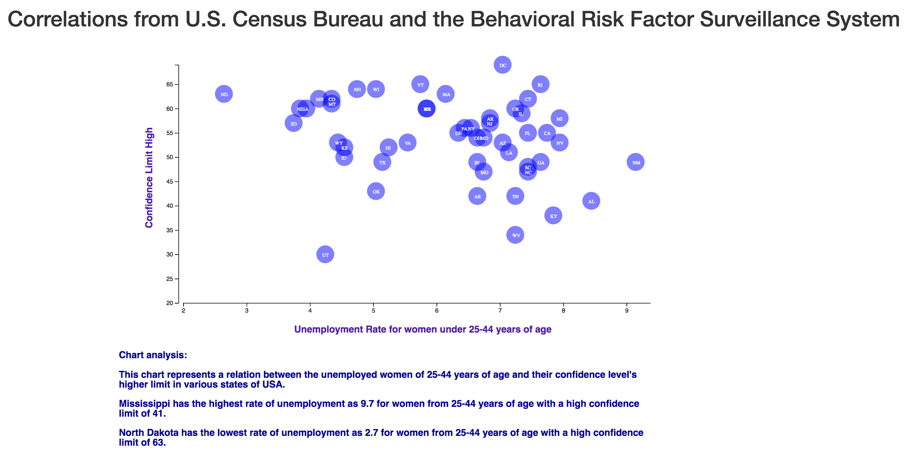

# Data Journalism and D3

### Unemployment rate; Estimate; AGE - 25 to 44 years (Female) Vs. High Confidence Level
Level 1: D3 Dabbler

Using the D3 techniques, created a scatter plot that represents each state with circle elements. This is coded in 
app.js file and data is pulled from data.csv by using the d3.csv function.

Preferred browser: Firefox
Chrome may have some violation issues and may need some extra commands to work.

Note: In data.csv- Used AH column (Unemployment rate; Estimate; AGE - 25 to 44 years) of ACS_14_1YR_S2301_with_ann.csv and column "M" (Confidence_limit_High) of BRFSS_2014_Overall.csv

