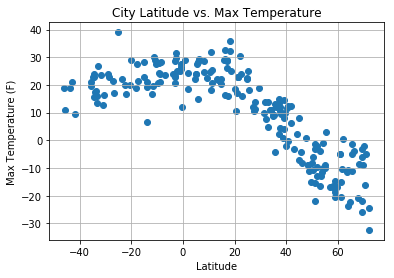
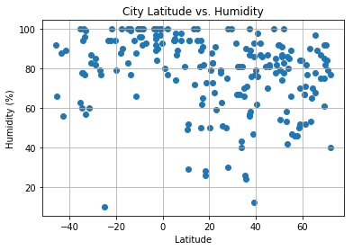
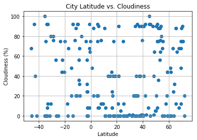
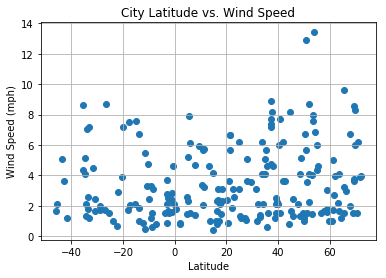

## Creating a Python script to visualize the weather of 500+ cities across the world of varying distance from the equator and documenting the analysis based off data.

### Data Analysis

* Trend 1: Latitude vs Maximum Temperature : The generated scatter plot shows that the temperature decreases with increase in latitude. The same trend is analysed for all the 500 cities.

* Trend 2: Latitude vs Humidity Plot: The humidity of most of the cities stays in the range of 60-100% from negative 60 to 80 degrees Latitude with few exceptions.

* Trend 3: Latitude vs Wind speed Plot: The wind speed of most of the cities stays in the range of 0-10% from negative 60 to 80 degrees Latitude with few exceptions.


```python
# Dependencies
import matplotlib.pyplot as plt
import requests as requests
import pandas as pd
import seaborn as sb
import numpy as np
import csv
from citipy import citipy
```


```python
# Save config information.

api_key = "c7f9f57b4779391ea1f5ae067591c971"
url = "http://api.openweathermap.org/data/2.5/weather?units=metric&APPID=" + api_key
```


```python
#Installing citipy module
!pip install citipy
from citipy import citipy

#Extracting response for 500 cities
cities = []
city_weather_data =[]
lats = np.random.randint(low=-90, high=90, size=1000)
lons = np.random.randint(low=-180, high=180, size=1000)
for lat, lon in zip(lats, lons):
    city = citipy.nearest_city(lat, lon)
    #print(city.city_name)
    
    city_weather_request_url = url + "&q=" + city.city_name
    print(city_weather_request_url)
    
    response = requests.get(city_weather_request_url)
    if response.status_code !=404:
        city_weather_data.append(response.json())
        
    elif response.status_code ==500:
        print(city_weather_request_url)
```

    Requirement already satisfied: citipy in /Users/aditibidwai/anaconda3/lib/python3.6/site-packages
    Requirement already satisfied: kdtree>=0.12 in /Users/aditibidwai/anaconda3/lib/python3.6/site-packages (from citipy)
    http://api.openweathermap.org/data/2.5/weather?units=metric&APPID=c7f9f57b4779391ea1f5ae067591c971&q=souillac
    http://api.openweathermap.org/data/2.5/weather?units=metric&APPID=c7f9f57b4779391ea1f5ae067591c971&q=new norfolk
    http://api.openweathermap.org/data/2.5/weather?units=metric&APPID=c7f9f57b4779391ea1f5ae067591c971&q=cape town
    http://api.openweathermap.org/data/2.5/weather?units=metric&APPID=c7f9f57b4779391ea1f5ae067591c971&q=ponta delgada
    http://api.openweathermap.org/data/2.5/weather?units=metric&APPID=c7f9f57b4779391ea1f5ae067591c971&q=aksu
    http://api.openweathermap.org/data/2.5/weather?units=metric&APPID=c7f9f57b4779391ea1f5ae067591c971&q=huarmey
    http://api.openweathermap.org/data/2.5/weather?units=metric&APPID=c7f9f57b4779391ea1f5ae067591c971&q=avarua
    http://api.openweathermap.org/data/2.5/weather?units=metric&APPID=c7f9f57b4779391ea1f5ae067591c971&q=that phanom
    http://api.openweathermap.org/data/2.5/weather?units=metric&APPID=c7f9f57b4779391ea1f5ae067591c971&q=omsukchan
    http://api.openweathermap.org/data/2.5/weather?units=metric&APPID=c7f9f57b4779391ea1f5ae067591c971&q=hithadhoo
    http://api.openweathermap.org/data/2.5/weather?units=metric&APPID=c7f9f57b4779391ea1f5ae067591c971&q=busselton
    http://api.openweathermap.org/data/2.5/weather?units=metric&APPID=c7f9f57b4779391ea1f5ae067591c971&q=atar
    http://api.openweathermap.org/data/2.5/weather?units=metric&APPID=c7f9f57b4779391ea1f5ae067591c971&q=jamestown
    http://api.openweathermap.org/data/2.5/weather?units=metric&APPID=c7f9f57b4779391ea1f5ae067591c971&q=grand gaube
    http://api.openweathermap.org/data/2.5/weather?units=metric&APPID=c7f9f57b4779391ea1f5ae067591c971&q=fort nelson
    http://api.openweathermap.org/data/2.5/weather?units=metric&APPID=c7f9f57b4779391ea1f5ae067591c971&q=bredasdorp
    http://api.openweathermap.org/data/2.5/weather?units=metric&APPID=c7f9f57b4779391ea1f5ae067591c971&q=tungor
    http://api.openweathermap.org/data/2.5/weather?units=metric&APPID=c7f9f57b4779391ea1f5ae067591c971&q=dingle
    http://api.openweathermap.org/data/2.5/weather?units=metric&APPID=c7f9f57b4779391ea1f5ae067591c971&q=clyde river
    http://api.openweathermap.org/data/2.5/weather?units=metric&APPID=c7f9f57b4779391ea1f5ae067591c971&q=arraial do cabo
    http://api.openweathermap.org/data/2.5/weather?units=metric&APPID=c7f9f57b4779391ea1f5ae067591c971&q=barrow
    http://api.openweathermap.org/data/2.5/weather?units=metric&APPID=c7f9f57b4779391ea1f5ae067591c971&q=bredasdorp
    http://api.openweathermap.org/data/2.5/weather?units=metric&APPID=c7f9f57b4779391ea1f5ae067591c971&q=hithadhoo
    http://api.openweathermap.org/data/2.5/weather?units=metric&APPID=c7f9f57b4779391ea1f5ae067591c971&q=pauini
    http://api.openweathermap.org/data/2.5/weather?units=metric&APPID=c7f9f57b4779391ea1f5ae067591c971&q=husavik
    http://api.openweathermap.org/data/2.5/weather?units=metric&APPID=c7f9f57b4779391ea1f5ae067591c971&q=batsfjord
    http://api.openweathermap.org/data/2.5/weather?units=metric&APPID=c7f9f57b4779391ea1f5ae067591c971&q=pangkalanbuun
    http://api.openweathermap.org/data/2.5/weather?units=metric&APPID=c7f9f57b4779391ea1f5ae067591c971&q=laguna
    http://api.openweathermap.org/data/2.5/weather?units=metric&APPID=c7f9f57b4779391ea1f5ae067591c971&q=busselton
    http://api.openweathermap.org/data/2.5/weather?units=metric&APPID=c7f9f57b4779391ea1f5ae067591c971&q=rikitea
    http://api.openweathermap.org/data/2.5/weather?units=metric&APPID=c7f9f57b4779391ea1f5ae067591c971&q=barrow
    http://api.openweathermap.org/data/2.5/weather?units=metric&APPID=c7f9f57b4779391ea1f5ae067591c971&q=mys shmidta
    http://api.openweathermap.org/data/2.5/weather?units=metric&APPID=c7f9f57b4779391ea1f5ae067591c971&q=narsaq
    http://api.openweathermap.org/data/2.5/weather?units=metric&APPID=c7f9f57b4779391ea1f5ae067591c971&q=richards bay
    http://api.openweathermap.org/data/2.5/weather?units=metric&APPID=c7f9f57b4779391ea1f5ae067591c971&q=diamantina
    http://api.openweathermap.org/data/2.5/weather?units=metric&APPID=c7f9f57b4779391ea1f5ae067591c971&q=qaanaaq
    http://api.openweathermap.org/data/2.5/weather?units=metric&APPID=c7f9f57b4779391ea1f5ae067591c971&q=rawson
    http://api.openweathermap.org/data/2.5/weather?units=metric&APPID=c7f9f57b4779391ea1f5ae067591c971&q=ushuaia
    http://api.openweathermap.org/data/2.5/weather?units=metric&APPID=c7f9f57b4779391ea1f5ae067591c971&q=bluff
    http://api.openweathermap.org/data/2.5/weather?units=metric&APPID=c7f9f57b4779391ea1f5ae067591c971&q=aitape
    http://api.openweathermap.org/data/2.5/weather?units=metric&APPID=c7f9f57b4779391ea1f5ae067591c971&q=viligili
    http://api.openweathermap.org/data/2.5/weather?units=metric&APPID=c7f9f57b4779391ea1f5ae067591c971&q=rikitea
    http://api.openweathermap.org/data/2.5/weather?units=metric&APPID=c7f9f57b4779391ea1f5ae067591c971&q=nikolskoye
    http://api.openweathermap.org/data/2.5/weather?units=metric&APPID=c7f9f57b4779391ea1f5ae067591c971&q=mataura
    http://api.openweathermap.org/data/2.5/weather?units=metric&APPID=c7f9f57b4779391ea1f5ae067591c971&q=bluff
    http://api.openweathermap.org/data/2.5/weather?units=metric&APPID=c7f9f57b4779391ea1f5ae067591c971&q=mataura
    http://api.openweathermap.org/data/2.5/weather?units=metric&APPID=c7f9f57b4779391ea1f5ae067591c971&q=chitrakonda
    http://api.openweathermap.org/data/2.5/weather?units=metric&APPID=c7f9f57b4779391ea1f5ae067591c971&q=punta arenas
    http://api.openweathermap.org/data/2.5/weather?units=metric&APPID=c7f9f57b4779391ea1f5ae067591c971&q=qaanaaq
    http://api.openweathermap.org/data/2.5/weather?units=metric&APPID=c7f9f57b4779391ea1f5ae067591c971&q=popondetta
    http://api.openweathermap.org/data/2.5/weather?units=metric&APPID=c7f9f57b4779391ea1f5ae067591c971&q=bethel
    http://api.openweathermap.org/data/2.5/weather?units=metric&APPID=c7f9f57b4779391ea1f5ae067591c971&q=amderma
    http://api.openweathermap.org/data/2.5/weather?units=metric&APPID=c7f9f57b4779391ea1f5ae067591c971&q=atuona
    http://api.openweathermap.org/data/2.5/weather?units=metric&APPID=c7f9f57b4779391ea1f5ae067591c971&q=ust-omchug
    http://api.openweathermap.org/data/2.5/weather?units=metric&APPID=c7f9f57b4779391ea1f5ae067591c971&q=mudyuga
    http://api.openweathermap.org/data/2.5/weather?units=metric&APPID=c7f9f57b4779391ea1f5ae067591c971&q=ponta do sol
    http://api.openweathermap.org/data/2.5/weather?units=metric&APPID=c7f9f57b4779391ea1f5ae067591c971&q=bougouni
    http://api.openweathermap.org/data/2.5/weather?units=metric&APPID=c7f9f57b4779391ea1f5ae067591c971&q=kamenskoye
    http://api.openweathermap.org/data/2.5/weather?units=metric&APPID=c7f9f57b4779391ea1f5ae067591c971&q=saldanha
    http://api.openweathermap.org/data/2.5/weather?units=metric&APPID=c7f9f57b4779391ea1f5ae067591c971&q=mahaicony
    http://api.openweathermap.org/data/2.5/weather?units=metric&APPID=c7f9f57b4779391ea1f5ae067591c971&q=santiago
    http://api.openweathermap.org/data/2.5/weather?units=metric&APPID=c7f9f57b4779391ea1f5ae067591c971&q=vila praia de ancora
    http://api.openweathermap.org/data/2.5/weather?units=metric&APPID=c7f9f57b4779391ea1f5ae067591c971&q=rikitea
    http://api.openweathermap.org/data/2.5/weather?units=metric&APPID=c7f9f57b4779391ea1f5ae067591c971&q=hilo
    http://api.openweathermap.org/data/2.5/weather?units=metric&APPID=c7f9f57b4779391ea1f5ae067591c971&q=makakilo city
    http://api.openweathermap.org/data/2.5/weather?units=metric&APPID=c7f9f57b4779391ea1f5ae067591c971&q=vaini
    http://api.openweathermap.org/data/2.5/weather?units=metric&APPID=c7f9f57b4779391ea1f5ae067591c971&q=kaseda
    http://api.openweathermap.org/data/2.5/weather?units=metric&APPID=c7f9f57b4779391ea1f5ae067591c971&q=ribeira grande
    http://api.openweathermap.org/data/2.5/weather?units=metric&APPID=c7f9f57b4779391ea1f5ae067591c971&q=port pirie
    http://api.openweathermap.org/data/2.5/weather?units=metric&APPID=c7f9f57b4779391ea1f5ae067591c971&q=hithadhoo
    http://api.openweathermap.org/data/2.5/weather?units=metric&APPID=c7f9f57b4779391ea1f5ae067591c971&q=severobaykalsk
    http://api.openweathermap.org/data/2.5/weather?units=metric&APPID=c7f9f57b4779391ea1f5ae067591c971&q=castanheira do ribatejo
    http://api.openweathermap.org/data/2.5/weather?units=metric&APPID=c7f9f57b4779391ea1f5ae067591c971&q=kimbe
    http://api.openweathermap.org/data/2.5/weather?units=metric&APPID=c7f9f57b4779391ea1f5ae067591c971&q=buritizeiro
    http://api.openweathermap.org/data/2.5/weather?units=metric&APPID=c7f9f57b4779391ea1f5ae067591c971&q=sobolevo
    http://api.openweathermap.org/data/2.5/weather?units=metric&APPID=c7f9f57b4779391ea1f5ae067591c971&q=busselton
    http://api.openweathermap.org/data/2.5/weather?units=metric&APPID=c7f9f57b4779391ea1f5ae067591c971&q=chlum u trebone
    http://api.openweathermap.org/data/2.5/weather?units=metric&APPID=c7f9f57b4779391ea1f5ae067591c971&q=mamaku
    http://api.openweathermap.org/data/2.5/weather?units=metric&APPID=c7f9f57b4779391ea1f5ae067591c971&q=illoqqortoormiut
    http://api.openweathermap.org/data/2.5/weather?units=metric&APPID=c7f9f57b4779391ea1f5ae067591c971&q=stephenville
    http://api.openweathermap.org/data/2.5/weather?units=metric&APPID=c7f9f57b4779391ea1f5ae067591c971&q=atambua
    http://api.openweathermap.org/data/2.5/weather?units=metric&APPID=c7f9f57b4779391ea1f5ae067591c971&q=imabari
    http://api.openweathermap.org/data/2.5/weather?units=metric&APPID=c7f9f57b4779391ea1f5ae067591c971&q=mataura
    http://api.openweathermap.org/data/2.5/weather?units=metric&APPID=c7f9f57b4779391ea1f5ae067591c971&q=belaya gora
    http://api.openweathermap.org/data/2.5/weather?units=metric&APPID=c7f9f57b4779391ea1f5ae067591c971&q=port alfred
    http://api.openweathermap.org/data/2.5/weather?units=metric&APPID=c7f9f57b4779391ea1f5ae067591c971&q=tsihombe
    http://api.openweathermap.org/data/2.5/weather?units=metric&APPID=c7f9f57b4779391ea1f5ae067591c971&q=chokurdakh
    http://api.openweathermap.org/data/2.5/weather?units=metric&APPID=c7f9f57b4779391ea1f5ae067591c971&q=yellowknife
    http://api.openweathermap.org/data/2.5/weather?units=metric&APPID=c7f9f57b4779391ea1f5ae067591c971&q=mataura
    http://api.openweathermap.org/data/2.5/weather?units=metric&APPID=c7f9f57b4779391ea1f5ae067591c971&q=kapaa
    http://api.openweathermap.org/data/2.5/weather?units=metric&APPID=c7f9f57b4779391ea1f5ae067591c971&q=victoria
    http://api.openweathermap.org/data/2.5/weather?units=metric&APPID=c7f9f57b4779391ea1f5ae067591c971&q=busselton
    http://api.openweathermap.org/data/2.5/weather?units=metric&APPID=c7f9f57b4779391ea1f5ae067591c971&q=busselton
    http://api.openweathermap.org/data/2.5/weather?units=metric&APPID=c7f9f57b4779391ea1f5ae067591c971&q=raudeberg
    http://api.openweathermap.org/data/2.5/weather?units=metric&APPID=c7f9f57b4779391ea1f5ae067591c971&q=illoqqortoormiut
    http://api.openweathermap.org/data/2.5/weather?units=metric&APPID=c7f9f57b4779391ea1f5ae067591c971&q=yulara
    http://api.openweathermap.org/data/2.5/weather?units=metric&APPID=c7f9f57b4779391ea1f5ae067591c971&q=rikitea
    http://api.openweathermap.org/data/2.5/weather?units=metric&APPID=c7f9f57b4779391ea1f5ae067591c971&q=saleaula
    http://api.openweathermap.org/data/2.5/weather?units=metric&APPID=c7f9f57b4779391ea1f5ae067591c971&q=puerto ayora
    http://api.openweathermap.org/data/2.5/weather?units=metric&APPID=c7f9f57b4779391ea1f5ae067591c971&q=mataura
    http://api.openweathermap.org/data/2.5/weather?units=metric&APPID=c7f9f57b4779391ea1f5ae067591c971&q=taolanaro
    http://api.openweathermap.org/data/2.5/weather?units=metric&APPID=c7f9f57b4779391ea1f5ae067591c971&q=puerto ayora
    http://api.openweathermap.org/data/2.5/weather?units=metric&APPID=c7f9f57b4779391ea1f5ae067591c971&q=cherskiy
    http://api.openweathermap.org/data/2.5/weather?units=metric&APPID=c7f9f57b4779391ea1f5ae067591c971&q=puerto ayora
    http://api.openweathermap.org/data/2.5/weather?units=metric&APPID=c7f9f57b4779391ea1f5ae067591c971&q=chokurdakh
    http://api.openweathermap.org/data/2.5/weather?units=metric&APPID=c7f9f57b4779391ea1f5ae067591c971&q=nsoko
    http://api.openweathermap.org/data/2.5/weather?units=metric&APPID=c7f9f57b4779391ea1f5ae067591c971&q=barrow
    http://api.openweathermap.org/data/2.5/weather?units=metric&APPID=c7f9f57b4779391ea1f5ae067591c971&q=mar del plata
    http://api.openweathermap.org/data/2.5/weather?units=metric&APPID=c7f9f57b4779391ea1f5ae067591c971&q=ushuaia
    http://api.openweathermap.org/data/2.5/weather?units=metric&APPID=c7f9f57b4779391ea1f5ae067591c971&q=cayenne
    http://api.openweathermap.org/data/2.5/weather?units=metric&APPID=c7f9f57b4779391ea1f5ae067591c971&q=derzhavinsk
    http://api.openweathermap.org/data/2.5/weather?units=metric&APPID=c7f9f57b4779391ea1f5ae067591c971&q=rocha
    http://api.openweathermap.org/data/2.5/weather?units=metric&APPID=c7f9f57b4779391ea1f5ae067591c971&q=tsihombe
    http://api.openweathermap.org/data/2.5/weather?units=metric&APPID=c7f9f57b4779391ea1f5ae067591c971&q=ushuaia
    http://api.openweathermap.org/data/2.5/weather?units=metric&APPID=c7f9f57b4779391ea1f5ae067591c971&q=grand gaube
    http://api.openweathermap.org/data/2.5/weather?units=metric&APPID=c7f9f57b4779391ea1f5ae067591c971&q=saint-michel-des-saints
    http://api.openweathermap.org/data/2.5/weather?units=metric&APPID=c7f9f57b4779391ea1f5ae067591c971&q=tasiilaq
    http://api.openweathermap.org/data/2.5/weather?units=metric&APPID=c7f9f57b4779391ea1f5ae067591c971&q=ukiah
    http://api.openweathermap.org/data/2.5/weather?units=metric&APPID=c7f9f57b4779391ea1f5ae067591c971&q=georgetown
    http://api.openweathermap.org/data/2.5/weather?units=metric&APPID=c7f9f57b4779391ea1f5ae067591c971&q=carnarvon
    http://api.openweathermap.org/data/2.5/weather?units=metric&APPID=c7f9f57b4779391ea1f5ae067591c971&q=taolanaro
    http://api.openweathermap.org/data/2.5/weather?units=metric&APPID=c7f9f57b4779391ea1f5ae067591c971&q=grand river south east
    http://api.openweathermap.org/data/2.5/weather?units=metric&APPID=c7f9f57b4779391ea1f5ae067591c971&q=poso
    http://api.openweathermap.org/data/2.5/weather?units=metric&APPID=c7f9f57b4779391ea1f5ae067591c971&q=albany
    http://api.openweathermap.org/data/2.5/weather?units=metric&APPID=c7f9f57b4779391ea1f5ae067591c971&q=bluff
    http://api.openweathermap.org/data/2.5/weather?units=metric&APPID=c7f9f57b4779391ea1f5ae067591c971&q=lolua
    http://api.openweathermap.org/data/2.5/weather?units=metric&APPID=c7f9f57b4779391ea1f5ae067591c971&q=hovd
    http://api.openweathermap.org/data/2.5/weather?units=metric&APPID=c7f9f57b4779391ea1f5ae067591c971&q=vaini
    http://api.openweathermap.org/data/2.5/weather?units=metric&APPID=c7f9f57b4779391ea1f5ae067591c971&q=cockburn town
    http://api.openweathermap.org/data/2.5/weather?units=metric&APPID=c7f9f57b4779391ea1f5ae067591c971&q=nome
    http://api.openweathermap.org/data/2.5/weather?units=metric&APPID=c7f9f57b4779391ea1f5ae067591c971&q=la reforma
    http://api.openweathermap.org/data/2.5/weather?units=metric&APPID=c7f9f57b4779391ea1f5ae067591c971&q=sur
    http://api.openweathermap.org/data/2.5/weather?units=metric&APPID=c7f9f57b4779391ea1f5ae067591c971&q=atuona
    http://api.openweathermap.org/data/2.5/weather?units=metric&APPID=c7f9f57b4779391ea1f5ae067591c971&q=lumeje
    http://api.openweathermap.org/data/2.5/weather?units=metric&APPID=c7f9f57b4779391ea1f5ae067591c971&q=butaritari
    http://api.openweathermap.org/data/2.5/weather?units=metric&APPID=c7f9f57b4779391ea1f5ae067591c971&q=saint-philippe
    http://api.openweathermap.org/data/2.5/weather?units=metric&APPID=c7f9f57b4779391ea1f5ae067591c971&q=sungairaya
    http://api.openweathermap.org/data/2.5/weather?units=metric&APPID=c7f9f57b4779391ea1f5ae067591c971&q=san cristobal
    http://api.openweathermap.org/data/2.5/weather?units=metric&APPID=c7f9f57b4779391ea1f5ae067591c971&q=kodiak
    http://api.openweathermap.org/data/2.5/weather?units=metric&APPID=c7f9f57b4779391ea1f5ae067591c971&q=mataura
    http://api.openweathermap.org/data/2.5/weather?units=metric&APPID=c7f9f57b4779391ea1f5ae067591c971&q=albany
    http://api.openweathermap.org/data/2.5/weather?units=metric&APPID=c7f9f57b4779391ea1f5ae067591c971&q=kempsey
    http://api.openweathermap.org/data/2.5/weather?units=metric&APPID=c7f9f57b4779391ea1f5ae067591c971&q=kanashevo
    http://api.openweathermap.org/data/2.5/weather?units=metric&APPID=c7f9f57b4779391ea1f5ae067591c971&q=moose factory
    http://api.openweathermap.org/data/2.5/weather?units=metric&APPID=c7f9f57b4779391ea1f5ae067591c971&q=yerbogachen
    http://api.openweathermap.org/data/2.5/weather?units=metric&APPID=c7f9f57b4779391ea1f5ae067591c971&q=taolanaro
    http://api.openweathermap.org/data/2.5/weather?units=metric&APPID=c7f9f57b4779391ea1f5ae067591c971&q=gizo
    http://api.openweathermap.org/data/2.5/weather?units=metric&APPID=c7f9f57b4779391ea1f5ae067591c971&q=hermanus
    http://api.openweathermap.org/data/2.5/weather?units=metric&APPID=c7f9f57b4779391ea1f5ae067591c971&q=ushuaia
    http://api.openweathermap.org/data/2.5/weather?units=metric&APPID=c7f9f57b4779391ea1f5ae067591c971&q=luderitz
    http://api.openweathermap.org/data/2.5/weather?units=metric&APPID=c7f9f57b4779391ea1f5ae067591c971&q=bluff
    http://api.openweathermap.org/data/2.5/weather?units=metric&APPID=c7f9f57b4779391ea1f5ae067591c971&q=rikitea
    http://api.openweathermap.org/data/2.5/weather?units=metric&APPID=c7f9f57b4779391ea1f5ae067591c971&q=hithadhoo
    http://api.openweathermap.org/data/2.5/weather?units=metric&APPID=c7f9f57b4779391ea1f5ae067591c971&q=illoqqortoormiut
    http://api.openweathermap.org/data/2.5/weather?units=metric&APPID=c7f9f57b4779391ea1f5ae067591c971&q=saint-pierre
    http://api.openweathermap.org/data/2.5/weather?units=metric&APPID=c7f9f57b4779391ea1f5ae067591c971&q=uruzgan
    http://api.openweathermap.org/data/2.5/weather?units=metric&APPID=c7f9f57b4779391ea1f5ae067591c971&q=ust-ilimsk
    http://api.openweathermap.org/data/2.5/weather?units=metric&APPID=c7f9f57b4779391ea1f5ae067591c971&q=qaanaaq
    http://api.openweathermap.org/data/2.5/weather?units=metric&APPID=c7f9f57b4779391ea1f5ae067591c971&q=nikolskoye
    http://api.openweathermap.org/data/2.5/weather?units=metric&APPID=c7f9f57b4779391ea1f5ae067591c971&q=arraial do cabo
    http://api.openweathermap.org/data/2.5/weather?units=metric&APPID=c7f9f57b4779391ea1f5ae067591c971&q=masuguru
    http://api.openweathermap.org/data/2.5/weather?units=metric&APPID=c7f9f57b4779391ea1f5ae067591c971&q=atuona
    http://api.openweathermap.org/data/2.5/weather?units=metric&APPID=c7f9f57b4779391ea1f5ae067591c971&q=belushya guba
    http://api.openweathermap.org/data/2.5/weather?units=metric&APPID=c7f9f57b4779391ea1f5ae067591c971&q=punta arenas
    http://api.openweathermap.org/data/2.5/weather?units=metric&APPID=c7f9f57b4779391ea1f5ae067591c971&q=catuday
    http://api.openweathermap.org/data/2.5/weather?units=metric&APPID=c7f9f57b4779391ea1f5ae067591c971&q=kodinsk
    http://api.openweathermap.org/data/2.5/weather?units=metric&APPID=c7f9f57b4779391ea1f5ae067591c971&q=si bun ruang
    http://api.openweathermap.org/data/2.5/weather?units=metric&APPID=c7f9f57b4779391ea1f5ae067591c971&q=rikitea
    http://api.openweathermap.org/data/2.5/weather?units=metric&APPID=c7f9f57b4779391ea1f5ae067591c971&q=puerto ayora
    http://api.openweathermap.org/data/2.5/weather?units=metric&APPID=c7f9f57b4779391ea1f5ae067591c971&q=wahran
    http://api.openweathermap.org/data/2.5/weather?units=metric&APPID=c7f9f57b4779391ea1f5ae067591c971&q=punta arenas
    http://api.openweathermap.org/data/2.5/weather?units=metric&APPID=c7f9f57b4779391ea1f5ae067591c971&q=cherskiy
    http://api.openweathermap.org/data/2.5/weather?units=metric&APPID=c7f9f57b4779391ea1f5ae067591c971&q=carnarvon
    http://api.openweathermap.org/data/2.5/weather?units=metric&APPID=c7f9f57b4779391ea1f5ae067591c971&q=rajampet
    http://api.openweathermap.org/data/2.5/weather?units=metric&APPID=c7f9f57b4779391ea1f5ae067591c971&q=riyadh
    http://api.openweathermap.org/data/2.5/weather?units=metric&APPID=c7f9f57b4779391ea1f5ae067591c971&q=dikson
    http://api.openweathermap.org/data/2.5/weather?units=metric&APPID=c7f9f57b4779391ea1f5ae067591c971&q=hilo
    http://api.openweathermap.org/data/2.5/weather?units=metric&APPID=c7f9f57b4779391ea1f5ae067591c971&q=uarini
    http://api.openweathermap.org/data/2.5/weather?units=metric&APPID=c7f9f57b4779391ea1f5ae067591c971&q=longyearbyen
    http://api.openweathermap.org/data/2.5/weather?units=metric&APPID=c7f9f57b4779391ea1f5ae067591c971&q=bethel
    http://api.openweathermap.org/data/2.5/weather?units=metric&APPID=c7f9f57b4779391ea1f5ae067591c971&q=rikitea
    http://api.openweathermap.org/data/2.5/weather?units=metric&APPID=c7f9f57b4779391ea1f5ae067591c971&q=richards bay
    http://api.openweathermap.org/data/2.5/weather?units=metric&APPID=c7f9f57b4779391ea1f5ae067591c971&q=caravelas
    http://api.openweathermap.org/data/2.5/weather?units=metric&APPID=c7f9f57b4779391ea1f5ae067591c971&q=egvekinot
    http://api.openweathermap.org/data/2.5/weather?units=metric&APPID=c7f9f57b4779391ea1f5ae067591c971&q=aflu
    http://api.openweathermap.org/data/2.5/weather?units=metric&APPID=c7f9f57b4779391ea1f5ae067591c971&q=khatanga
    http://api.openweathermap.org/data/2.5/weather?units=metric&APPID=c7f9f57b4779391ea1f5ae067591c971&q=geraldton
    http://api.openweathermap.org/data/2.5/weather?units=metric&APPID=c7f9f57b4779391ea1f5ae067591c971&q=clyde river
    http://api.openweathermap.org/data/2.5/weather?units=metric&APPID=c7f9f57b4779391ea1f5ae067591c971&q=hilo
    http://api.openweathermap.org/data/2.5/weather?units=metric&APPID=c7f9f57b4779391ea1f5ae067591c971&q=fort saint john
    http://api.openweathermap.org/data/2.5/weather?units=metric&APPID=c7f9f57b4779391ea1f5ae067591c971&q=airai
    http://api.openweathermap.org/data/2.5/weather?units=metric&APPID=c7f9f57b4779391ea1f5ae067591c971&q=teknaf
    http://api.openweathermap.org/data/2.5/weather?units=metric&APPID=c7f9f57b4779391ea1f5ae067591c971&q=taolanaro
    http://api.openweathermap.org/data/2.5/weather?units=metric&APPID=c7f9f57b4779391ea1f5ae067591c971&q=new norfolk
    http://api.openweathermap.org/data/2.5/weather?units=metric&APPID=c7f9f57b4779391ea1f5ae067591c971&q=rikitea
    http://api.openweathermap.org/data/2.5/weather?units=metric&APPID=c7f9f57b4779391ea1f5ae067591c971&q=jamestown
    http://api.openweathermap.org/data/2.5/weather?units=metric&APPID=c7f9f57b4779391ea1f5ae067591c971&q=ribeira grande
    http://api.openweathermap.org/data/2.5/weather?units=metric&APPID=c7f9f57b4779391ea1f5ae067591c971&q=iqaluit
    http://api.openweathermap.org/data/2.5/weather?units=metric&APPID=c7f9f57b4779391ea1f5ae067591c971&q=katsuura
    http://api.openweathermap.org/data/2.5/weather?units=metric&APPID=c7f9f57b4779391ea1f5ae067591c971&q=puerto ayora
    http://api.openweathermap.org/data/2.5/weather?units=metric&APPID=c7f9f57b4779391ea1f5ae067591c971&q=keetmanshoop
    http://api.openweathermap.org/data/2.5/weather?units=metric&APPID=c7f9f57b4779391ea1f5ae067591c971&q=illoqqortoormiut
    http://api.openweathermap.org/data/2.5/weather?units=metric&APPID=c7f9f57b4779391ea1f5ae067591c971&q=qaanaaq
    http://api.openweathermap.org/data/2.5/weather?units=metric&APPID=c7f9f57b4779391ea1f5ae067591c971&q=east london
    http://api.openweathermap.org/data/2.5/weather?units=metric&APPID=c7f9f57b4779391ea1f5ae067591c971&q=miranorte
    http://api.openweathermap.org/data/2.5/weather?units=metric&APPID=c7f9f57b4779391ea1f5ae067591c971&q=russkiy
    http://api.openweathermap.org/data/2.5/weather?units=metric&APPID=c7f9f57b4779391ea1f5ae067591c971&q=yellowknife
    http://api.openweathermap.org/data/2.5/weather?units=metric&APPID=c7f9f57b4779391ea1f5ae067591c971&q=belyy yar
    http://api.openweathermap.org/data/2.5/weather?units=metric&APPID=c7f9f57b4779391ea1f5ae067591c971&q=jamestown
    http://api.openweathermap.org/data/2.5/weather?units=metric&APPID=c7f9f57b4779391ea1f5ae067591c971&q=coihaique
    http://api.openweathermap.org/data/2.5/weather?units=metric&APPID=c7f9f57b4779391ea1f5ae067591c971&q=shache
    http://api.openweathermap.org/data/2.5/weather?units=metric&APPID=c7f9f57b4779391ea1f5ae067591c971&q=ust-kulom
    http://api.openweathermap.org/data/2.5/weather?units=metric&APPID=c7f9f57b4779391ea1f5ae067591c971&q=rikitea
    http://api.openweathermap.org/data/2.5/weather?units=metric&APPID=c7f9f57b4779391ea1f5ae067591c971&q=mataura
    http://api.openweathermap.org/data/2.5/weather?units=metric&APPID=c7f9f57b4779391ea1f5ae067591c971&q=rikitea
    http://api.openweathermap.org/data/2.5/weather?units=metric&APPID=c7f9f57b4779391ea1f5ae067591c971&q=vaini
    http://api.openweathermap.org/data/2.5/weather?units=metric&APPID=c7f9f57b4779391ea1f5ae067591c971&q=maunabo
    http://api.openweathermap.org/data/2.5/weather?units=metric&APPID=c7f9f57b4779391ea1f5ae067591c971&q=prince rupert
    http://api.openweathermap.org/data/2.5/weather?units=metric&APPID=c7f9f57b4779391ea1f5ae067591c971&q=amderma
    http://api.openweathermap.org/data/2.5/weather?units=metric&APPID=c7f9f57b4779391ea1f5ae067591c971&q=chuy
    http://api.openweathermap.org/data/2.5/weather?units=metric&APPID=c7f9f57b4779391ea1f5ae067591c971&q=erzin
    http://api.openweathermap.org/data/2.5/weather?units=metric&APPID=c7f9f57b4779391ea1f5ae067591c971&q=funadhoo
    http://api.openweathermap.org/data/2.5/weather?units=metric&APPID=c7f9f57b4779391ea1f5ae067591c971&q=rio grande
    http://api.openweathermap.org/data/2.5/weather?units=metric&APPID=c7f9f57b4779391ea1f5ae067591c971&q=hobart
    http://api.openweathermap.org/data/2.5/weather?units=metric&APPID=c7f9f57b4779391ea1f5ae067591c971&q=balabac
    http://api.openweathermap.org/data/2.5/weather?units=metric&APPID=c7f9f57b4779391ea1f5ae067591c971&q=yenotayevka
    http://api.openweathermap.org/data/2.5/weather?units=metric&APPID=c7f9f57b4779391ea1f5ae067591c971&q=santa fe
    http://api.openweathermap.org/data/2.5/weather?units=metric&APPID=c7f9f57b4779391ea1f5ae067591c971&q=ushuaia
    http://api.openweathermap.org/data/2.5/weather?units=metric&APPID=c7f9f57b4779391ea1f5ae067591c971&q=vaini
    http://api.openweathermap.org/data/2.5/weather?units=metric&APPID=c7f9f57b4779391ea1f5ae067591c971&q=esperance
    http://api.openweathermap.org/data/2.5/weather?units=metric&APPID=c7f9f57b4779391ea1f5ae067591c971&q=kapaa
    http://api.openweathermap.org/data/2.5/weather?units=metric&APPID=c7f9f57b4779391ea1f5ae067591c971&q=huarmey
    http://api.openweathermap.org/data/2.5/weather?units=metric&APPID=c7f9f57b4779391ea1f5ae067591c971&q=hermanus
    http://api.openweathermap.org/data/2.5/weather?units=metric&APPID=c7f9f57b4779391ea1f5ae067591c971&q=ushuaia
    http://api.openweathermap.org/data/2.5/weather?units=metric&APPID=c7f9f57b4779391ea1f5ae067591c971&q=dapaong
    http://api.openweathermap.org/data/2.5/weather?units=metric&APPID=c7f9f57b4779391ea1f5ae067591c971&q=tubruq
    http://api.openweathermap.org/data/2.5/weather?units=metric&APPID=c7f9f57b4779391ea1f5ae067591c971&q=jamestown
    http://api.openweathermap.org/data/2.5/weather?units=metric&APPID=c7f9f57b4779391ea1f5ae067591c971&q=petropavlovsk-kamchatskiy
    http://api.openweathermap.org/data/2.5/weather?units=metric&APPID=c7f9f57b4779391ea1f5ae067591c971&q=atuona
    http://api.openweathermap.org/data/2.5/weather?units=metric&APPID=c7f9f57b4779391ea1f5ae067591c971&q=northam
    http://api.openweathermap.org/data/2.5/weather?units=metric&APPID=c7f9f57b4779391ea1f5ae067591c971&q=port hardy
    http://api.openweathermap.org/data/2.5/weather?units=metric&APPID=c7f9f57b4779391ea1f5ae067591c971&q=rikitea
    http://api.openweathermap.org/data/2.5/weather?units=metric&APPID=c7f9f57b4779391ea1f5ae067591c971&q=hermanus
    http://api.openweathermap.org/data/2.5/weather?units=metric&APPID=c7f9f57b4779391ea1f5ae067591c971&q=pinsk
    http://api.openweathermap.org/data/2.5/weather?units=metric&APPID=c7f9f57b4779391ea1f5ae067591c971&q=camocim
    http://api.openweathermap.org/data/2.5/weather?units=metric&APPID=c7f9f57b4779391ea1f5ae067591c971&q=port elizabeth
    http://api.openweathermap.org/data/2.5/weather?units=metric&APPID=c7f9f57b4779391ea1f5ae067591c971&q=butaritari
    http://api.openweathermap.org/data/2.5/weather?units=metric&APPID=c7f9f57b4779391ea1f5ae067591c971&q=vaini
    http://api.openweathermap.org/data/2.5/weather?units=metric&APPID=c7f9f57b4779391ea1f5ae067591c971&q=richards bay
    http://api.openweathermap.org/data/2.5/weather?units=metric&APPID=c7f9f57b4779391ea1f5ae067591c971&q=umzimvubu
    http://api.openweathermap.org/data/2.5/weather?units=metric&APPID=c7f9f57b4779391ea1f5ae067591c971&q=yellowknife
    http://api.openweathermap.org/data/2.5/weather?units=metric&APPID=c7f9f57b4779391ea1f5ae067591c971&q=arraial do cabo
    http://api.openweathermap.org/data/2.5/weather?units=metric&APPID=c7f9f57b4779391ea1f5ae067591c971&q=thompson
    http://api.openweathermap.org/data/2.5/weather?units=metric&APPID=c7f9f57b4779391ea1f5ae067591c971&q=avarua
    http://api.openweathermap.org/data/2.5/weather?units=metric&APPID=c7f9f57b4779391ea1f5ae067591c971&q=mataura
    http://api.openweathermap.org/data/2.5/weather?units=metric&APPID=c7f9f57b4779391ea1f5ae067591c971&q=puerto ayora
    http://api.openweathermap.org/data/2.5/weather?units=metric&APPID=c7f9f57b4779391ea1f5ae067591c971&q=luderitz
    http://api.openweathermap.org/data/2.5/weather?units=metric&APPID=c7f9f57b4779391ea1f5ae067591c971&q=borogontsy
    http://api.openweathermap.org/data/2.5/weather?units=metric&APPID=c7f9f57b4779391ea1f5ae067591c971&q=jamestown
    http://api.openweathermap.org/data/2.5/weather?units=metric&APPID=c7f9f57b4779391ea1f5ae067591c971&q=sehithwa
    http://api.openweathermap.org/data/2.5/weather?units=metric&APPID=c7f9f57b4779391ea1f5ae067591c971&q=tumannyy
    http://api.openweathermap.org/data/2.5/weather?units=metric&APPID=c7f9f57b4779391ea1f5ae067591c971&q=mar del plata
    http://api.openweathermap.org/data/2.5/weather?units=metric&APPID=c7f9f57b4779391ea1f5ae067591c971&q=saint george
    http://api.openweathermap.org/data/2.5/weather?units=metric&APPID=c7f9f57b4779391ea1f5ae067591c971&q=faya
    http://api.openweathermap.org/data/2.5/weather?units=metric&APPID=c7f9f57b4779391ea1f5ae067591c971&q=rikitea
    http://api.openweathermap.org/data/2.5/weather?units=metric&APPID=c7f9f57b4779391ea1f5ae067591c971&q=barrow
    http://api.openweathermap.org/data/2.5/weather?units=metric&APPID=c7f9f57b4779391ea1f5ae067591c971&q=arraial do cabo
    http://api.openweathermap.org/data/2.5/weather?units=metric&APPID=c7f9f57b4779391ea1f5ae067591c971&q=villa del rosario
    http://api.openweathermap.org/data/2.5/weather?units=metric&APPID=c7f9f57b4779391ea1f5ae067591c971&q=bredasdorp
    http://api.openweathermap.org/data/2.5/weather?units=metric&APPID=c7f9f57b4779391ea1f5ae067591c971&q=punta arenas
    http://api.openweathermap.org/data/2.5/weather?units=metric&APPID=c7f9f57b4779391ea1f5ae067591c971&q=sao paulo de olivenca
    http://api.openweathermap.org/data/2.5/weather?units=metric&APPID=c7f9f57b4779391ea1f5ae067591c971&q=hilo
    http://api.openweathermap.org/data/2.5/weather?units=metric&APPID=c7f9f57b4779391ea1f5ae067591c971&q=myitkyina
    http://api.openweathermap.org/data/2.5/weather?units=metric&APPID=c7f9f57b4779391ea1f5ae067591c971&q=karaul
    http://api.openweathermap.org/data/2.5/weather?units=metric&APPID=c7f9f57b4779391ea1f5ae067591c971&q=pangnirtung
    http://api.openweathermap.org/data/2.5/weather?units=metric&APPID=c7f9f57b4779391ea1f5ae067591c971&q=macheng
    http://api.openweathermap.org/data/2.5/weather?units=metric&APPID=c7f9f57b4779391ea1f5ae067591c971&q=winchester
    http://api.openweathermap.org/data/2.5/weather?units=metric&APPID=c7f9f57b4779391ea1f5ae067591c971&q=rakaia
    http://api.openweathermap.org/data/2.5/weather?units=metric&APPID=c7f9f57b4779391ea1f5ae067591c971&q=punta arenas
    http://api.openweathermap.org/data/2.5/weather?units=metric&APPID=c7f9f57b4779391ea1f5ae067591c971&q=regina
    http://api.openweathermap.org/data/2.5/weather?units=metric&APPID=c7f9f57b4779391ea1f5ae067591c971&q=rikitea
    http://api.openweathermap.org/data/2.5/weather?units=metric&APPID=c7f9f57b4779391ea1f5ae067591c971&q=miandrivazo
    http://api.openweathermap.org/data/2.5/weather?units=metric&APPID=c7f9f57b4779391ea1f5ae067591c971&q=tokur
    http://api.openweathermap.org/data/2.5/weather?units=metric&APPID=c7f9f57b4779391ea1f5ae067591c971&q=vaini
    http://api.openweathermap.org/data/2.5/weather?units=metric&APPID=c7f9f57b4779391ea1f5ae067591c971&q=kloulklubed
    http://api.openweathermap.org/data/2.5/weather?units=metric&APPID=c7f9f57b4779391ea1f5ae067591c971&q=carnarvon
    http://api.openweathermap.org/data/2.5/weather?units=metric&APPID=c7f9f57b4779391ea1f5ae067591c971&q=grootfontein
    http://api.openweathermap.org/data/2.5/weather?units=metric&APPID=c7f9f57b4779391ea1f5ae067591c971&q=hobart
    http://api.openweathermap.org/data/2.5/weather?units=metric&APPID=c7f9f57b4779391ea1f5ae067591c971&q=tres picos
    http://api.openweathermap.org/data/2.5/weather?units=metric&APPID=c7f9f57b4779391ea1f5ae067591c971&q=mossendjo
    http://api.openweathermap.org/data/2.5/weather?units=metric&APPID=c7f9f57b4779391ea1f5ae067591c971&q=sitka
    http://api.openweathermap.org/data/2.5/weather?units=metric&APPID=c7f9f57b4779391ea1f5ae067591c971&q=hilo
    http://api.openweathermap.org/data/2.5/weather?units=metric&APPID=c7f9f57b4779391ea1f5ae067591c971&q=skjervoy
    http://api.openweathermap.org/data/2.5/weather?units=metric&APPID=c7f9f57b4779391ea1f5ae067591c971&q=half moon bay
    http://api.openweathermap.org/data/2.5/weather?units=metric&APPID=c7f9f57b4779391ea1f5ae067591c971&q=bluff
    http://api.openweathermap.org/data/2.5/weather?units=metric&APPID=c7f9f57b4779391ea1f5ae067591c971&q=attawapiskat
    http://api.openweathermap.org/data/2.5/weather?units=metric&APPID=c7f9f57b4779391ea1f5ae067591c971&q=port alfred
    http://api.openweathermap.org/data/2.5/weather?units=metric&APPID=c7f9f57b4779391ea1f5ae067591c971&q=albany
    http://api.openweathermap.org/data/2.5/weather?units=metric&APPID=c7f9f57b4779391ea1f5ae067591c971&q=mitsamiouli
    http://api.openweathermap.org/data/2.5/weather?units=metric&APPID=c7f9f57b4779391ea1f5ae067591c971&q=geraldton
    http://api.openweathermap.org/data/2.5/weather?units=metric&APPID=c7f9f57b4779391ea1f5ae067591c971&q=tuktoyaktuk
    http://api.openweathermap.org/data/2.5/weather?units=metric&APPID=c7f9f57b4779391ea1f5ae067591c971&q=fairbanks
    http://api.openweathermap.org/data/2.5/weather?units=metric&APPID=c7f9f57b4779391ea1f5ae067591c971&q=severnoye
    http://api.openweathermap.org/data/2.5/weather?units=metric&APPID=c7f9f57b4779391ea1f5ae067591c971&q=bluff
    http://api.openweathermap.org/data/2.5/weather?units=metric&APPID=c7f9f57b4779391ea1f5ae067591c971&q=aklavik
    http://api.openweathermap.org/data/2.5/weather?units=metric&APPID=c7f9f57b4779391ea1f5ae067591c971&q=provideniya
    http://api.openweathermap.org/data/2.5/weather?units=metric&APPID=c7f9f57b4779391ea1f5ae067591c971&q=parangan
    http://api.openweathermap.org/data/2.5/weather?units=metric&APPID=c7f9f57b4779391ea1f5ae067591c971&q=ushuaia
    http://api.openweathermap.org/data/2.5/weather?units=metric&APPID=c7f9f57b4779391ea1f5ae067591c971&q=hithadhoo
    http://api.openweathermap.org/data/2.5/weather?units=metric&APPID=c7f9f57b4779391ea1f5ae067591c971&q=mataura
    http://api.openweathermap.org/data/2.5/weather?units=metric&APPID=c7f9f57b4779391ea1f5ae067591c971&q=qaanaaq
    http://api.openweathermap.org/data/2.5/weather?units=metric&APPID=c7f9f57b4779391ea1f5ae067591c971&q=kodiak
    http://api.openweathermap.org/data/2.5/weather?units=metric&APPID=c7f9f57b4779391ea1f5ae067591c971&q=ust-nera
    http://api.openweathermap.org/data/2.5/weather?units=metric&APPID=c7f9f57b4779391ea1f5ae067591c971&q=atuona
    http://api.openweathermap.org/data/2.5/weather?units=metric&APPID=c7f9f57b4779391ea1f5ae067591c971&q=jamestown
    http://api.openweathermap.org/data/2.5/weather?units=metric&APPID=c7f9f57b4779391ea1f5ae067591c971&q=burkhala
    http://api.openweathermap.org/data/2.5/weather?units=metric&APPID=c7f9f57b4779391ea1f5ae067591c971&q=calamar
    http://api.openweathermap.org/data/2.5/weather?units=metric&APPID=c7f9f57b4779391ea1f5ae067591c971&q=hilo
    http://api.openweathermap.org/data/2.5/weather?units=metric&APPID=c7f9f57b4779391ea1f5ae067591c971&q=abonnema
    http://api.openweathermap.org/data/2.5/weather?units=metric&APPID=c7f9f57b4779391ea1f5ae067591c971&q=antalaha
    http://api.openweathermap.org/data/2.5/weather?units=metric&APPID=c7f9f57b4779391ea1f5ae067591c971&q=mar del plata
    http://api.openweathermap.org/data/2.5/weather?units=metric&APPID=c7f9f57b4779391ea1f5ae067591c971&q=berlevag
    http://api.openweathermap.org/data/2.5/weather?units=metric&APPID=c7f9f57b4779391ea1f5ae067591c971&q=albany
    http://api.openweathermap.org/data/2.5/weather?units=metric&APPID=c7f9f57b4779391ea1f5ae067591c971&q=bluff
    http://api.openweathermap.org/data/2.5/weather?units=metric&APPID=c7f9f57b4779391ea1f5ae067591c971&q=richards bay
    http://api.openweathermap.org/data/2.5/weather?units=metric&APPID=c7f9f57b4779391ea1f5ae067591c971&q=arraial do cabo
    http://api.openweathermap.org/data/2.5/weather?units=metric&APPID=c7f9f57b4779391ea1f5ae067591c971&q=punta arenas
    http://api.openweathermap.org/data/2.5/weather?units=metric&APPID=c7f9f57b4779391ea1f5ae067591c971&q=dikson
    http://api.openweathermap.org/data/2.5/weather?units=metric&APPID=c7f9f57b4779391ea1f5ae067591c971&q=boundiali
    http://api.openweathermap.org/data/2.5/weather?units=metric&APPID=c7f9f57b4779391ea1f5ae067591c971&q=rzeszow
    http://api.openweathermap.org/data/2.5/weather?units=metric&APPID=c7f9f57b4779391ea1f5ae067591c971&q=port alfred
    http://api.openweathermap.org/data/2.5/weather?units=metric&APPID=c7f9f57b4779391ea1f5ae067591c971&q=cabo san lucas
    http://api.openweathermap.org/data/2.5/weather?units=metric&APPID=c7f9f57b4779391ea1f5ae067591c971&q=bredasdorp
    http://api.openweathermap.org/data/2.5/weather?units=metric&APPID=c7f9f57b4779391ea1f5ae067591c971&q=ketchikan
    http://api.openweathermap.org/data/2.5/weather?units=metric&APPID=c7f9f57b4779391ea1f5ae067591c971&q=rorvik
    http://api.openweathermap.org/data/2.5/weather?units=metric&APPID=c7f9f57b4779391ea1f5ae067591c971&q=matara
    http://api.openweathermap.org/data/2.5/weather?units=metric&APPID=c7f9f57b4779391ea1f5ae067591c971&q=illoqqortoormiut
    http://api.openweathermap.org/data/2.5/weather?units=metric&APPID=c7f9f57b4779391ea1f5ae067591c971&q=east london
    http://api.openweathermap.org/data/2.5/weather?units=metric&APPID=c7f9f57b4779391ea1f5ae067591c971&q=hermanus
    http://api.openweathermap.org/data/2.5/weather?units=metric&APPID=c7f9f57b4779391ea1f5ae067591c971&q=vanimo
    http://api.openweathermap.org/data/2.5/weather?units=metric&APPID=c7f9f57b4779391ea1f5ae067591c971&q=kapaa
    http://api.openweathermap.org/data/2.5/weather?units=metric&APPID=c7f9f57b4779391ea1f5ae067591c971&q=dukat
    http://api.openweathermap.org/data/2.5/weather?units=metric&APPID=c7f9f57b4779391ea1f5ae067591c971&q=tuktoyaktuk
    http://api.openweathermap.org/data/2.5/weather?units=metric&APPID=c7f9f57b4779391ea1f5ae067591c971&q=hermanus
    http://api.openweathermap.org/data/2.5/weather?units=metric&APPID=c7f9f57b4779391ea1f5ae067591c971&q=porto novo
    http://api.openweathermap.org/data/2.5/weather?units=metric&APPID=c7f9f57b4779391ea1f5ae067591c971&q=najran
    http://api.openweathermap.org/data/2.5/weather?units=metric&APPID=c7f9f57b4779391ea1f5ae067591c971&q=rio claro
    http://api.openweathermap.org/data/2.5/weather?units=metric&APPID=c7f9f57b4779391ea1f5ae067591c971&q=saint-philippe
    http://api.openweathermap.org/data/2.5/weather?units=metric&APPID=c7f9f57b4779391ea1f5ae067591c971&q=tessalit
    http://api.openweathermap.org/data/2.5/weather?units=metric&APPID=c7f9f57b4779391ea1f5ae067591c971&q=bluff
    http://api.openweathermap.org/data/2.5/weather?units=metric&APPID=c7f9f57b4779391ea1f5ae067591c971&q=kapaa
    http://api.openweathermap.org/data/2.5/weather?units=metric&APPID=c7f9f57b4779391ea1f5ae067591c971&q=vaini
    http://api.openweathermap.org/data/2.5/weather?units=metric&APPID=c7f9f57b4779391ea1f5ae067591c971&q=wolsztyn
    http://api.openweathermap.org/data/2.5/weather?units=metric&APPID=c7f9f57b4779391ea1f5ae067591c971&q=dali
    http://api.openweathermap.org/data/2.5/weather?units=metric&APPID=c7f9f57b4779391ea1f5ae067591c971&q=barrow
    http://api.openweathermap.org/data/2.5/weather?units=metric&APPID=c7f9f57b4779391ea1f5ae067591c971&q=mataura
    http://api.openweathermap.org/data/2.5/weather?units=metric&APPID=c7f9f57b4779391ea1f5ae067591c971&q=vilyuysk
    http://api.openweathermap.org/data/2.5/weather?units=metric&APPID=c7f9f57b4779391ea1f5ae067591c971&q=verkhoyansk
    http://api.openweathermap.org/data/2.5/weather?units=metric&APPID=c7f9f57b4779391ea1f5ae067591c971&q=victoria
    http://api.openweathermap.org/data/2.5/weather?units=metric&APPID=c7f9f57b4779391ea1f5ae067591c971&q=rikitea
    http://api.openweathermap.org/data/2.5/weather?units=metric&APPID=c7f9f57b4779391ea1f5ae067591c971&q=saint-augustin
    http://api.openweathermap.org/data/2.5/weather?units=metric&APPID=c7f9f57b4779391ea1f5ae067591c971&q=jamestown
    http://api.openweathermap.org/data/2.5/weather?units=metric&APPID=c7f9f57b4779391ea1f5ae067591c971&q=belushya guba
    http://api.openweathermap.org/data/2.5/weather?units=metric&APPID=c7f9f57b4779391ea1f5ae067591c971&q=souillac
    http://api.openweathermap.org/data/2.5/weather?units=metric&APPID=c7f9f57b4779391ea1f5ae067591c971&q=cape town
    http://api.openweathermap.org/data/2.5/weather?units=metric&APPID=c7f9f57b4779391ea1f5ae067591c971&q=jamestown
    http://api.openweathermap.org/data/2.5/weather?units=metric&APPID=c7f9f57b4779391ea1f5ae067591c971&q=kapaa
    http://api.openweathermap.org/data/2.5/weather?units=metric&APPID=c7f9f57b4779391ea1f5ae067591c971&q=punta arenas
    http://api.openweathermap.org/data/2.5/weather?units=metric&APPID=c7f9f57b4779391ea1f5ae067591c971&q=mahebourg
    http://api.openweathermap.org/data/2.5/weather?units=metric&APPID=c7f9f57b4779391ea1f5ae067591c971&q=barrow
    http://api.openweathermap.org/data/2.5/weather?units=metric&APPID=c7f9f57b4779391ea1f5ae067591c971&q=port alfred
    http://api.openweathermap.org/data/2.5/weather?units=metric&APPID=c7f9f57b4779391ea1f5ae067591c971&q=albany
    http://api.openweathermap.org/data/2.5/weather?units=metric&APPID=c7f9f57b4779391ea1f5ae067591c971&q=havoysund
    http://api.openweathermap.org/data/2.5/weather?units=metric&APPID=c7f9f57b4779391ea1f5ae067591c971&q=henties bay
    http://api.openweathermap.org/data/2.5/weather?units=metric&APPID=c7f9f57b4779391ea1f5ae067591c971&q=whyalla
    http://api.openweathermap.org/data/2.5/weather?units=metric&APPID=c7f9f57b4779391ea1f5ae067591c971&q=belushya guba
    http://api.openweathermap.org/data/2.5/weather?units=metric&APPID=c7f9f57b4779391ea1f5ae067591c971&q=meulaboh
    http://api.openweathermap.org/data/2.5/weather?units=metric&APPID=c7f9f57b4779391ea1f5ae067591c971&q=sao jose da coroa grande
    http://api.openweathermap.org/data/2.5/weather?units=metric&APPID=c7f9f57b4779391ea1f5ae067591c971&q=maniitsoq
    http://api.openweathermap.org/data/2.5/weather?units=metric&APPID=c7f9f57b4779391ea1f5ae067591c971&q=vaini
    http://api.openweathermap.org/data/2.5/weather?units=metric&APPID=c7f9f57b4779391ea1f5ae067591c971&q=vaini
    http://api.openweathermap.org/data/2.5/weather?units=metric&APPID=c7f9f57b4779391ea1f5ae067591c971&q=nikolskoye
    http://api.openweathermap.org/data/2.5/weather?units=metric&APPID=c7f9f57b4779391ea1f5ae067591c971&q=cabo san lucas
    http://api.openweathermap.org/data/2.5/weather?units=metric&APPID=c7f9f57b4779391ea1f5ae067591c971&q=cap malheureux
    http://api.openweathermap.org/data/2.5/weather?units=metric&APPID=c7f9f57b4779391ea1f5ae067591c971&q=atuona
    http://api.openweathermap.org/data/2.5/weather?units=metric&APPID=c7f9f57b4779391ea1f5ae067591c971&q=vaini
    http://api.openweathermap.org/data/2.5/weather?units=metric&APPID=c7f9f57b4779391ea1f5ae067591c971&q=bubaque
    http://api.openweathermap.org/data/2.5/weather?units=metric&APPID=c7f9f57b4779391ea1f5ae067591c971&q=sao filipe
    http://api.openweathermap.org/data/2.5/weather?units=metric&APPID=c7f9f57b4779391ea1f5ae067591c971&q=salina cruz
    http://api.openweathermap.org/data/2.5/weather?units=metric&APPID=c7f9f57b4779391ea1f5ae067591c971&q=vila velha
    http://api.openweathermap.org/data/2.5/weather?units=metric&APPID=c7f9f57b4779391ea1f5ae067591c971&q=bombay
    http://api.openweathermap.org/data/2.5/weather?units=metric&APPID=c7f9f57b4779391ea1f5ae067591c971&q=hobart
    http://api.openweathermap.org/data/2.5/weather?units=metric&APPID=c7f9f57b4779391ea1f5ae067591c971&q=vikersund
    http://api.openweathermap.org/data/2.5/weather?units=metric&APPID=c7f9f57b4779391ea1f5ae067591c971&q=airai
    http://api.openweathermap.org/data/2.5/weather?units=metric&APPID=c7f9f57b4779391ea1f5ae067591c971&q=pevek
    http://api.openweathermap.org/data/2.5/weather?units=metric&APPID=c7f9f57b4779391ea1f5ae067591c971&q=port lincoln
    http://api.openweathermap.org/data/2.5/weather?units=metric&APPID=c7f9f57b4779391ea1f5ae067591c971&q=tsihombe
    http://api.openweathermap.org/data/2.5/weather?units=metric&APPID=c7f9f57b4779391ea1f5ae067591c971&q=da lat
    http://api.openweathermap.org/data/2.5/weather?units=metric&APPID=c7f9f57b4779391ea1f5ae067591c971&q=karasjok
    http://api.openweathermap.org/data/2.5/weather?units=metric&APPID=c7f9f57b4779391ea1f5ae067591c971&q=cape town
    http://api.openweathermap.org/data/2.5/weather?units=metric&APPID=c7f9f57b4779391ea1f5ae067591c971&q=hithadhoo
    http://api.openweathermap.org/data/2.5/weather?units=metric&APPID=c7f9f57b4779391ea1f5ae067591c971&q=tasiilaq
    http://api.openweathermap.org/data/2.5/weather?units=metric&APPID=c7f9f57b4779391ea1f5ae067591c971&q=iberia
    http://api.openweathermap.org/data/2.5/weather?units=metric&APPID=c7f9f57b4779391ea1f5ae067591c971&q=yar-sale
    http://api.openweathermap.org/data/2.5/weather?units=metric&APPID=c7f9f57b4779391ea1f5ae067591c971&q=marsa matruh
    http://api.openweathermap.org/data/2.5/weather?units=metric&APPID=c7f9f57b4779391ea1f5ae067591c971&q=puerto ayora
    http://api.openweathermap.org/data/2.5/weather?units=metric&APPID=c7f9f57b4779391ea1f5ae067591c971&q=ust-kut
    http://api.openweathermap.org/data/2.5/weather?units=metric&APPID=c7f9f57b4779391ea1f5ae067591c971&q=marzuq
    http://api.openweathermap.org/data/2.5/weather?units=metric&APPID=c7f9f57b4779391ea1f5ae067591c971&q=hermanus
    http://api.openweathermap.org/data/2.5/weather?units=metric&APPID=c7f9f57b4779391ea1f5ae067591c971&q=flinders
    http://api.openweathermap.org/data/2.5/weather?units=metric&APPID=c7f9f57b4779391ea1f5ae067591c971&q=hermanus
    http://api.openweathermap.org/data/2.5/weather?units=metric&APPID=c7f9f57b4779391ea1f5ae067591c971&q=ribeira grande
    http://api.openweathermap.org/data/2.5/weather?units=metric&APPID=c7f9f57b4779391ea1f5ae067591c971&q=athens
    http://api.openweathermap.org/data/2.5/weather?units=metric&APPID=c7f9f57b4779391ea1f5ae067591c971&q=pangnirtung
    http://api.openweathermap.org/data/2.5/weather?units=metric&APPID=c7f9f57b4779391ea1f5ae067591c971&q=avarua
    http://api.openweathermap.org/data/2.5/weather?units=metric&APPID=c7f9f57b4779391ea1f5ae067591c971&q=binzhou
    http://api.openweathermap.org/data/2.5/weather?units=metric&APPID=c7f9f57b4779391ea1f5ae067591c971&q=umm lajj
    http://api.openweathermap.org/data/2.5/weather?units=metric&APPID=c7f9f57b4779391ea1f5ae067591c971&q=ponta do sol
    http://api.openweathermap.org/data/2.5/weather?units=metric&APPID=c7f9f57b4779391ea1f5ae067591c971&q=busselton
    http://api.openweathermap.org/data/2.5/weather?units=metric&APPID=c7f9f57b4779391ea1f5ae067591c971&q=hobart
    http://api.openweathermap.org/data/2.5/weather?units=metric&APPID=c7f9f57b4779391ea1f5ae067591c971&q=pyapon
    http://api.openweathermap.org/data/2.5/weather?units=metric&APPID=c7f9f57b4779391ea1f5ae067591c971&q=nouadhibou
    http://api.openweathermap.org/data/2.5/weather?units=metric&APPID=c7f9f57b4779391ea1f5ae067591c971&q=torbay
    http://api.openweathermap.org/data/2.5/weather?units=metric&APPID=c7f9f57b4779391ea1f5ae067591c971&q=bredasdorp
    http://api.openweathermap.org/data/2.5/weather?units=metric&APPID=c7f9f57b4779391ea1f5ae067591c971&q=new norfolk
    http://api.openweathermap.org/data/2.5/weather?units=metric&APPID=c7f9f57b4779391ea1f5ae067591c971&q=nanortalik
    http://api.openweathermap.org/data/2.5/weather?units=metric&APPID=c7f9f57b4779391ea1f5ae067591c971&q=hermanus
    http://api.openweathermap.org/data/2.5/weather?units=metric&APPID=c7f9f57b4779391ea1f5ae067591c971&q=qaanaaq
    http://api.openweathermap.org/data/2.5/weather?units=metric&APPID=c7f9f57b4779391ea1f5ae067591c971&q=salinopolis
    http://api.openweathermap.org/data/2.5/weather?units=metric&APPID=c7f9f57b4779391ea1f5ae067591c971&q=kumluca
    http://api.openweathermap.org/data/2.5/weather?units=metric&APPID=c7f9f57b4779391ea1f5ae067591c971&q=yellowknife
    http://api.openweathermap.org/data/2.5/weather?units=metric&APPID=c7f9f57b4779391ea1f5ae067591c971&q=ushuaia
    http://api.openweathermap.org/data/2.5/weather?units=metric&APPID=c7f9f57b4779391ea1f5ae067591c971&q=bluff
    http://api.openweathermap.org/data/2.5/weather?units=metric&APPID=c7f9f57b4779391ea1f5ae067591c971&q=ust-koksa
    http://api.openweathermap.org/data/2.5/weather?units=metric&APPID=c7f9f57b4779391ea1f5ae067591c971&q=husavik
    http://api.openweathermap.org/data/2.5/weather?units=metric&APPID=c7f9f57b4779391ea1f5ae067591c971&q=vila velha
    http://api.openweathermap.org/data/2.5/weather?units=metric&APPID=c7f9f57b4779391ea1f5ae067591c971&q=busselton
    http://api.openweathermap.org/data/2.5/weather?units=metric&APPID=c7f9f57b4779391ea1f5ae067591c971&q=norman wells
    http://api.openweathermap.org/data/2.5/weather?units=metric&APPID=c7f9f57b4779391ea1f5ae067591c971&q=qaanaaq
    http://api.openweathermap.org/data/2.5/weather?units=metric&APPID=c7f9f57b4779391ea1f5ae067591c971&q=yellowknife
    http://api.openweathermap.org/data/2.5/weather?units=metric&APPID=c7f9f57b4779391ea1f5ae067591c971&q=pangoa
    http://api.openweathermap.org/data/2.5/weather?units=metric&APPID=c7f9f57b4779391ea1f5ae067591c971&q=jamestown
    http://api.openweathermap.org/data/2.5/weather?units=metric&APPID=c7f9f57b4779391ea1f5ae067591c971&q=seoul
    http://api.openweathermap.org/data/2.5/weather?units=metric&APPID=c7f9f57b4779391ea1f5ae067591c971&q=vaini
    http://api.openweathermap.org/data/2.5/weather?units=metric&APPID=c7f9f57b4779391ea1f5ae067591c971&q=kapaa
    http://api.openweathermap.org/data/2.5/weather?units=metric&APPID=c7f9f57b4779391ea1f5ae067591c971&q=dunedin
    http://api.openweathermap.org/data/2.5/weather?units=metric&APPID=c7f9f57b4779391ea1f5ae067591c971&q=punta arenas
    http://api.openweathermap.org/data/2.5/weather?units=metric&APPID=c7f9f57b4779391ea1f5ae067591c971&q=thompson
    http://api.openweathermap.org/data/2.5/weather?units=metric&APPID=c7f9f57b4779391ea1f5ae067591c971&q=rikitea
    http://api.openweathermap.org/data/2.5/weather?units=metric&APPID=c7f9f57b4779391ea1f5ae067591c971&q=atuona
    http://api.openweathermap.org/data/2.5/weather?units=metric&APPID=c7f9f57b4779391ea1f5ae067591c971&q=ribeira grande
    http://api.openweathermap.org/data/2.5/weather?units=metric&APPID=c7f9f57b4779391ea1f5ae067591c971&q=east london
    http://api.openweathermap.org/data/2.5/weather?units=metric&APPID=c7f9f57b4779391ea1f5ae067591c971&q=tsihombe
    http://api.openweathermap.org/data/2.5/weather?units=metric&APPID=c7f9f57b4779391ea1f5ae067591c971&q=marcona
    http://api.openweathermap.org/data/2.5/weather?units=metric&APPID=c7f9f57b4779391ea1f5ae067591c971&q=ushuaia
    http://api.openweathermap.org/data/2.5/weather?units=metric&APPID=c7f9f57b4779391ea1f5ae067591c971&q=zaraza
    http://api.openweathermap.org/data/2.5/weather?units=metric&APPID=c7f9f57b4779391ea1f5ae067591c971&q=longyearbyen
    http://api.openweathermap.org/data/2.5/weather?units=metric&APPID=c7f9f57b4779391ea1f5ae067591c971&q=victoria
    http://api.openweathermap.org/data/2.5/weather?units=metric&APPID=c7f9f57b4779391ea1f5ae067591c971&q=batagay-alyta
    http://api.openweathermap.org/data/2.5/weather?units=metric&APPID=c7f9f57b4779391ea1f5ae067591c971&q=chingirlau
    http://api.openweathermap.org/data/2.5/weather?units=metric&APPID=c7f9f57b4779391ea1f5ae067591c971&q=punta arenas
    http://api.openweathermap.org/data/2.5/weather?units=metric&APPID=c7f9f57b4779391ea1f5ae067591c971&q=rikitea
    http://api.openweathermap.org/data/2.5/weather?units=metric&APPID=c7f9f57b4779391ea1f5ae067591c971&q=hithadhoo
    http://api.openweathermap.org/data/2.5/weather?units=metric&APPID=c7f9f57b4779391ea1f5ae067591c971&q=roald
    http://api.openweathermap.org/data/2.5/weather?units=metric&APPID=c7f9f57b4779391ea1f5ae067591c971&q=ambunti
    http://api.openweathermap.org/data/2.5/weather?units=metric&APPID=c7f9f57b4779391ea1f5ae067591c971&q=ilulissat
    http://api.openweathermap.org/data/2.5/weather?units=metric&APPID=c7f9f57b4779391ea1f5ae067591c971&q=punta arenas
    http://api.openweathermap.org/data/2.5/weather?units=metric&APPID=c7f9f57b4779391ea1f5ae067591c971&q=thompson
    http://api.openweathermap.org/data/2.5/weather?units=metric&APPID=c7f9f57b4779391ea1f5ae067591c971&q=sentyabrskiy
    http://api.openweathermap.org/data/2.5/weather?units=metric&APPID=c7f9f57b4779391ea1f5ae067591c971&q=saint-philippe
    http://api.openweathermap.org/data/2.5/weather?units=metric&APPID=c7f9f57b4779391ea1f5ae067591c971&q=cherskiy
    http://api.openweathermap.org/data/2.5/weather?units=metric&APPID=c7f9f57b4779391ea1f5ae067591c971&q=bambous virieux
    http://api.openweathermap.org/data/2.5/weather?units=metric&APPID=c7f9f57b4779391ea1f5ae067591c971&q=rikitea
    http://api.openweathermap.org/data/2.5/weather?units=metric&APPID=c7f9f57b4779391ea1f5ae067591c971&q=cape town
    http://api.openweathermap.org/data/2.5/weather?units=metric&APPID=c7f9f57b4779391ea1f5ae067591c971&q=tiksi
    http://api.openweathermap.org/data/2.5/weather?units=metric&APPID=c7f9f57b4779391ea1f5ae067591c971&q=bluff
    http://api.openweathermap.org/data/2.5/weather?units=metric&APPID=c7f9f57b4779391ea1f5ae067591c971&q=faanui
    http://api.openweathermap.org/data/2.5/weather?units=metric&APPID=c7f9f57b4779391ea1f5ae067591c971&q=ushuaia
    http://api.openweathermap.org/data/2.5/weather?units=metric&APPID=c7f9f57b4779391ea1f5ae067591c971&q=ngunguru
    http://api.openweathermap.org/data/2.5/weather?units=metric&APPID=c7f9f57b4779391ea1f5ae067591c971&q=new norfolk
    http://api.openweathermap.org/data/2.5/weather?units=metric&APPID=c7f9f57b4779391ea1f5ae067591c971&q=busselton
    http://api.openweathermap.org/data/2.5/weather?units=metric&APPID=c7f9f57b4779391ea1f5ae067591c971&q=hobart
    http://api.openweathermap.org/data/2.5/weather?units=metric&APPID=c7f9f57b4779391ea1f5ae067591c971&q=avarua
    http://api.openweathermap.org/data/2.5/weather?units=metric&APPID=c7f9f57b4779391ea1f5ae067591c971&q=tuktoyaktuk
    http://api.openweathermap.org/data/2.5/weather?units=metric&APPID=c7f9f57b4779391ea1f5ae067591c971&q=ushuaia
    http://api.openweathermap.org/data/2.5/weather?units=metric&APPID=c7f9f57b4779391ea1f5ae067591c971&q=northam
    http://api.openweathermap.org/data/2.5/weather?units=metric&APPID=c7f9f57b4779391ea1f5ae067591c971&q=lebu
    http://api.openweathermap.org/data/2.5/weather?units=metric&APPID=c7f9f57b4779391ea1f5ae067591c971&q=solovetskiy
    http://api.openweathermap.org/data/2.5/weather?units=metric&APPID=c7f9f57b4779391ea1f5ae067591c971&q=nikolskoye
    http://api.openweathermap.org/data/2.5/weather?units=metric&APPID=c7f9f57b4779391ea1f5ae067591c971&q=bethel
    http://api.openweathermap.org/data/2.5/weather?units=metric&APPID=c7f9f57b4779391ea1f5ae067591c971&q=westport
    http://api.openweathermap.org/data/2.5/weather?units=metric&APPID=c7f9f57b4779391ea1f5ae067591c971&q=arraial do cabo
    http://api.openweathermap.org/data/2.5/weather?units=metric&APPID=c7f9f57b4779391ea1f5ae067591c971&q=grandview
    http://api.openweathermap.org/data/2.5/weather?units=metric&APPID=c7f9f57b4779391ea1f5ae067591c971&q=certeju de sus
    http://api.openweathermap.org/data/2.5/weather?units=metric&APPID=c7f9f57b4779391ea1f5ae067591c971&q=wilmington island
    http://api.openweathermap.org/data/2.5/weather?units=metric&APPID=c7f9f57b4779391ea1f5ae067591c971&q=pisco
    http://api.openweathermap.org/data/2.5/weather?units=metric&APPID=c7f9f57b4779391ea1f5ae067591c971&q=hobart
    http://api.openweathermap.org/data/2.5/weather?units=metric&APPID=c7f9f57b4779391ea1f5ae067591c971&q=los llanos de aridane
    http://api.openweathermap.org/data/2.5/weather?units=metric&APPID=c7f9f57b4779391ea1f5ae067591c971&q=saint-philippe
    http://api.openweathermap.org/data/2.5/weather?units=metric&APPID=c7f9f57b4779391ea1f5ae067591c971&q=akyab
    http://api.openweathermap.org/data/2.5/weather?units=metric&APPID=c7f9f57b4779391ea1f5ae067591c971&q=surgut
    http://api.openweathermap.org/data/2.5/weather?units=metric&APPID=c7f9f57b4779391ea1f5ae067591c971&q=palatka
    http://api.openweathermap.org/data/2.5/weather?units=metric&APPID=c7f9f57b4779391ea1f5ae067591c971&q=punta arenas
    http://api.openweathermap.org/data/2.5/weather?units=metric&APPID=c7f9f57b4779391ea1f5ae067591c971&q=rikitea
    http://api.openweathermap.org/data/2.5/weather?units=metric&APPID=c7f9f57b4779391ea1f5ae067591c971&q=busselton
    http://api.openweathermap.org/data/2.5/weather?units=metric&APPID=c7f9f57b4779391ea1f5ae067591c971&q=punta arenas
    http://api.openweathermap.org/data/2.5/weather?units=metric&APPID=c7f9f57b4779391ea1f5ae067591c971&q=jamestown
    http://api.openweathermap.org/data/2.5/weather?units=metric&APPID=c7f9f57b4779391ea1f5ae067591c971&q=port alfred
    http://api.openweathermap.org/data/2.5/weather?units=metric&APPID=c7f9f57b4779391ea1f5ae067591c971&q=carutapera
    http://api.openweathermap.org/data/2.5/weather?units=metric&APPID=c7f9f57b4779391ea1f5ae067591c971&q=amudat
    http://api.openweathermap.org/data/2.5/weather?units=metric&APPID=c7f9f57b4779391ea1f5ae067591c971&q=bambous virieux
    http://api.openweathermap.org/data/2.5/weather?units=metric&APPID=c7f9f57b4779391ea1f5ae067591c971&q=airai
    http://api.openweathermap.org/data/2.5/weather?units=metric&APPID=c7f9f57b4779391ea1f5ae067591c971&q=mataura
    http://api.openweathermap.org/data/2.5/weather?units=metric&APPID=c7f9f57b4779391ea1f5ae067591c971&q=ushuaia
    http://api.openweathermap.org/data/2.5/weather?units=metric&APPID=c7f9f57b4779391ea1f5ae067591c971&q=hasaki
    http://api.openweathermap.org/data/2.5/weather?units=metric&APPID=c7f9f57b4779391ea1f5ae067591c971&q=norman wells
    http://api.openweathermap.org/data/2.5/weather?units=metric&APPID=c7f9f57b4779391ea1f5ae067591c971&q=pevek
    http://api.openweathermap.org/data/2.5/weather?units=metric&APPID=c7f9f57b4779391ea1f5ae067591c971&q=saskylakh
    http://api.openweathermap.org/data/2.5/weather?units=metric&APPID=c7f9f57b4779391ea1f5ae067591c971&q=lardos
    http://api.openweathermap.org/data/2.5/weather?units=metric&APPID=c7f9f57b4779391ea1f5ae067591c971&q=albany
    http://api.openweathermap.org/data/2.5/weather?units=metric&APPID=c7f9f57b4779391ea1f5ae067591c971&q=ribeira grande
    http://api.openweathermap.org/data/2.5/weather?units=metric&APPID=c7f9f57b4779391ea1f5ae067591c971&q=illoqqortoormiut
    http://api.openweathermap.org/data/2.5/weather?units=metric&APPID=c7f9f57b4779391ea1f5ae067591c971&q=chitral
    http://api.openweathermap.org/data/2.5/weather?units=metric&APPID=c7f9f57b4779391ea1f5ae067591c971&q=petukhovo
    http://api.openweathermap.org/data/2.5/weather?units=metric&APPID=c7f9f57b4779391ea1f5ae067591c971&q=hambantota
    http://api.openweathermap.org/data/2.5/weather?units=metric&APPID=c7f9f57b4779391ea1f5ae067591c971&q=shitkino
    http://api.openweathermap.org/data/2.5/weather?units=metric&APPID=c7f9f57b4779391ea1f5ae067591c971&q=thompson
    http://api.openweathermap.org/data/2.5/weather?units=metric&APPID=c7f9f57b4779391ea1f5ae067591c971&q=avarua
    http://api.openweathermap.org/data/2.5/weather?units=metric&APPID=c7f9f57b4779391ea1f5ae067591c971&q=saint-philippe
    http://api.openweathermap.org/data/2.5/weather?units=metric&APPID=c7f9f57b4779391ea1f5ae067591c971&q=rikitea
    http://api.openweathermap.org/data/2.5/weather?units=metric&APPID=c7f9f57b4779391ea1f5ae067591c971&q=east london
    http://api.openweathermap.org/data/2.5/weather?units=metric&APPID=c7f9f57b4779391ea1f5ae067591c971&q=nha trang
    http://api.openweathermap.org/data/2.5/weather?units=metric&APPID=c7f9f57b4779391ea1f5ae067591c971&q=aklavik
    http://api.openweathermap.org/data/2.5/weather?units=metric&APPID=c7f9f57b4779391ea1f5ae067591c971&q=vila velha
    http://api.openweathermap.org/data/2.5/weather?units=metric&APPID=c7f9f57b4779391ea1f5ae067591c971&q=taolanaro
    http://api.openweathermap.org/data/2.5/weather?units=metric&APPID=c7f9f57b4779391ea1f5ae067591c971&q=bluff
    http://api.openweathermap.org/data/2.5/weather?units=metric&APPID=c7f9f57b4779391ea1f5ae067591c971&q=punta arenas
    http://api.openweathermap.org/data/2.5/weather?units=metric&APPID=c7f9f57b4779391ea1f5ae067591c971&q=fort frances
    http://api.openweathermap.org/data/2.5/weather?units=metric&APPID=c7f9f57b4779391ea1f5ae067591c971&q=clyde river
    http://api.openweathermap.org/data/2.5/weather?units=metric&APPID=c7f9f57b4779391ea1f5ae067591c971&q=bluff
    http://api.openweathermap.org/data/2.5/weather?units=metric&APPID=c7f9f57b4779391ea1f5ae067591c971&q=mar del plata
    http://api.openweathermap.org/data/2.5/weather?units=metric&APPID=c7f9f57b4779391ea1f5ae067591c971&q=rikitea
    http://api.openweathermap.org/data/2.5/weather?units=metric&APPID=c7f9f57b4779391ea1f5ae067591c971&q=shitanjing
    http://api.openweathermap.org/data/2.5/weather?units=metric&APPID=c7f9f57b4779391ea1f5ae067591c971&q=bethel
    http://api.openweathermap.org/data/2.5/weather?units=metric&APPID=c7f9f57b4779391ea1f5ae067591c971&q=chokurdakh
    http://api.openweathermap.org/data/2.5/weather?units=metric&APPID=c7f9f57b4779391ea1f5ae067591c971&q=kloulklubed
    http://api.openweathermap.org/data/2.5/weather?units=metric&APPID=c7f9f57b4779391ea1f5ae067591c971&q=rikitea
    http://api.openweathermap.org/data/2.5/weather?units=metric&APPID=c7f9f57b4779391ea1f5ae067591c971&q=ugoofaaru
    http://api.openweathermap.org/data/2.5/weather?units=metric&APPID=c7f9f57b4779391ea1f5ae067591c971&q=avarua
    http://api.openweathermap.org/data/2.5/weather?units=metric&APPID=c7f9f57b4779391ea1f5ae067591c971&q=two hills
    http://api.openweathermap.org/data/2.5/weather?units=metric&APPID=c7f9f57b4779391ea1f5ae067591c971&q=bathsheba
    http://api.openweathermap.org/data/2.5/weather?units=metric&APPID=c7f9f57b4779391ea1f5ae067591c971&q=hilo
    http://api.openweathermap.org/data/2.5/weather?units=metric&APPID=c7f9f57b4779391ea1f5ae067591c971&q=hirara
    http://api.openweathermap.org/data/2.5/weather?units=metric&APPID=c7f9f57b4779391ea1f5ae067591c971&q=rikitea
    http://api.openweathermap.org/data/2.5/weather?units=metric&APPID=c7f9f57b4779391ea1f5ae067591c971&q=taolanaro
    http://api.openweathermap.org/data/2.5/weather?units=metric&APPID=c7f9f57b4779391ea1f5ae067591c971&q=kasongo-lunda
    http://api.openweathermap.org/data/2.5/weather?units=metric&APPID=c7f9f57b4779391ea1f5ae067591c971&q=vao
    http://api.openweathermap.org/data/2.5/weather?units=metric&APPID=c7f9f57b4779391ea1f5ae067591c971&q=nome
    http://api.openweathermap.org/data/2.5/weather?units=metric&APPID=c7f9f57b4779391ea1f5ae067591c971&q=geraldton
    http://api.openweathermap.org/data/2.5/weather?units=metric&APPID=c7f9f57b4779391ea1f5ae067591c971&q=jamestown
    http://api.openweathermap.org/data/2.5/weather?units=metric&APPID=c7f9f57b4779391ea1f5ae067591c971&q=marcona
    http://api.openweathermap.org/data/2.5/weather?units=metric&APPID=c7f9f57b4779391ea1f5ae067591c971&q=sioux lookout
    http://api.openweathermap.org/data/2.5/weather?units=metric&APPID=c7f9f57b4779391ea1f5ae067591c971&q=mataura
    http://api.openweathermap.org/data/2.5/weather?units=metric&APPID=c7f9f57b4779391ea1f5ae067591c971&q=jamestown
    http://api.openweathermap.org/data/2.5/weather?units=metric&APPID=c7f9f57b4779391ea1f5ae067591c971&q=baijiantan
    http://api.openweathermap.org/data/2.5/weather?units=metric&APPID=c7f9f57b4779391ea1f5ae067591c971&q=busselton
    http://api.openweathermap.org/data/2.5/weather?units=metric&APPID=c7f9f57b4779391ea1f5ae067591c971&q=kavieng
    http://api.openweathermap.org/data/2.5/weather?units=metric&APPID=c7f9f57b4779391ea1f5ae067591c971&q=lorengau
    http://api.openweathermap.org/data/2.5/weather?units=metric&APPID=c7f9f57b4779391ea1f5ae067591c971&q=jamestown
    http://api.openweathermap.org/data/2.5/weather?units=metric&APPID=c7f9f57b4779391ea1f5ae067591c971&q=mar del plata
    http://api.openweathermap.org/data/2.5/weather?units=metric&APPID=c7f9f57b4779391ea1f5ae067591c971&q=mahon
    http://api.openweathermap.org/data/2.5/weather?units=metric&APPID=c7f9f57b4779391ea1f5ae067591c971&q=ngukurr
    http://api.openweathermap.org/data/2.5/weather?units=metric&APPID=c7f9f57b4779391ea1f5ae067591c971&q=wanning
    http://api.openweathermap.org/data/2.5/weather?units=metric&APPID=c7f9f57b4779391ea1f5ae067591c971&q=ushuaia
    http://api.openweathermap.org/data/2.5/weather?units=metric&APPID=c7f9f57b4779391ea1f5ae067591c971&q=weihai
    http://api.openweathermap.org/data/2.5/weather?units=metric&APPID=c7f9f57b4779391ea1f5ae067591c971&q=kaitangata
    http://api.openweathermap.org/data/2.5/weather?units=metric&APPID=c7f9f57b4779391ea1f5ae067591c971&q=cherskiy
    http://api.openweathermap.org/data/2.5/weather?units=metric&APPID=c7f9f57b4779391ea1f5ae067591c971&q=beberibe
    http://api.openweathermap.org/data/2.5/weather?units=metric&APPID=c7f9f57b4779391ea1f5ae067591c971&q=fairbanks
    http://api.openweathermap.org/data/2.5/weather?units=metric&APPID=c7f9f57b4779391ea1f5ae067591c971&q=ribeira grande
    http://api.openweathermap.org/data/2.5/weather?units=metric&APPID=c7f9f57b4779391ea1f5ae067591c971&q=arraial do cabo
    http://api.openweathermap.org/data/2.5/weather?units=metric&APPID=c7f9f57b4779391ea1f5ae067591c971&q=hobyo
    http://api.openweathermap.org/data/2.5/weather?units=metric&APPID=c7f9f57b4779391ea1f5ae067591c971&q=kapaa
    http://api.openweathermap.org/data/2.5/weather?units=metric&APPID=c7f9f57b4779391ea1f5ae067591c971&q=jamestown
    http://api.openweathermap.org/data/2.5/weather?units=metric&APPID=c7f9f57b4779391ea1f5ae067591c971&q=lorengau
    http://api.openweathermap.org/data/2.5/weather?units=metric&APPID=c7f9f57b4779391ea1f5ae067591c971&q=abnub
    http://api.openweathermap.org/data/2.5/weather?units=metric&APPID=c7f9f57b4779391ea1f5ae067591c971&q=rio grande
    http://api.openweathermap.org/data/2.5/weather?units=metric&APPID=c7f9f57b4779391ea1f5ae067591c971&q=monywa
    http://api.openweathermap.org/data/2.5/weather?units=metric&APPID=c7f9f57b4779391ea1f5ae067591c971&q=myitkyina
    http://api.openweathermap.org/data/2.5/weather?units=metric&APPID=c7f9f57b4779391ea1f5ae067591c971&q=atuona
    http://api.openweathermap.org/data/2.5/weather?units=metric&APPID=c7f9f57b4779391ea1f5ae067591c971&q=taoudenni
    http://api.openweathermap.org/data/2.5/weather?units=metric&APPID=c7f9f57b4779391ea1f5ae067591c971&q=ouesso
    http://api.openweathermap.org/data/2.5/weather?units=metric&APPID=c7f9f57b4779391ea1f5ae067591c971&q=bulgan
    http://api.openweathermap.org/data/2.5/weather?units=metric&APPID=c7f9f57b4779391ea1f5ae067591c971&q=avarua
    http://api.openweathermap.org/data/2.5/weather?units=metric&APPID=c7f9f57b4779391ea1f5ae067591c971&q=narasannapeta
    http://api.openweathermap.org/data/2.5/weather?units=metric&APPID=c7f9f57b4779391ea1f5ae067591c971&q=saskylakh
    http://api.openweathermap.org/data/2.5/weather?units=metric&APPID=c7f9f57b4779391ea1f5ae067591c971&q=mataura
    http://api.openweathermap.org/data/2.5/weather?units=metric&APPID=c7f9f57b4779391ea1f5ae067591c971&q=hilo
    http://api.openweathermap.org/data/2.5/weather?units=metric&APPID=c7f9f57b4779391ea1f5ae067591c971&q=georgetown
    http://api.openweathermap.org/data/2.5/weather?units=metric&APPID=c7f9f57b4779391ea1f5ae067591c971&q=xining
    http://api.openweathermap.org/data/2.5/weather?units=metric&APPID=c7f9f57b4779391ea1f5ae067591c971&q=new norfolk
    http://api.openweathermap.org/data/2.5/weather?units=metric&APPID=c7f9f57b4779391ea1f5ae067591c971&q=plettenberg bay
    http://api.openweathermap.org/data/2.5/weather?units=metric&APPID=c7f9f57b4779391ea1f5ae067591c971&q=cachoeira do sul
    http://api.openweathermap.org/data/2.5/weather?units=metric&APPID=c7f9f57b4779391ea1f5ae067591c971&q=ushuaia
    http://api.openweathermap.org/data/2.5/weather?units=metric&APPID=c7f9f57b4779391ea1f5ae067591c971&q=hasaki
    http://api.openweathermap.org/data/2.5/weather?units=metric&APPID=c7f9f57b4779391ea1f5ae067591c971&q=ushuaia
    http://api.openweathermap.org/data/2.5/weather?units=metric&APPID=c7f9f57b4779391ea1f5ae067591c971&q=ushuaia
    http://api.openweathermap.org/data/2.5/weather?units=metric&APPID=c7f9f57b4779391ea1f5ae067591c971&q=garden acres
    http://api.openweathermap.org/data/2.5/weather?units=metric&APPID=c7f9f57b4779391ea1f5ae067591c971&q=beyneu
    http://api.openweathermap.org/data/2.5/weather?units=metric&APPID=c7f9f57b4779391ea1f5ae067591c971&q=hobyo
    http://api.openweathermap.org/data/2.5/weather?units=metric&APPID=c7f9f57b4779391ea1f5ae067591c971&q=albany
    http://api.openweathermap.org/data/2.5/weather?units=metric&APPID=c7f9f57b4779391ea1f5ae067591c971&q=santa eulalia del rio
    http://api.openweathermap.org/data/2.5/weather?units=metric&APPID=c7f9f57b4779391ea1f5ae067591c971&q=fukue
    http://api.openweathermap.org/data/2.5/weather?units=metric&APPID=c7f9f57b4779391ea1f5ae067591c971&q=taolanaro
    http://api.openweathermap.org/data/2.5/weather?units=metric&APPID=c7f9f57b4779391ea1f5ae067591c971&q=ponta do sol
    http://api.openweathermap.org/data/2.5/weather?units=metric&APPID=c7f9f57b4779391ea1f5ae067591c971&q=chuy
    http://api.openweathermap.org/data/2.5/weather?units=metric&APPID=c7f9f57b4779391ea1f5ae067591c971&q=hasaki
    http://api.openweathermap.org/data/2.5/weather?units=metric&APPID=c7f9f57b4779391ea1f5ae067591c971&q=vaitupu
    http://api.openweathermap.org/data/2.5/weather?units=metric&APPID=c7f9f57b4779391ea1f5ae067591c971&q=dafeng
    http://api.openweathermap.org/data/2.5/weather?units=metric&APPID=c7f9f57b4779391ea1f5ae067591c971&q=atuona
    http://api.openweathermap.org/data/2.5/weather?units=metric&APPID=c7f9f57b4779391ea1f5ae067591c971&q=novyye burasy
    http://api.openweathermap.org/data/2.5/weather?units=metric&APPID=c7f9f57b4779391ea1f5ae067591c971&q=peniche
    http://api.openweathermap.org/data/2.5/weather?units=metric&APPID=c7f9f57b4779391ea1f5ae067591c971&q=kapaa
    http://api.openweathermap.org/data/2.5/weather?units=metric&APPID=c7f9f57b4779391ea1f5ae067591c971&q=vaitupu
    http://api.openweathermap.org/data/2.5/weather?units=metric&APPID=c7f9f57b4779391ea1f5ae067591c971&q=takapau
    http://api.openweathermap.org/data/2.5/weather?units=metric&APPID=c7f9f57b4779391ea1f5ae067591c971&q=carballo
    http://api.openweathermap.org/data/2.5/weather?units=metric&APPID=c7f9f57b4779391ea1f5ae067591c971&q=mchinji
    http://api.openweathermap.org/data/2.5/weather?units=metric&APPID=c7f9f57b4779391ea1f5ae067591c971&q=ushuaia
    http://api.openweathermap.org/data/2.5/weather?units=metric&APPID=c7f9f57b4779391ea1f5ae067591c971&q=korhogo
    http://api.openweathermap.org/data/2.5/weather?units=metric&APPID=c7f9f57b4779391ea1f5ae067591c971&q=boddam
    http://api.openweathermap.org/data/2.5/weather?units=metric&APPID=c7f9f57b4779391ea1f5ae067591c971&q=punta arenas
    http://api.openweathermap.org/data/2.5/weather?units=metric&APPID=c7f9f57b4779391ea1f5ae067591c971&q=kodiak
    http://api.openweathermap.org/data/2.5/weather?units=metric&APPID=c7f9f57b4779391ea1f5ae067591c971&q=norman wells
    http://api.openweathermap.org/data/2.5/weather?units=metric&APPID=c7f9f57b4779391ea1f5ae067591c971&q=pilar
    http://api.openweathermap.org/data/2.5/weather?units=metric&APPID=c7f9f57b4779391ea1f5ae067591c971&q=constitucion
    http://api.openweathermap.org/data/2.5/weather?units=metric&APPID=c7f9f57b4779391ea1f5ae067591c971&q=bela
    http://api.openweathermap.org/data/2.5/weather?units=metric&APPID=c7f9f57b4779391ea1f5ae067591c971&q=upernavik
    http://api.openweathermap.org/data/2.5/weather?units=metric&APPID=c7f9f57b4779391ea1f5ae067591c971&q=ushuaia
    http://api.openweathermap.org/data/2.5/weather?units=metric&APPID=c7f9f57b4779391ea1f5ae067591c971&q=rikitea
    http://api.openweathermap.org/data/2.5/weather?units=metric&APPID=c7f9f57b4779391ea1f5ae067591c971&q=barentsburg
    http://api.openweathermap.org/data/2.5/weather?units=metric&APPID=c7f9f57b4779391ea1f5ae067591c971&q=ust-nera
    http://api.openweathermap.org/data/2.5/weather?units=metric&APPID=c7f9f57b4779391ea1f5ae067591c971&q=wairoa
    http://api.openweathermap.org/data/2.5/weather?units=metric&APPID=c7f9f57b4779391ea1f5ae067591c971&q=castro
    http://api.openweathermap.org/data/2.5/weather?units=metric&APPID=c7f9f57b4779391ea1f5ae067591c971&q=taolanaro
    http://api.openweathermap.org/data/2.5/weather?units=metric&APPID=c7f9f57b4779391ea1f5ae067591c971&q=zarya
    http://api.openweathermap.org/data/2.5/weather?units=metric&APPID=c7f9f57b4779391ea1f5ae067591c971&q=vestmanna
    http://api.openweathermap.org/data/2.5/weather?units=metric&APPID=c7f9f57b4779391ea1f5ae067591c971&q=cape town
    http://api.openweathermap.org/data/2.5/weather?units=metric&APPID=c7f9f57b4779391ea1f5ae067591c971&q=husavik
    http://api.openweathermap.org/data/2.5/weather?units=metric&APPID=c7f9f57b4779391ea1f5ae067591c971&q=hobart
    http://api.openweathermap.org/data/2.5/weather?units=metric&APPID=c7f9f57b4779391ea1f5ae067591c971&q=belmonte
    http://api.openweathermap.org/data/2.5/weather?units=metric&APPID=c7f9f57b4779391ea1f5ae067591c971&q=belushya guba
    http://api.openweathermap.org/data/2.5/weather?units=metric&APPID=c7f9f57b4779391ea1f5ae067591c971&q=fevralsk
    http://api.openweathermap.org/data/2.5/weather?units=metric&APPID=c7f9f57b4779391ea1f5ae067591c971&q=kailua
    http://api.openweathermap.org/data/2.5/weather?units=metric&APPID=c7f9f57b4779391ea1f5ae067591c971&q=bluff
    http://api.openweathermap.org/data/2.5/weather?units=metric&APPID=c7f9f57b4779391ea1f5ae067591c971&q=kodiak
    http://api.openweathermap.org/data/2.5/weather?units=metric&APPID=c7f9f57b4779391ea1f5ae067591c971&q=kadungora
    http://api.openweathermap.org/data/2.5/weather?units=metric&APPID=c7f9f57b4779391ea1f5ae067591c971&q=mataura
    http://api.openweathermap.org/data/2.5/weather?units=metric&APPID=c7f9f57b4779391ea1f5ae067591c971&q=yellowknife
    http://api.openweathermap.org/data/2.5/weather?units=metric&APPID=c7f9f57b4779391ea1f5ae067591c971&q=port alfred
    http://api.openweathermap.org/data/2.5/weather?units=metric&APPID=c7f9f57b4779391ea1f5ae067591c971&q=beringovskiy
    http://api.openweathermap.org/data/2.5/weather?units=metric&APPID=c7f9f57b4779391ea1f5ae067591c971&q=kapaa
    http://api.openweathermap.org/data/2.5/weather?units=metric&APPID=c7f9f57b4779391ea1f5ae067591c971&q=hobart
    http://api.openweathermap.org/data/2.5/weather?units=metric&APPID=c7f9f57b4779391ea1f5ae067591c971&q=aripuana
    http://api.openweathermap.org/data/2.5/weather?units=metric&APPID=c7f9f57b4779391ea1f5ae067591c971&q=porto walter
    http://api.openweathermap.org/data/2.5/weather?units=metric&APPID=c7f9f57b4779391ea1f5ae067591c971&q=mataura
    http://api.openweathermap.org/data/2.5/weather?units=metric&APPID=c7f9f57b4779391ea1f5ae067591c971&q=avarua
    http://api.openweathermap.org/data/2.5/weather?units=metric&APPID=c7f9f57b4779391ea1f5ae067591c971&q=los llanos de aridane
    http://api.openweathermap.org/data/2.5/weather?units=metric&APPID=c7f9f57b4779391ea1f5ae067591c971&q=wulanhaote
    http://api.openweathermap.org/data/2.5/weather?units=metric&APPID=c7f9f57b4779391ea1f5ae067591c971&q=hermanus
    http://api.openweathermap.org/data/2.5/weather?units=metric&APPID=c7f9f57b4779391ea1f5ae067591c971&q=hermanus
    http://api.openweathermap.org/data/2.5/weather?units=metric&APPID=c7f9f57b4779391ea1f5ae067591c971&q=hermanus
    http://api.openweathermap.org/data/2.5/weather?units=metric&APPID=c7f9f57b4779391ea1f5ae067591c971&q=bay roberts
    http://api.openweathermap.org/data/2.5/weather?units=metric&APPID=c7f9f57b4779391ea1f5ae067591c971&q=lorengau
    http://api.openweathermap.org/data/2.5/weather?units=metric&APPID=c7f9f57b4779391ea1f5ae067591c971&q=sao joao da barra
    http://api.openweathermap.org/data/2.5/weather?units=metric&APPID=c7f9f57b4779391ea1f5ae067591c971&q=illoqqortoormiut
    http://api.openweathermap.org/data/2.5/weather?units=metric&APPID=c7f9f57b4779391ea1f5ae067591c971&q=kapaa
    http://api.openweathermap.org/data/2.5/weather?units=metric&APPID=c7f9f57b4779391ea1f5ae067591c971&q=taolanaro
    http://api.openweathermap.org/data/2.5/weather?units=metric&APPID=c7f9f57b4779391ea1f5ae067591c971&q=rikitea
    http://api.openweathermap.org/data/2.5/weather?units=metric&APPID=c7f9f57b4779391ea1f5ae067591c971&q=taolanaro
    http://api.openweathermap.org/data/2.5/weather?units=metric&APPID=c7f9f57b4779391ea1f5ae067591c971&q=florence
    http://api.openweathermap.org/data/2.5/weather?units=metric&APPID=c7f9f57b4779391ea1f5ae067591c971&q=bonavista
    http://api.openweathermap.org/data/2.5/weather?units=metric&APPID=c7f9f57b4779391ea1f5ae067591c971&q=bluff
    http://api.openweathermap.org/data/2.5/weather?units=metric&APPID=c7f9f57b4779391ea1f5ae067591c971&q=urumqi
    http://api.openweathermap.org/data/2.5/weather?units=metric&APPID=c7f9f57b4779391ea1f5ae067591c971&q=ponta do sol
    http://api.openweathermap.org/data/2.5/weather?units=metric&APPID=c7f9f57b4779391ea1f5ae067591c971&q=chokurdakh
    http://api.openweathermap.org/data/2.5/weather?units=metric&APPID=c7f9f57b4779391ea1f5ae067591c971&q=kargasok
    http://api.openweathermap.org/data/2.5/weather?units=metric&APPID=c7f9f57b4779391ea1f5ae067591c971&q=marawi
    http://api.openweathermap.org/data/2.5/weather?units=metric&APPID=c7f9f57b4779391ea1f5ae067591c971&q=esperance
    http://api.openweathermap.org/data/2.5/weather?units=metric&APPID=c7f9f57b4779391ea1f5ae067591c971&q=ushuaia
    http://api.openweathermap.org/data/2.5/weather?units=metric&APPID=c7f9f57b4779391ea1f5ae067591c971&q=bambous virieux
    http://api.openweathermap.org/data/2.5/weather?units=metric&APPID=c7f9f57b4779391ea1f5ae067591c971&q=taolanaro
    http://api.openweathermap.org/data/2.5/weather?units=metric&APPID=c7f9f57b4779391ea1f5ae067591c971&q=leningradskiy
    http://api.openweathermap.org/data/2.5/weather?units=metric&APPID=c7f9f57b4779391ea1f5ae067591c971&q=yankton
    http://api.openweathermap.org/data/2.5/weather?units=metric&APPID=c7f9f57b4779391ea1f5ae067591c971&q=nioro
    http://api.openweathermap.org/data/2.5/weather?units=metric&APPID=c7f9f57b4779391ea1f5ae067591c971&q=jamestown
    http://api.openweathermap.org/data/2.5/weather?units=metric&APPID=c7f9f57b4779391ea1f5ae067591c971&q=acarau
    http://api.openweathermap.org/data/2.5/weather?units=metric&APPID=c7f9f57b4779391ea1f5ae067591c971&q=hobart
    http://api.openweathermap.org/data/2.5/weather?units=metric&APPID=c7f9f57b4779391ea1f5ae067591c971&q=oktyabrskoye
    http://api.openweathermap.org/data/2.5/weather?units=metric&APPID=c7f9f57b4779391ea1f5ae067591c971&q=yellowknife
    http://api.openweathermap.org/data/2.5/weather?units=metric&APPID=c7f9f57b4779391ea1f5ae067591c971&q=shelburne
    http://api.openweathermap.org/data/2.5/weather?units=metric&APPID=c7f9f57b4779391ea1f5ae067591c971&q=ushuaia
    http://api.openweathermap.org/data/2.5/weather?units=metric&APPID=c7f9f57b4779391ea1f5ae067591c971&q=bluff
    http://api.openweathermap.org/data/2.5/weather?units=metric&APPID=c7f9f57b4779391ea1f5ae067591c971&q=ballina
    http://api.openweathermap.org/data/2.5/weather?units=metric&APPID=c7f9f57b4779391ea1f5ae067591c971&q=san quintin
    http://api.openweathermap.org/data/2.5/weather?units=metric&APPID=c7f9f57b4779391ea1f5ae067591c971&q=busselton
    http://api.openweathermap.org/data/2.5/weather?units=metric&APPID=c7f9f57b4779391ea1f5ae067591c971&q=dikson
    http://api.openweathermap.org/data/2.5/weather?units=metric&APPID=c7f9f57b4779391ea1f5ae067591c971&q=severo-kurilsk
    http://api.openweathermap.org/data/2.5/weather?units=metric&APPID=c7f9f57b4779391ea1f5ae067591c971&q=dingle
    http://api.openweathermap.org/data/2.5/weather?units=metric&APPID=c7f9f57b4779391ea1f5ae067591c971&q=gold coast
    http://api.openweathermap.org/data/2.5/weather?units=metric&APPID=c7f9f57b4779391ea1f5ae067591c971&q=bathsheba
    http://api.openweathermap.org/data/2.5/weather?units=metric&APPID=c7f9f57b4779391ea1f5ae067591c971&q=thompson
    http://api.openweathermap.org/data/2.5/weather?units=metric&APPID=c7f9f57b4779391ea1f5ae067591c971&q=polunochnoye
    http://api.openweathermap.org/data/2.5/weather?units=metric&APPID=c7f9f57b4779391ea1f5ae067591c971&q=ushuaia
    http://api.openweathermap.org/data/2.5/weather?units=metric&APPID=c7f9f57b4779391ea1f5ae067591c971&q=ushuaia
    http://api.openweathermap.org/data/2.5/weather?units=metric&APPID=c7f9f57b4779391ea1f5ae067591c971&q=avarua
    http://api.openweathermap.org/data/2.5/weather?units=metric&APPID=c7f9f57b4779391ea1f5ae067591c971&q=saleaula
    http://api.openweathermap.org/data/2.5/weather?units=metric&APPID=c7f9f57b4779391ea1f5ae067591c971&q=bluff
    http://api.openweathermap.org/data/2.5/weather?units=metric&APPID=c7f9f57b4779391ea1f5ae067591c971&q=mys shmidta
    http://api.openweathermap.org/data/2.5/weather?units=metric&APPID=c7f9f57b4779391ea1f5ae067591c971&q=moerai
    http://api.openweathermap.org/data/2.5/weather?units=metric&APPID=c7f9f57b4779391ea1f5ae067591c971&q=kyra
    http://api.openweathermap.org/data/2.5/weather?units=metric&APPID=c7f9f57b4779391ea1f5ae067591c971&q=puerto ayora
    http://api.openweathermap.org/data/2.5/weather?units=metric&APPID=c7f9f57b4779391ea1f5ae067591c971&q=kawambwa
    http://api.openweathermap.org/data/2.5/weather?units=metric&APPID=c7f9f57b4779391ea1f5ae067591c971&q=rikitea
    http://api.openweathermap.org/data/2.5/weather?units=metric&APPID=c7f9f57b4779391ea1f5ae067591c971&q=longyearbyen
    http://api.openweathermap.org/data/2.5/weather?units=metric&APPID=c7f9f57b4779391ea1f5ae067591c971&q=albany
    http://api.openweathermap.org/data/2.5/weather?units=metric&APPID=c7f9f57b4779391ea1f5ae067591c971&q=mataura
    http://api.openweathermap.org/data/2.5/weather?units=metric&APPID=c7f9f57b4779391ea1f5ae067591c971&q=albany
    http://api.openweathermap.org/data/2.5/weather?units=metric&APPID=c7f9f57b4779391ea1f5ae067591c971&q=upernavik
    http://api.openweathermap.org/data/2.5/weather?units=metric&APPID=c7f9f57b4779391ea1f5ae067591c971&q=bubaque
    http://api.openweathermap.org/data/2.5/weather?units=metric&APPID=c7f9f57b4779391ea1f5ae067591c971&q=komsomolskiy
    http://api.openweathermap.org/data/2.5/weather?units=metric&APPID=c7f9f57b4779391ea1f5ae067591c971&q=fasa
    http://api.openweathermap.org/data/2.5/weather?units=metric&APPID=c7f9f57b4779391ea1f5ae067591c971&q=hecelchakan
    http://api.openweathermap.org/data/2.5/weather?units=metric&APPID=c7f9f57b4779391ea1f5ae067591c971&q=belushya guba
    http://api.openweathermap.org/data/2.5/weather?units=metric&APPID=c7f9f57b4779391ea1f5ae067591c971&q=albany
    http://api.openweathermap.org/data/2.5/weather?units=metric&APPID=c7f9f57b4779391ea1f5ae067591c971&q=atuona
    http://api.openweathermap.org/data/2.5/weather?units=metric&APPID=c7f9f57b4779391ea1f5ae067591c971&q=deputatskiy
    http://api.openweathermap.org/data/2.5/weather?units=metric&APPID=c7f9f57b4779391ea1f5ae067591c971&q=iqaluit
    http://api.openweathermap.org/data/2.5/weather?units=metric&APPID=c7f9f57b4779391ea1f5ae067591c971&q=jamestown
    http://api.openweathermap.org/data/2.5/weather?units=metric&APPID=c7f9f57b4779391ea1f5ae067591c971&q=hilo
    http://api.openweathermap.org/data/2.5/weather?units=metric&APPID=c7f9f57b4779391ea1f5ae067591c971&q=belushya guba
    http://api.openweathermap.org/data/2.5/weather?units=metric&APPID=c7f9f57b4779391ea1f5ae067591c971&q=taolanaro
    http://api.openweathermap.org/data/2.5/weather?units=metric&APPID=c7f9f57b4779391ea1f5ae067591c971&q=cockburn town
    http://api.openweathermap.org/data/2.5/weather?units=metric&APPID=c7f9f57b4779391ea1f5ae067591c971&q=taolanaro
    http://api.openweathermap.org/data/2.5/weather?units=metric&APPID=c7f9f57b4779391ea1f5ae067591c971&q=ambulu
    http://api.openweathermap.org/data/2.5/weather?units=metric&APPID=c7f9f57b4779391ea1f5ae067591c971&q=camacha
    http://api.openweathermap.org/data/2.5/weather?units=metric&APPID=c7f9f57b4779391ea1f5ae067591c971&q=forio
    http://api.openweathermap.org/data/2.5/weather?units=metric&APPID=c7f9f57b4779391ea1f5ae067591c971&q=husavik
    http://api.openweathermap.org/data/2.5/weather?units=metric&APPID=c7f9f57b4779391ea1f5ae067591c971&q=puerto ayora
    http://api.openweathermap.org/data/2.5/weather?units=metric&APPID=c7f9f57b4779391ea1f5ae067591c971&q=asau
    http://api.openweathermap.org/data/2.5/weather?units=metric&APPID=c7f9f57b4779391ea1f5ae067591c971&q=namatanai
    http://api.openweathermap.org/data/2.5/weather?units=metric&APPID=c7f9f57b4779391ea1f5ae067591c971&q=dingle
    http://api.openweathermap.org/data/2.5/weather?units=metric&APPID=c7f9f57b4779391ea1f5ae067591c971&q=rikitea
    http://api.openweathermap.org/data/2.5/weather?units=metric&APPID=c7f9f57b4779391ea1f5ae067591c971&q=kapaa
    http://api.openweathermap.org/data/2.5/weather?units=metric&APPID=c7f9f57b4779391ea1f5ae067591c971&q=dicabisagan
    http://api.openweathermap.org/data/2.5/weather?units=metric&APPID=c7f9f57b4779391ea1f5ae067591c971&q=isangel
    http://api.openweathermap.org/data/2.5/weather?units=metric&APPID=c7f9f57b4779391ea1f5ae067591c971&q=rikitea
    http://api.openweathermap.org/data/2.5/weather?units=metric&APPID=c7f9f57b4779391ea1f5ae067591c971&q=mataura
    http://api.openweathermap.org/data/2.5/weather?units=metric&APPID=c7f9f57b4779391ea1f5ae067591c971&q=kruisfontein
    http://api.openweathermap.org/data/2.5/weather?units=metric&APPID=c7f9f57b4779391ea1f5ae067591c971&q=tuggurt
    http://api.openweathermap.org/data/2.5/weather?units=metric&APPID=c7f9f57b4779391ea1f5ae067591c971&q=mataura
    http://api.openweathermap.org/data/2.5/weather?units=metric&APPID=c7f9f57b4779391ea1f5ae067591c971&q=lourdes
    http://api.openweathermap.org/data/2.5/weather?units=metric&APPID=c7f9f57b4779391ea1f5ae067591c971&q=cidreira
    http://api.openweathermap.org/data/2.5/weather?units=metric&APPID=c7f9f57b4779391ea1f5ae067591c971&q=bluff
    http://api.openweathermap.org/data/2.5/weather?units=metric&APPID=c7f9f57b4779391ea1f5ae067591c971&q=sambava
    http://api.openweathermap.org/data/2.5/weather?units=metric&APPID=c7f9f57b4779391ea1f5ae067591c971&q=cape town
    http://api.openweathermap.org/data/2.5/weather?units=metric&APPID=c7f9f57b4779391ea1f5ae067591c971&q=soubre
    http://api.openweathermap.org/data/2.5/weather?units=metric&APPID=c7f9f57b4779391ea1f5ae067591c971&q=nome
    http://api.openweathermap.org/data/2.5/weather?units=metric&APPID=c7f9f57b4779391ea1f5ae067591c971&q=punta arenas
    http://api.openweathermap.org/data/2.5/weather?units=metric&APPID=c7f9f57b4779391ea1f5ae067591c971&q=lavrentiya
    http://api.openweathermap.org/data/2.5/weather?units=metric&APPID=c7f9f57b4779391ea1f5ae067591c971&q=east london
    http://api.openweathermap.org/data/2.5/weather?units=metric&APPID=c7f9f57b4779391ea1f5ae067591c971&q=iraucuba
    http://api.openweathermap.org/data/2.5/weather?units=metric&APPID=c7f9f57b4779391ea1f5ae067591c971&q=egvekinot
    http://api.openweathermap.org/data/2.5/weather?units=metric&APPID=c7f9f57b4779391ea1f5ae067591c971&q=sao filipe
    http://api.openweathermap.org/data/2.5/weather?units=metric&APPID=c7f9f57b4779391ea1f5ae067591c971&q=rikitea
    http://api.openweathermap.org/data/2.5/weather?units=metric&APPID=c7f9f57b4779391ea1f5ae067591c971&q=east london
    http://api.openweathermap.org/data/2.5/weather?units=metric&APPID=c7f9f57b4779391ea1f5ae067591c971&q=barentsburg
    http://api.openweathermap.org/data/2.5/weather?units=metric&APPID=c7f9f57b4779391ea1f5ae067591c971&q=bredasdorp
    http://api.openweathermap.org/data/2.5/weather?units=metric&APPID=c7f9f57b4779391ea1f5ae067591c971&q=akyab
    http://api.openweathermap.org/data/2.5/weather?units=metric&APPID=c7f9f57b4779391ea1f5ae067591c971&q=khandyga
    http://api.openweathermap.org/data/2.5/weather?units=metric&APPID=c7f9f57b4779391ea1f5ae067591c971&q=ushuaia
    http://api.openweathermap.org/data/2.5/weather?units=metric&APPID=c7f9f57b4779391ea1f5ae067591c971&q=airai
    http://api.openweathermap.org/data/2.5/weather?units=metric&APPID=c7f9f57b4779391ea1f5ae067591c971&q=lompoc
    http://api.openweathermap.org/data/2.5/weather?units=metric&APPID=c7f9f57b4779391ea1f5ae067591c971&q=margate
    http://api.openweathermap.org/data/2.5/weather?units=metric&APPID=c7f9f57b4779391ea1f5ae067591c971&q=tiksi
    http://api.openweathermap.org/data/2.5/weather?units=metric&APPID=c7f9f57b4779391ea1f5ae067591c971&q=padang
    http://api.openweathermap.org/data/2.5/weather?units=metric&APPID=c7f9f57b4779391ea1f5ae067591c971&q=paamiut
    http://api.openweathermap.org/data/2.5/weather?units=metric&APPID=c7f9f57b4779391ea1f5ae067591c971&q=kemijarvi
    http://api.openweathermap.org/data/2.5/weather?units=metric&APPID=c7f9f57b4779391ea1f5ae067591c971&q=baykit
    http://api.openweathermap.org/data/2.5/weather?units=metric&APPID=c7f9f57b4779391ea1f5ae067591c971&q=vaitupu
    http://api.openweathermap.org/data/2.5/weather?units=metric&APPID=c7f9f57b4779391ea1f5ae067591c971&q=tura
    http://api.openweathermap.org/data/2.5/weather?units=metric&APPID=c7f9f57b4779391ea1f5ae067591c971&q=marcona
    http://api.openweathermap.org/data/2.5/weather?units=metric&APPID=c7f9f57b4779391ea1f5ae067591c971&q=guerrero negro
    http://api.openweathermap.org/data/2.5/weather?units=metric&APPID=c7f9f57b4779391ea1f5ae067591c971&q=vaitupu
    http://api.openweathermap.org/data/2.5/weather?units=metric&APPID=c7f9f57b4779391ea1f5ae067591c971&q=ha tinh
    http://api.openweathermap.org/data/2.5/weather?units=metric&APPID=c7f9f57b4779391ea1f5ae067591c971&q=katsuura
    http://api.openweathermap.org/data/2.5/weather?units=metric&APPID=c7f9f57b4779391ea1f5ae067591c971&q=jamestown
    http://api.openweathermap.org/data/2.5/weather?units=metric&APPID=c7f9f57b4779391ea1f5ae067591c971&q=mataura
    http://api.openweathermap.org/data/2.5/weather?units=metric&APPID=c7f9f57b4779391ea1f5ae067591c971&q=lebu
    http://api.openweathermap.org/data/2.5/weather?units=metric&APPID=c7f9f57b4779391ea1f5ae067591c971&q=milingimbi
    http://api.openweathermap.org/data/2.5/weather?units=metric&APPID=c7f9f57b4779391ea1f5ae067591c971&q=tuktoyaktuk
    http://api.openweathermap.org/data/2.5/weather?units=metric&APPID=c7f9f57b4779391ea1f5ae067591c971&q=ewa beach
    http://api.openweathermap.org/data/2.5/weather?units=metric&APPID=c7f9f57b4779391ea1f5ae067591c971&q=albany
    http://api.openweathermap.org/data/2.5/weather?units=metric&APPID=c7f9f57b4779391ea1f5ae067591c971&q=puerto ayora
    http://api.openweathermap.org/data/2.5/weather?units=metric&APPID=c7f9f57b4779391ea1f5ae067591c971&q=port alfred
    http://api.openweathermap.org/data/2.5/weather?units=metric&APPID=c7f9f57b4779391ea1f5ae067591c971&q=ostrovnoy
    http://api.openweathermap.org/data/2.5/weather?units=metric&APPID=c7f9f57b4779391ea1f5ae067591c971&q=dodge city
    http://api.openweathermap.org/data/2.5/weather?units=metric&APPID=c7f9f57b4779391ea1f5ae067591c971&q=barentsburg
    http://api.openweathermap.org/data/2.5/weather?units=metric&APPID=c7f9f57b4779391ea1f5ae067591c971&q=grindavik
    http://api.openweathermap.org/data/2.5/weather?units=metric&APPID=c7f9f57b4779391ea1f5ae067591c971&q=kruisfontein
    http://api.openweathermap.org/data/2.5/weather?units=metric&APPID=c7f9f57b4779391ea1f5ae067591c971&q=punta arenas
    http://api.openweathermap.org/data/2.5/weather?units=metric&APPID=c7f9f57b4779391ea1f5ae067591c971&q=pisco
    http://api.openweathermap.org/data/2.5/weather?units=metric&APPID=c7f9f57b4779391ea1f5ae067591c971&q=cape town
    http://api.openweathermap.org/data/2.5/weather?units=metric&APPID=c7f9f57b4779391ea1f5ae067591c971&q=samalaeulu
    http://api.openweathermap.org/data/2.5/weather?units=metric&APPID=c7f9f57b4779391ea1f5ae067591c971&q=shingu
    http://api.openweathermap.org/data/2.5/weather?units=metric&APPID=c7f9f57b4779391ea1f5ae067591c971&q=ensenada
    http://api.openweathermap.org/data/2.5/weather?units=metric&APPID=c7f9f57b4779391ea1f5ae067591c971&q=yellowknife
    http://api.openweathermap.org/data/2.5/weather?units=metric&APPID=c7f9f57b4779391ea1f5ae067591c971&q=busselton
    http://api.openweathermap.org/data/2.5/weather?units=metric&APPID=c7f9f57b4779391ea1f5ae067591c971&q=vaini
    http://api.openweathermap.org/data/2.5/weather?units=metric&APPID=c7f9f57b4779391ea1f5ae067591c971&q=bredasdorp
    http://api.openweathermap.org/data/2.5/weather?units=metric&APPID=c7f9f57b4779391ea1f5ae067591c971&q=kruisfontein
    http://api.openweathermap.org/data/2.5/weather?units=metric&APPID=c7f9f57b4779391ea1f5ae067591c971&q=fairbanks
    http://api.openweathermap.org/data/2.5/weather?units=metric&APPID=c7f9f57b4779391ea1f5ae067591c971&q=jiddah
    http://api.openweathermap.org/data/2.5/weather?units=metric&APPID=c7f9f57b4779391ea1f5ae067591c971&q=meulaboh
    http://api.openweathermap.org/data/2.5/weather?units=metric&APPID=c7f9f57b4779391ea1f5ae067591c971&q=yumen
    http://api.openweathermap.org/data/2.5/weather?units=metric&APPID=c7f9f57b4779391ea1f5ae067591c971&q=port augusta
    http://api.openweathermap.org/data/2.5/weather?units=metric&APPID=c7f9f57b4779391ea1f5ae067591c971&q=jamestown
    http://api.openweathermap.org/data/2.5/weather?units=metric&APPID=c7f9f57b4779391ea1f5ae067591c971&q=butaritari
    http://api.openweathermap.org/data/2.5/weather?units=metric&APPID=c7f9f57b4779391ea1f5ae067591c971&q=bucerias
    http://api.openweathermap.org/data/2.5/weather?units=metric&APPID=c7f9f57b4779391ea1f5ae067591c971&q=amderma
    http://api.openweathermap.org/data/2.5/weather?units=metric&APPID=c7f9f57b4779391ea1f5ae067591c971&q=kodiak
    http://api.openweathermap.org/data/2.5/weather?units=metric&APPID=c7f9f57b4779391ea1f5ae067591c971&q=lebu
    http://api.openweathermap.org/data/2.5/weather?units=metric&APPID=c7f9f57b4779391ea1f5ae067591c971&q=rikitea
    http://api.openweathermap.org/data/2.5/weather?units=metric&APPID=c7f9f57b4779391ea1f5ae067591c971&q=upernavik
    http://api.openweathermap.org/data/2.5/weather?units=metric&APPID=c7f9f57b4779391ea1f5ae067591c971&q=belushya guba
    http://api.openweathermap.org/data/2.5/weather?units=metric&APPID=c7f9f57b4779391ea1f5ae067591c971&q=frontera
    http://api.openweathermap.org/data/2.5/weather?units=metric&APPID=c7f9f57b4779391ea1f5ae067591c971&q=salalah
    http://api.openweathermap.org/data/2.5/weather?units=metric&APPID=c7f9f57b4779391ea1f5ae067591c971&q=grindavik
    http://api.openweathermap.org/data/2.5/weather?units=metric&APPID=c7f9f57b4779391ea1f5ae067591c971&q=arraial do cabo
    http://api.openweathermap.org/data/2.5/weather?units=metric&APPID=c7f9f57b4779391ea1f5ae067591c971&q=arraial do cabo
    http://api.openweathermap.org/data/2.5/weather?units=metric&APPID=c7f9f57b4779391ea1f5ae067591c971&q=abha
    http://api.openweathermap.org/data/2.5/weather?units=metric&APPID=c7f9f57b4779391ea1f5ae067591c971&q=rikitea
    http://api.openweathermap.org/data/2.5/weather?units=metric&APPID=c7f9f57b4779391ea1f5ae067591c971&q=arraial do cabo
    http://api.openweathermap.org/data/2.5/weather?units=metric&APPID=c7f9f57b4779391ea1f5ae067591c971&q=hithadhoo
    http://api.openweathermap.org/data/2.5/weather?units=metric&APPID=c7f9f57b4779391ea1f5ae067591c971&q=new norfolk
    http://api.openweathermap.org/data/2.5/weather?units=metric&APPID=c7f9f57b4779391ea1f5ae067591c971&q=busselton
    http://api.openweathermap.org/data/2.5/weather?units=metric&APPID=c7f9f57b4779391ea1f5ae067591c971&q=manta
    http://api.openweathermap.org/data/2.5/weather?units=metric&APPID=c7f9f57b4779391ea1f5ae067591c971&q=bluff
    http://api.openweathermap.org/data/2.5/weather?units=metric&APPID=c7f9f57b4779391ea1f5ae067591c971&q=quatre cocos
    http://api.openweathermap.org/data/2.5/weather?units=metric&APPID=c7f9f57b4779391ea1f5ae067591c971&q=airai
    http://api.openweathermap.org/data/2.5/weather?units=metric&APPID=c7f9f57b4779391ea1f5ae067591c971&q=taolanaro
    http://api.openweathermap.org/data/2.5/weather?units=metric&APPID=c7f9f57b4779391ea1f5ae067591c971&q=atuona
    http://api.openweathermap.org/data/2.5/weather?units=metric&APPID=c7f9f57b4779391ea1f5ae067591c971&q=kruisfontein
    http://api.openweathermap.org/data/2.5/weather?units=metric&APPID=c7f9f57b4779391ea1f5ae067591c971&q=albany
    http://api.openweathermap.org/data/2.5/weather?units=metric&APPID=c7f9f57b4779391ea1f5ae067591c971&q=dipkarpaz
    http://api.openweathermap.org/data/2.5/weather?units=metric&APPID=c7f9f57b4779391ea1f5ae067591c971&q=vaini
    http://api.openweathermap.org/data/2.5/weather?units=metric&APPID=c7f9f57b4779391ea1f5ae067591c971&q=albany
    http://api.openweathermap.org/data/2.5/weather?units=metric&APPID=c7f9f57b4779391ea1f5ae067591c971&q=tuapse
    http://api.openweathermap.org/data/2.5/weather?units=metric&APPID=c7f9f57b4779391ea1f5ae067591c971&q=ratnagiri
    http://api.openweathermap.org/data/2.5/weather?units=metric&APPID=c7f9f57b4779391ea1f5ae067591c971&q=busselton
    http://api.openweathermap.org/data/2.5/weather?units=metric&APPID=c7f9f57b4779391ea1f5ae067591c971&q=albany
    http://api.openweathermap.org/data/2.5/weather?units=metric&APPID=c7f9f57b4779391ea1f5ae067591c971&q=hermanus
    http://api.openweathermap.org/data/2.5/weather?units=metric&APPID=c7f9f57b4779391ea1f5ae067591c971&q=hithadhoo
    http://api.openweathermap.org/data/2.5/weather?units=metric&APPID=c7f9f57b4779391ea1f5ae067591c971&q=puerto baquerizo moreno
    http://api.openweathermap.org/data/2.5/weather?units=metric&APPID=c7f9f57b4779391ea1f5ae067591c971&q=lagos
    http://api.openweathermap.org/data/2.5/weather?units=metric&APPID=c7f9f57b4779391ea1f5ae067591c971&q=ushuaia
    http://api.openweathermap.org/data/2.5/weather?units=metric&APPID=c7f9f57b4779391ea1f5ae067591c971&q=taolanaro
    http://api.openweathermap.org/data/2.5/weather?units=metric&APPID=c7f9f57b4779391ea1f5ae067591c971&q=mataura
    http://api.openweathermap.org/data/2.5/weather?units=metric&APPID=c7f9f57b4779391ea1f5ae067591c971&q=port elizabeth
    http://api.openweathermap.org/data/2.5/weather?units=metric&APPID=c7f9f57b4779391ea1f5ae067591c971&q=hambantota
    http://api.openweathermap.org/data/2.5/weather?units=metric&APPID=c7f9f57b4779391ea1f5ae067591c971&q=nizhneyansk
    http://api.openweathermap.org/data/2.5/weather?units=metric&APPID=c7f9f57b4779391ea1f5ae067591c971&q=balkanabat
    http://api.openweathermap.org/data/2.5/weather?units=metric&APPID=c7f9f57b4779391ea1f5ae067591c971&q=pontianak
    http://api.openweathermap.org/data/2.5/weather?units=metric&APPID=c7f9f57b4779391ea1f5ae067591c971&q=mahon
    http://api.openweathermap.org/data/2.5/weather?units=metric&APPID=c7f9f57b4779391ea1f5ae067591c971&q=mar del plata
    http://api.openweathermap.org/data/2.5/weather?units=metric&APPID=c7f9f57b4779391ea1f5ae067591c971&q=andenes
    http://api.openweathermap.org/data/2.5/weather?units=metric&APPID=c7f9f57b4779391ea1f5ae067591c971&q=port alfred
    http://api.openweathermap.org/data/2.5/weather?units=metric&APPID=c7f9f57b4779391ea1f5ae067591c971&q=albany
    http://api.openweathermap.org/data/2.5/weather?units=metric&APPID=c7f9f57b4779391ea1f5ae067591c971&q=vastervik
    http://api.openweathermap.org/data/2.5/weather?units=metric&APPID=c7f9f57b4779391ea1f5ae067591c971&q=talnakh
    http://api.openweathermap.org/data/2.5/weather?units=metric&APPID=c7f9f57b4779391ea1f5ae067591c971&q=port alfred
    http://api.openweathermap.org/data/2.5/weather?units=metric&APPID=c7f9f57b4779391ea1f5ae067591c971&q=mys shmidta
    http://api.openweathermap.org/data/2.5/weather?units=metric&APPID=c7f9f57b4779391ea1f5ae067591c971&q=rikitea
    http://api.openweathermap.org/data/2.5/weather?units=metric&APPID=c7f9f57b4779391ea1f5ae067591c971&q=ribeira grande
    http://api.openweathermap.org/data/2.5/weather?units=metric&APPID=c7f9f57b4779391ea1f5ae067591c971&q=varangaon
    http://api.openweathermap.org/data/2.5/weather?units=metric&APPID=c7f9f57b4779391ea1f5ae067591c971&q=rikitea
    http://api.openweathermap.org/data/2.5/weather?units=metric&APPID=c7f9f57b4779391ea1f5ae067591c971&q=rikitea
    http://api.openweathermap.org/data/2.5/weather?units=metric&APPID=c7f9f57b4779391ea1f5ae067591c971&q=namatanai
    http://api.openweathermap.org/data/2.5/weather?units=metric&APPID=c7f9f57b4779391ea1f5ae067591c971&q=provideniya
    http://api.openweathermap.org/data/2.5/weather?units=metric&APPID=c7f9f57b4779391ea1f5ae067591c971&q=hithadhoo
    http://api.openweathermap.org/data/2.5/weather?units=metric&APPID=c7f9f57b4779391ea1f5ae067591c971&q=rikitea
    http://api.openweathermap.org/data/2.5/weather?units=metric&APPID=c7f9f57b4779391ea1f5ae067591c971&q=boa vista
    http://api.openweathermap.org/data/2.5/weather?units=metric&APPID=c7f9f57b4779391ea1f5ae067591c971&q=sovetskiy
    http://api.openweathermap.org/data/2.5/weather?units=metric&APPID=c7f9f57b4779391ea1f5ae067591c971&q=salgar
    http://api.openweathermap.org/data/2.5/weather?units=metric&APPID=c7f9f57b4779391ea1f5ae067591c971&q=altamira
    http://api.openweathermap.org/data/2.5/weather?units=metric&APPID=c7f9f57b4779391ea1f5ae067591c971&q=jizan
    http://api.openweathermap.org/data/2.5/weather?units=metric&APPID=c7f9f57b4779391ea1f5ae067591c971&q=nizhniy kuranakh
    http://api.openweathermap.org/data/2.5/weather?units=metric&APPID=c7f9f57b4779391ea1f5ae067591c971&q=upernavik
    http://api.openweathermap.org/data/2.5/weather?units=metric&APPID=c7f9f57b4779391ea1f5ae067591c971&q=sambava
    http://api.openweathermap.org/data/2.5/weather?units=metric&APPID=c7f9f57b4779391ea1f5ae067591c971&q=dno
    http://api.openweathermap.org/data/2.5/weather?units=metric&APPID=c7f9f57b4779391ea1f5ae067591c971&q=kapaa
    http://api.openweathermap.org/data/2.5/weather?units=metric&APPID=c7f9f57b4779391ea1f5ae067591c971&q=dalaba
    http://api.openweathermap.org/data/2.5/weather?units=metric&APPID=c7f9f57b4779391ea1f5ae067591c971&q=atuona
    http://api.openweathermap.org/data/2.5/weather?units=metric&APPID=c7f9f57b4779391ea1f5ae067591c971&q=sarh
    http://api.openweathermap.org/data/2.5/weather?units=metric&APPID=c7f9f57b4779391ea1f5ae067591c971&q=mutoko
    http://api.openweathermap.org/data/2.5/weather?units=metric&APPID=c7f9f57b4779391ea1f5ae067591c971&q=ngukurr
    http://api.openweathermap.org/data/2.5/weather?units=metric&APPID=c7f9f57b4779391ea1f5ae067591c971&q=new norfolk
    http://api.openweathermap.org/data/2.5/weather?units=metric&APPID=c7f9f57b4779391ea1f5ae067591c971&q=esperance
    http://api.openweathermap.org/data/2.5/weather?units=metric&APPID=c7f9f57b4779391ea1f5ae067591c971&q=cayenne
    http://api.openweathermap.org/data/2.5/weather?units=metric&APPID=c7f9f57b4779391ea1f5ae067591c971&q=kalabo
    http://api.openweathermap.org/data/2.5/weather?units=metric&APPID=c7f9f57b4779391ea1f5ae067591c971&q=bani
    http://api.openweathermap.org/data/2.5/weather?units=metric&APPID=c7f9f57b4779391ea1f5ae067591c971&q=talnakh
    http://api.openweathermap.org/data/2.5/weather?units=metric&APPID=c7f9f57b4779391ea1f5ae067591c971&q=attawapiskat
    http://api.openweathermap.org/data/2.5/weather?units=metric&APPID=c7f9f57b4779391ea1f5ae067591c971&q=sioux lookout
    http://api.openweathermap.org/data/2.5/weather?units=metric&APPID=c7f9f57b4779391ea1f5ae067591c971&q=cape town
    http://api.openweathermap.org/data/2.5/weather?units=metric&APPID=c7f9f57b4779391ea1f5ae067591c971&q=nhamunda
    http://api.openweathermap.org/data/2.5/weather?units=metric&APPID=c7f9f57b4779391ea1f5ae067591c971&q=albany
    http://api.openweathermap.org/data/2.5/weather?units=metric&APPID=c7f9f57b4779391ea1f5ae067591c971&q=santo antonio do leverger
    http://api.openweathermap.org/data/2.5/weather?units=metric&APPID=c7f9f57b4779391ea1f5ae067591c971&q=airai
    http://api.openweathermap.org/data/2.5/weather?units=metric&APPID=c7f9f57b4779391ea1f5ae067591c971&q=albany
    http://api.openweathermap.org/data/2.5/weather?units=metric&APPID=c7f9f57b4779391ea1f5ae067591c971&q=samarai
    http://api.openweathermap.org/data/2.5/weather?units=metric&APPID=c7f9f57b4779391ea1f5ae067591c971&q=bambous virieux
    http://api.openweathermap.org/data/2.5/weather?units=metric&APPID=c7f9f57b4779391ea1f5ae067591c971&q=amderma
    http://api.openweathermap.org/data/2.5/weather?units=metric&APPID=c7f9f57b4779391ea1f5ae067591c971&q=kirakira
    http://api.openweathermap.org/data/2.5/weather?units=metric&APPID=c7f9f57b4779391ea1f5ae067591c971&q=bethel
    http://api.openweathermap.org/data/2.5/weather?units=metric&APPID=c7f9f57b4779391ea1f5ae067591c971&q=adrar
    http://api.openweathermap.org/data/2.5/weather?units=metric&APPID=c7f9f57b4779391ea1f5ae067591c971&q=kijang
    http://api.openweathermap.org/data/2.5/weather?units=metric&APPID=c7f9f57b4779391ea1f5ae067591c971&q=pevek
    http://api.openweathermap.org/data/2.5/weather?units=metric&APPID=c7f9f57b4779391ea1f5ae067591c971&q=mys shmidta
    http://api.openweathermap.org/data/2.5/weather?units=metric&APPID=c7f9f57b4779391ea1f5ae067591c971&q=blagoyevo
    http://api.openweathermap.org/data/2.5/weather?units=metric&APPID=c7f9f57b4779391ea1f5ae067591c971&q=puerto ayora
    http://api.openweathermap.org/data/2.5/weather?units=metric&APPID=c7f9f57b4779391ea1f5ae067591c971&q=namibe
    http://api.openweathermap.org/data/2.5/weather?units=metric&APPID=c7f9f57b4779391ea1f5ae067591c971&q=taolanaro
    http://api.openweathermap.org/data/2.5/weather?units=metric&APPID=c7f9f57b4779391ea1f5ae067591c971&q=ancud
    http://api.openweathermap.org/data/2.5/weather?units=metric&APPID=c7f9f57b4779391ea1f5ae067591c971&q=rikitea
    http://api.openweathermap.org/data/2.5/weather?units=metric&APPID=c7f9f57b4779391ea1f5ae067591c971&q=lagoa
    http://api.openweathermap.org/data/2.5/weather?units=metric&APPID=c7f9f57b4779391ea1f5ae067591c971&q=kemijarvi
    http://api.openweathermap.org/data/2.5/weather?units=metric&APPID=c7f9f57b4779391ea1f5ae067591c971&q=tura
    http://api.openweathermap.org/data/2.5/weather?units=metric&APPID=c7f9f57b4779391ea1f5ae067591c971&q=pisco
    http://api.openweathermap.org/data/2.5/weather?units=metric&APPID=c7f9f57b4779391ea1f5ae067591c971&q=norsup
    http://api.openweathermap.org/data/2.5/weather?units=metric&APPID=c7f9f57b4779391ea1f5ae067591c971&q=new norfolk
    http://api.openweathermap.org/data/2.5/weather?units=metric&APPID=c7f9f57b4779391ea1f5ae067591c971&q=nishihara
    http://api.openweathermap.org/data/2.5/weather?units=metric&APPID=c7f9f57b4779391ea1f5ae067591c971&q=angul
    http://api.openweathermap.org/data/2.5/weather?units=metric&APPID=c7f9f57b4779391ea1f5ae067591c971&q=albany
    http://api.openweathermap.org/data/2.5/weather?units=metric&APPID=c7f9f57b4779391ea1f5ae067591c971&q=indiana
    http://api.openweathermap.org/data/2.5/weather?units=metric&APPID=c7f9f57b4779391ea1f5ae067591c971&q=ushuaia
    http://api.openweathermap.org/data/2.5/weather?units=metric&APPID=c7f9f57b4779391ea1f5ae067591c971&q=ushuaia
    http://api.openweathermap.org/data/2.5/weather?units=metric&APPID=c7f9f57b4779391ea1f5ae067591c971&q=brokopondo
    http://api.openweathermap.org/data/2.5/weather?units=metric&APPID=c7f9f57b4779391ea1f5ae067591c971&q=saint-philippe
    http://api.openweathermap.org/data/2.5/weather?units=metric&APPID=c7f9f57b4779391ea1f5ae067591c971&q=barrow
    http://api.openweathermap.org/data/2.5/weather?units=metric&APPID=c7f9f57b4779391ea1f5ae067591c971&q=rikitea
    http://api.openweathermap.org/data/2.5/weather?units=metric&APPID=c7f9f57b4779391ea1f5ae067591c971&q=arraial do cabo
    http://api.openweathermap.org/data/2.5/weather?units=metric&APPID=c7f9f57b4779391ea1f5ae067591c971&q=cape town
    http://api.openweathermap.org/data/2.5/weather?units=metric&APPID=c7f9f57b4779391ea1f5ae067591c971&q=willowmore
    http://api.openweathermap.org/data/2.5/weather?units=metric&APPID=c7f9f57b4779391ea1f5ae067591c971&q=vaini
    http://api.openweathermap.org/data/2.5/weather?units=metric&APPID=c7f9f57b4779391ea1f5ae067591c971&q=ushuaia
    http://api.openweathermap.org/data/2.5/weather?units=metric&APPID=c7f9f57b4779391ea1f5ae067591c971&q=atocha
    http://api.openweathermap.org/data/2.5/weather?units=metric&APPID=c7f9f57b4779391ea1f5ae067591c971&q=kapaa
    http://api.openweathermap.org/data/2.5/weather?units=metric&APPID=c7f9f57b4779391ea1f5ae067591c971&q=aklavik
    http://api.openweathermap.org/data/2.5/weather?units=metric&APPID=c7f9f57b4779391ea1f5ae067591c971&q=olga
    http://api.openweathermap.org/data/2.5/weather?units=metric&APPID=c7f9f57b4779391ea1f5ae067591c971&q=vaini
    http://api.openweathermap.org/data/2.5/weather?units=metric&APPID=c7f9f57b4779391ea1f5ae067591c971&q=severo-kurilsk
    http://api.openweathermap.org/data/2.5/weather?units=metric&APPID=c7f9f57b4779391ea1f5ae067591c971&q=colesberg
    http://api.openweathermap.org/data/2.5/weather?units=metric&APPID=c7f9f57b4779391ea1f5ae067591c971&q=georgetown
    http://api.openweathermap.org/data/2.5/weather?units=metric&APPID=c7f9f57b4779391ea1f5ae067591c971&q=harindanga
    http://api.openweathermap.org/data/2.5/weather?units=metric&APPID=c7f9f57b4779391ea1f5ae067591c971&q=dunedin
    http://api.openweathermap.org/data/2.5/weather?units=metric&APPID=c7f9f57b4779391ea1f5ae067591c971&q=hanzhong
    http://api.openweathermap.org/data/2.5/weather?units=metric&APPID=c7f9f57b4779391ea1f5ae067591c971&q=mataura
    http://api.openweathermap.org/data/2.5/weather?units=metric&APPID=c7f9f57b4779391ea1f5ae067591c971&q=fairbanks
    http://api.openweathermap.org/data/2.5/weather?units=metric&APPID=c7f9f57b4779391ea1f5ae067591c971&q=taolanaro
    http://api.openweathermap.org/data/2.5/weather?units=metric&APPID=c7f9f57b4779391ea1f5ae067591c971&q=moranbah
    http://api.openweathermap.org/data/2.5/weather?units=metric&APPID=c7f9f57b4779391ea1f5ae067591c971&q=rikitea
    http://api.openweathermap.org/data/2.5/weather?units=metric&APPID=c7f9f57b4779391ea1f5ae067591c971&q=mataura
    http://api.openweathermap.org/data/2.5/weather?units=metric&APPID=c7f9f57b4779391ea1f5ae067591c971&q=mataura
    http://api.openweathermap.org/data/2.5/weather?units=metric&APPID=c7f9f57b4779391ea1f5ae067591c971&q=albany
    http://api.openweathermap.org/data/2.5/weather?units=metric&APPID=c7f9f57b4779391ea1f5ae067591c971&q=qaqortoq
    http://api.openweathermap.org/data/2.5/weather?units=metric&APPID=c7f9f57b4779391ea1f5ae067591c971&q=mataura
    http://api.openweathermap.org/data/2.5/weather?units=metric&APPID=c7f9f57b4779391ea1f5ae067591c971&q=mullaitivu
    http://api.openweathermap.org/data/2.5/weather?units=metric&APPID=c7f9f57b4779391ea1f5ae067591c971&q=taolanaro
    http://api.openweathermap.org/data/2.5/weather?units=metric&APPID=c7f9f57b4779391ea1f5ae067591c971&q=general pico
    http://api.openweathermap.org/data/2.5/weather?units=metric&APPID=c7f9f57b4779391ea1f5ae067591c971&q=yellowknife
    http://api.openweathermap.org/data/2.5/weather?units=metric&APPID=c7f9f57b4779391ea1f5ae067591c971&q=grand river south east
    http://api.openweathermap.org/data/2.5/weather?units=metric&APPID=c7f9f57b4779391ea1f5ae067591c971&q=bolungarvik
    http://api.openweathermap.org/data/2.5/weather?units=metric&APPID=c7f9f57b4779391ea1f5ae067591c971&q=qaanaaq
    http://api.openweathermap.org/data/2.5/weather?units=metric&APPID=c7f9f57b4779391ea1f5ae067591c971&q=lebu
    http://api.openweathermap.org/data/2.5/weather?units=metric&APPID=c7f9f57b4779391ea1f5ae067591c971&q=codrington
    http://api.openweathermap.org/data/2.5/weather?units=metric&APPID=c7f9f57b4779391ea1f5ae067591c971&q=puerto ayora
    http://api.openweathermap.org/data/2.5/weather?units=metric&APPID=c7f9f57b4779391ea1f5ae067591c971&q=torbay
    http://api.openweathermap.org/data/2.5/weather?units=metric&APPID=c7f9f57b4779391ea1f5ae067591c971&q=port blair
    http://api.openweathermap.org/data/2.5/weather?units=metric&APPID=c7f9f57b4779391ea1f5ae067591c971&q=ascension
    http://api.openweathermap.org/data/2.5/weather?units=metric&APPID=c7f9f57b4779391ea1f5ae067591c971&q=faanui
    http://api.openweathermap.org/data/2.5/weather?units=metric&APPID=c7f9f57b4779391ea1f5ae067591c971&q=sentyabrskiy
    http://api.openweathermap.org/data/2.5/weather?units=metric&APPID=c7f9f57b4779391ea1f5ae067591c971&q=mount isa
    http://api.openweathermap.org/data/2.5/weather?units=metric&APPID=c7f9f57b4779391ea1f5ae067591c971&q=mana
    http://api.openweathermap.org/data/2.5/weather?units=metric&APPID=c7f9f57b4779391ea1f5ae067591c971&q=ajaccio
    http://api.openweathermap.org/data/2.5/weather?units=metric&APPID=c7f9f57b4779391ea1f5ae067591c971&q=kushiro
    http://api.openweathermap.org/data/2.5/weather?units=metric&APPID=c7f9f57b4779391ea1f5ae067591c971&q=maragogi
    http://api.openweathermap.org/data/2.5/weather?units=metric&APPID=c7f9f57b4779391ea1f5ae067591c971&q=metehara
    http://api.openweathermap.org/data/2.5/weather?units=metric&APPID=c7f9f57b4779391ea1f5ae067591c971&q=mys shmidta
    http://api.openweathermap.org/data/2.5/weather?units=metric&APPID=c7f9f57b4779391ea1f5ae067591c971&q=albany
    http://api.openweathermap.org/data/2.5/weather?units=metric&APPID=c7f9f57b4779391ea1f5ae067591c971&q=rikitea


```python
city_weather_data[0]
```


    {'base': 'stations',
     'clouds': {'all': 90},
     'cod': 200,
     'coord': {'lat': 45.6, 'lon': -0.6},
     'dt': 1519970400,
     'id': 3026644,
     'main': {'humidity': 70,
      'pressure': 991,
      'temp': 7.45,
      'temp_max': 8,
      'temp_min': 7},
     'name': 'Souillac',
     'sys': {'country': 'FR',
      'id': 5528,
      'message': 0.0036,
      'sunrise': 1519972734,
      'sunset': 1520013046,
      'type': 1},
     'visibility': 10000,
     'weather': [{'description': 'overcast clouds',
       'icon': '04n',
       'id': 804,
       'main': 'Clouds'}],
     'wind': {'deg': 240, 'speed': 7.2}}


```python
# List for holding temperature, humidity, cloudiness and windspeed
# Extract interesting data from responses
    
extracted_data = []
lat_data = 0
temp_data =0
for city_weather in city_weather_data:
    lat_data = city_weather.get("coord").get("lat")
    temp_data = city_weather.get("main").get("temp")
    humidity_data = city_weather.get("main").get('humidity')
    cloud_data = city_weather.get('clouds').get('all')
    wind_speed_data = city_weather.get("wind").get('speed')
    
    extract = {'name': city_weather.get('name'),"temp": temp_data, "lat": lat_data, "humidity": humidity_data, 'clouds': cloud_data, 'speed': wind_speed_data}
    extracted_data.append(extract)

city_weather_data_df = pd.DataFrame(extracted_data)
city_weather_data_df
```


<div>
<style>
    .dataframe thead tr:only-child th {
        text-align: right;
    }

    .dataframe thead th {
        text-align: left;
    }

    .dataframe tbody tr th {
        vertical-align: top;
    }
</style>
<table border="1" class="dataframe">
  <thead>
    <tr style="text-align: right;">
      <th></th>
      <th>clouds</th>
      <th>humidity</th>
      <th>lat</th>
      <th>name</th>
      <th>speed</th>
      <th>temp</th>
    </tr>
  </thead>
  <tbody>
    <tr>
      <th>0</th>
      <td>90</td>
      <td>70</td>
      <td>45.60</td>
      <td>Souillac</td>
      <td>7.20</td>
      <td>7.45</td>
    </tr>
    <tr>
      <th>1</th>
      <td>40</td>
      <td>56</td>
      <td>-42.78</td>
      <td>New Norfolk</td>
      <td>4.60</td>
      <td>21.00</td>
    </tr>
    <tr>
      <th>2</th>
      <td>0</td>
      <td>56</td>
      <td>-33.93</td>
      <td>Cape Town</td>
      <td>3.10</td>
      <td>21.00</td>
    </tr>
    <tr>
      <th>3</th>
      <td>40</td>
      <td>58</td>
      <td>37.73</td>
      <td>Ponta Delgada</td>
      <td>8.20</td>
      <td>12.00</td>
    </tr>
    <tr>
      <th>4</th>
      <td>90</td>
      <td>77</td>
      <td>52.04</td>
      <td>Aksu</td>
      <td>6.00</td>
      <td>-17.00</td>
    </tr>
    <tr>
      <th>5</th>
      <td>8</td>
      <td>87</td>
      <td>-10.07</td>
      <td>Huarmey</td>
      <td>1.18</td>
      <td>16.53</td>
    </tr>
    <tr>
      <th>6</th>
      <td>40</td>
      <td>78</td>
      <td>-21.21</td>
      <td>Avarua</td>
      <td>4.60</td>
      <td>28.00</td>
    </tr>
    <tr>
      <th>7</th>
      <td>75</td>
      <td>59</td>
      <td>16.94</td>
      <td>That Phanom</td>
      <td>1.00</td>
      <td>32.97</td>
    </tr>
    <tr>
      <th>8</th>
      <td>0</td>
      <td>82</td>
      <td>62.53</td>
      <td>Omsukchan</td>
      <td>1.03</td>
      <td>-21.65</td>
    </tr>
    <tr>
      <th>9</th>
      <td>36</td>
      <td>100</td>
      <td>-0.60</td>
      <td>Hithadhoo</td>
      <td>3.38</td>
      <td>27.91</td>
    </tr>
    <tr>
      <th>10</th>
      <td>0</td>
      <td>93</td>
      <td>-33.64</td>
      <td>Busselton</td>
      <td>7.43</td>
      <td>21.83</td>
    </tr>
    <tr>
      <th>11</th>
      <td>0</td>
      <td>79</td>
      <td>20.52</td>
      <td>Atar</td>
      <td>0.88</td>
      <td>10.66</td>
    </tr>
    <tr>
      <th>12</th>
      <td>44</td>
      <td>66</td>
      <td>-33.21</td>
      <td>Jamestown</td>
      <td>0.78</td>
      <td>25.01</td>
    </tr>
    <tr>
      <th>13</th>
      <td>75</td>
      <td>79</td>
      <td>-20.01</td>
      <td>Grand Gaube</td>
      <td>7.20</td>
      <td>29.00</td>
    </tr>
    <tr>
      <th>14</th>
      <td>90</td>
      <td>77</td>
      <td>58.81</td>
      <td>Fort Nelson</td>
      <td>4.10</td>
      <td>-15.00</td>
    </tr>
    <tr>
      <th>15</th>
      <td>68</td>
      <td>64</td>
      <td>-34.53</td>
      <td>Bredasdorp</td>
      <td>7.20</td>
      <td>22.00</td>
    </tr>
    <tr>
      <th>16</th>
      <td>88</td>
      <td>92</td>
      <td>53.39</td>
      <td>Tungor</td>
      <td>8.88</td>
      <td>-10.17</td>
    </tr>
    <tr>
      <th>17</th>
      <td>0</td>
      <td>52</td>
      <td>11.00</td>
      <td>Dingle</td>
      <td>5.68</td>
      <td>32.06</td>
    </tr>
    <tr>
      <th>18</th>
      <td>90</td>
      <td>84</td>
      <td>70.47</td>
      <td>Clyde River</td>
      <td>1.50</td>
      <td>-16.00</td>
    </tr>
    <tr>
      <th>19</th>
      <td>8</td>
      <td>98</td>
      <td>-22.97</td>
      <td>Arraial do Cabo</td>
      <td>4.33</td>
      <td>24.93</td>
    </tr>
    <tr>
      <th>20</th>
      <td>0</td>
      <td>95</td>
      <td>-38.31</td>
      <td>Barrow</td>
      <td>2.58</td>
      <td>18.08</td>
    </tr>
    <tr>
      <th>21</th>
      <td>68</td>
      <td>64</td>
      <td>-34.53</td>
      <td>Bredasdorp</td>
      <td>7.20</td>
      <td>22.00</td>
    </tr>
    <tr>
      <th>22</th>
      <td>36</td>
      <td>100</td>
      <td>-0.60</td>
      <td>Hithadhoo</td>
      <td>3.38</td>
      <td>27.91</td>
    </tr>
    <tr>
      <th>23</th>
      <td>68</td>
      <td>99</td>
      <td>-7.71</td>
      <td>Pauini</td>
      <td>1.28</td>
      <td>22.43</td>
    </tr>
    <tr>
      <th>24</th>
      <td>0</td>
      <td>72</td>
      <td>50.56</td>
      <td>Husavik</td>
      <td>1.68</td>
      <td>-12.95</td>
    </tr>
    <tr>
      <th>25</th>
      <td>40</td>
      <td>63</td>
      <td>70.63</td>
      <td>Batsfjord</td>
      <td>8.70</td>
      <td>-5.68</td>
    </tr>
    <tr>
      <th>26</th>
      <td>8</td>
      <td>84</td>
      <td>-2.68</td>
      <td>Pangkalanbuun</td>
      <td>1.68</td>
      <td>31.41</td>
    </tr>
    <tr>
      <th>27</th>
      <td>0</td>
      <td>75</td>
      <td>27.52</td>
      <td>Laguna</td>
      <td>1.08</td>
      <td>10.71</td>
    </tr>
    <tr>
      <th>28</th>
      <td>0</td>
      <td>93</td>
      <td>-33.64</td>
      <td>Busselton</td>
      <td>7.43</td>
      <td>21.83</td>
    </tr>
    <tr>
      <th>29</th>
      <td>92</td>
      <td>100</td>
      <td>-23.12</td>
      <td>Rikitea</td>
      <td>8.43</td>
      <td>27.16</td>
    </tr>
    <tr>
      <th>...</th>
      <td>...</td>
      <td>...</td>
      <td>...</td>
      <td>...</td>
      <td>...</td>
      <td>...</td>
    </tr>
    <tr>
      <th>866</th>
      <td>12</td>
      <td>83</td>
      <td>-30.72</td>
      <td>Colesberg</td>
      <td>2.43</td>
      <td>16.43</td>
    </tr>
    <tr>
      <th>867</th>
      <td>40</td>
      <td>100</td>
      <td>6.80</td>
      <td>Georgetown</td>
      <td>1.00</td>
      <td>22.00</td>
    </tr>
    <tr>
      <th>868</th>
      <td>20</td>
      <td>38</td>
      <td>22.04</td>
      <td>Harindanga</td>
      <td>3.60</td>
      <td>33.00</td>
    </tr>
    <tr>
      <th>869</th>
      <td>68</td>
      <td>92</td>
      <td>-45.87</td>
      <td>Dunedin</td>
      <td>1.68</td>
      <td>18.76</td>
    </tr>
    <tr>
      <th>870</th>
      <td>20</td>
      <td>67</td>
      <td>33.08</td>
      <td>Hanzhong</td>
      <td>1.28</td>
      <td>13.93</td>
    </tr>
    <tr>
      <th>871</th>
      <td>68</td>
      <td>75</td>
      <td>-46.19</td>
      <td>Mataura</td>
      <td>4.23</td>
      <td>21.68</td>
    </tr>
    <tr>
      <th>872</th>
      <td>1</td>
      <td>70</td>
      <td>64.84</td>
      <td>Fairbanks</td>
      <td>3.10</td>
      <td>-19.71</td>
    </tr>
    <tr>
      <th>873</th>
      <td>36</td>
      <td>70</td>
      <td>-22.00</td>
      <td>Moranbah</td>
      <td>2.08</td>
      <td>30.78</td>
    </tr>
    <tr>
      <th>874</th>
      <td>92</td>
      <td>100</td>
      <td>-23.12</td>
      <td>Rikitea</td>
      <td>8.43</td>
      <td>27.16</td>
    </tr>
    <tr>
      <th>875</th>
      <td>68</td>
      <td>75</td>
      <td>-46.19</td>
      <td>Mataura</td>
      <td>4.23</td>
      <td>21.68</td>
    </tr>
    <tr>
      <th>876</th>
      <td>68</td>
      <td>75</td>
      <td>-46.19</td>
      <td>Mataura</td>
      <td>4.23</td>
      <td>21.68</td>
    </tr>
    <tr>
      <th>877</th>
      <td>90</td>
      <td>97</td>
      <td>42.65</td>
      <td>Albany</td>
      <td>3.60</td>
      <td>2.27</td>
    </tr>
    <tr>
      <th>878</th>
      <td>0</td>
      <td>67</td>
      <td>60.72</td>
      <td>Qaqortoq</td>
      <td>1.00</td>
      <td>-5.00</td>
    </tr>
    <tr>
      <th>879</th>
      <td>68</td>
      <td>75</td>
      <td>-46.19</td>
      <td>Mataura</td>
      <td>4.23</td>
      <td>21.68</td>
    </tr>
    <tr>
      <th>880</th>
      <td>0</td>
      <td>63</td>
      <td>-35.66</td>
      <td>General Pico</td>
      <td>4.33</td>
      <td>19.58</td>
    </tr>
    <tr>
      <th>881</th>
      <td>90</td>
      <td>63</td>
      <td>62.45</td>
      <td>Yellowknife</td>
      <td>4.10</td>
      <td>-22.00</td>
    </tr>
    <tr>
      <th>882</th>
      <td>68</td>
      <td>93</td>
      <td>77.48</td>
      <td>Qaanaaq</td>
      <td>3.78</td>
      <td>-11.12</td>
    </tr>
    <tr>
      <th>883</th>
      <td>48</td>
      <td>68</td>
      <td>8.96</td>
      <td>Lebu</td>
      <td>1.73</td>
      <td>15.21</td>
    </tr>
    <tr>
      <th>884</th>
      <td>80</td>
      <td>85</td>
      <td>-28.95</td>
      <td>Codrington</td>
      <td>1.98</td>
      <td>23.83</td>
    </tr>
    <tr>
      <th>885</th>
      <td>80</td>
      <td>100</td>
      <td>-0.74</td>
      <td>Puerto Ayora</td>
      <td>2.43</td>
      <td>26.01</td>
    </tr>
    <tr>
      <th>886</th>
      <td>90</td>
      <td>93</td>
      <td>47.66</td>
      <td>Torbay</td>
      <td>3.60</td>
      <td>1.00</td>
    </tr>
    <tr>
      <th>887</th>
      <td>0</td>
      <td>99</td>
      <td>11.67</td>
      <td>Port Blair</td>
      <td>4.08</td>
      <td>28.88</td>
    </tr>
    <tr>
      <th>888</th>
      <td>56</td>
      <td>97</td>
      <td>-16.48</td>
      <td>Faanui</td>
      <td>7.83</td>
      <td>28.31</td>
    </tr>
    <tr>
      <th>889</th>
      <td>75</td>
      <td>100</td>
      <td>-20.73</td>
      <td>Mount Isa</td>
      <td>2.60</td>
      <td>25.00</td>
    </tr>
    <tr>
      <th>890</th>
      <td>40</td>
      <td>92</td>
      <td>43.52</td>
      <td>Mana</td>
      <td>0.50</td>
      <td>-2.48</td>
    </tr>
    <tr>
      <th>891</th>
      <td>92</td>
      <td>87</td>
      <td>41.93</td>
      <td>Ajaccio</td>
      <td>6.20</td>
      <td>12.47</td>
    </tr>
    <tr>
      <th>892</th>
      <td>75</td>
      <td>69</td>
      <td>43.11</td>
      <td>Kushiro</td>
      <td>8.70</td>
      <td>1.00</td>
    </tr>
    <tr>
      <th>893</th>
      <td>32</td>
      <td>100</td>
      <td>-9.01</td>
      <td>Maragogi</td>
      <td>1.53</td>
      <td>21.01</td>
    </tr>
    <tr>
      <th>894</th>
      <td>90</td>
      <td>97</td>
      <td>42.65</td>
      <td>Albany</td>
      <td>3.60</td>
      <td>2.27</td>
    </tr>
    <tr>
      <th>895</th>
      <td>92</td>
      <td>100</td>
      <td>-23.12</td>
      <td>Rikitea</td>
      <td>8.43</td>
      <td>27.16</td>
    </tr>
  </tbody>
</table>
<p>896 rows × 6 columns</p>
</div>


```python
#Reformatting the dataframe and taking a sample of 500 entries
city_weather_data_df = city_weather_data_df.rename(columns={'name' : 'City Name', 'lat' : 'Latitude', 'temp' : 'Temperature', 
                                     'humidity': 'Humidity','clouds': 'Cloudiness', 'speed': 'Wind Speed'})

city_weather_data_df = city_weather_data_df.sample(500)
columnsTitles = ['City Name', 'Latitude', 'Temperature', 'Humidity', 'Cloudiness', 'Wind Speed']
city_weather_data_df = city_weather_data_df.reindex(columns=columnsTitles)
city_weather_data_df
```


<div>
<style>
    .dataframe thead tr:only-child th {
        text-align: right;
    }

    .dataframe thead th {
        text-align: left;
    }

    .dataframe tbody tr th {
        vertical-align: top;
    }
</style>
<table border="1" class="dataframe">
  <thead>
    <tr style="text-align: right;">
      <th></th>
      <th>City Name</th>
      <th>Latitude</th>
      <th>Temperature</th>
      <th>Humidity</th>
      <th>Cloudiness</th>
      <th>Wind Speed</th>
    </tr>
  </thead>
  <tbody>
    <tr>
      <th>146</th>
      <td>Kodinsk</td>
      <td>58.60</td>
      <td>-17.20</td>
      <td>50</td>
      <td>20</td>
      <td>1.63</td>
    </tr>
    <tr>
      <th>119</th>
      <td>Saint-Philippe</td>
      <td>45.36</td>
      <td>-1.50</td>
      <td>86</td>
      <td>75</td>
      <td>8.70</td>
    </tr>
    <tr>
      <th>274</th>
      <td>Provideniya</td>
      <td>64.42</td>
      <td>-1.20</td>
      <td>95</td>
      <td>92</td>
      <td>4.83</td>
    </tr>
    <tr>
      <th>833</th>
      <td>Kijang</td>
      <td>35.24</td>
      <td>9.00</td>
      <td>26</td>
      <td>0</td>
      <td>5.70</td>
    </tr>
    <tr>
      <th>458</th>
      <td>Saint-Philippe</td>
      <td>45.36</td>
      <td>-1.50</td>
      <td>86</td>
      <td>75</td>
      <td>8.70</td>
    </tr>
    <tr>
      <th>174</th>
      <td>Iqaluit</td>
      <td>63.75</td>
      <td>-12.00</td>
      <td>92</td>
      <td>75</td>
      <td>6.70</td>
    </tr>
    <tr>
      <th>320</th>
      <td>Dali</td>
      <td>25.60</td>
      <td>18.26</td>
      <td>51</td>
      <td>0</td>
      <td>1.23</td>
    </tr>
    <tr>
      <th>311</th>
      <td>Porto Novo</td>
      <td>-23.68</td>
      <td>22.00</td>
      <td>94</td>
      <td>75</td>
      <td>1.00</td>
    </tr>
    <tr>
      <th>498</th>
      <td>Rikitea</td>
      <td>-23.12</td>
      <td>27.16</td>
      <td>100</td>
      <td>92</td>
      <td>8.43</td>
    </tr>
    <tr>
      <th>561</th>
      <td>Garden Acres</td>
      <td>37.96</td>
      <td>9.48</td>
      <td>76</td>
      <td>40</td>
      <td>4.60</td>
    </tr>
    <tr>
      <th>772</th>
      <td>Tuapse</td>
      <td>44.10</td>
      <td>2.21</td>
      <td>81</td>
      <td>8</td>
      <td>0.78</td>
    </tr>
    <tr>
      <th>542</th>
      <td>Myitkyina</td>
      <td>25.38</td>
      <td>25.06</td>
      <td>63</td>
      <td>12</td>
      <td>1.33</td>
    </tr>
    <tr>
      <th>390</th>
      <td>Hermanus</td>
      <td>-34.42</td>
      <td>16.68</td>
      <td>87</td>
      <td>56</td>
      <td>3.78</td>
    </tr>
    <tr>
      <th>752</th>
      <td>Frontera</td>
      <td>18.53</td>
      <td>25.00</td>
      <td>73</td>
      <td>40</td>
      <td>3.10</td>
    </tr>
    <tr>
      <th>313</th>
      <td>Rio Claro</td>
      <td>-22.41</td>
      <td>20.03</td>
      <td>94</td>
      <td>44</td>
      <td>0.68</td>
    </tr>
    <tr>
      <th>128</th>
      <td>Yerbogachen</td>
      <td>61.28</td>
      <td>-20.40</td>
      <td>52</td>
      <td>0</td>
      <td>1.73</td>
    </tr>
    <tr>
      <th>478</th>
      <td>Albany</td>
      <td>42.65</td>
      <td>2.27</td>
      <td>97</td>
      <td>90</td>
      <td>3.60</td>
    </tr>
    <tr>
      <th>690</th>
      <td>Lourdes</td>
      <td>13.73</td>
      <td>21.59</td>
      <td>72</td>
      <td>0</td>
      <td>1.00</td>
    </tr>
    <tr>
      <th>452</th>
      <td>Grandview</td>
      <td>38.89</td>
      <td>0.98</td>
      <td>47</td>
      <td>1</td>
      <td>1.23</td>
    </tr>
    <tr>
      <th>72</th>
      <td>Stephenville</td>
      <td>32.22</td>
      <td>7.80</td>
      <td>81</td>
      <td>1</td>
      <td>2.10</td>
    </tr>
    <tr>
      <th>745</th>
      <td>Jamestown</td>
      <td>-33.21</td>
      <td>25.01</td>
      <td>66</td>
      <td>44</td>
      <td>0.78</td>
    </tr>
    <tr>
      <th>786</th>
      <td>Mahon</td>
      <td>51.89</td>
      <td>-2.00</td>
      <td>100</td>
      <td>75</td>
      <td>8.70</td>
    </tr>
    <tr>
      <th>186</th>
      <td>Ust-Kulom</td>
      <td>61.69</td>
      <td>-10.37</td>
      <td>82</td>
      <td>44</td>
      <td>2.68</td>
    </tr>
    <tr>
      <th>279</th>
      <td>Qaanaaq</td>
      <td>77.48</td>
      <td>-11.12</td>
      <td>93</td>
      <td>68</td>
      <td>3.78</td>
    </tr>
    <tr>
      <th>784</th>
      <td>Balkanabat</td>
      <td>39.51</td>
      <td>9.91</td>
      <td>77</td>
      <td>76</td>
      <td>2.28</td>
    </tr>
    <tr>
      <th>505</th>
      <td>Avarua</td>
      <td>-21.21</td>
      <td>28.00</td>
      <td>78</td>
      <td>40</td>
      <td>4.60</td>
    </tr>
    <tr>
      <th>226</th>
      <td>Mataura</td>
      <td>-46.19</td>
      <td>21.68</td>
      <td>75</td>
      <td>68</td>
      <td>4.23</td>
    </tr>
    <tr>
      <th>401</th>
      <td>Norman Wells</td>
      <td>65.28</td>
      <td>-25.00</td>
      <td>69</td>
      <td>5</td>
      <td>3.10</td>
    </tr>
    <tr>
      <th>183</th>
      <td>Jamestown</td>
      <td>-33.21</td>
      <td>25.01</td>
      <td>66</td>
      <td>44</td>
      <td>0.78</td>
    </tr>
    <tr>
      <th>11</th>
      <td>Atar</td>
      <td>20.52</td>
      <td>10.66</td>
      <td>79</td>
      <td>0</td>
      <td>0.88</td>
    </tr>
    <tr>
      <th>...</th>
      <td>...</td>
      <td>...</td>
      <td>...</td>
      <td>...</td>
      <td>...</td>
      <td>...</td>
    </tr>
    <tr>
      <th>627</th>
      <td>Marawi</td>
      <td>8.00</td>
      <td>24.81</td>
      <td>94</td>
      <td>76</td>
      <td>1.38</td>
    </tr>
    <tr>
      <th>768</th>
      <td>Kruisfontein</td>
      <td>-34.00</td>
      <td>17.76</td>
      <td>100</td>
      <td>100</td>
      <td>5.03</td>
    </tr>
    <tr>
      <th>811</th>
      <td>Dalaba</td>
      <td>10.69</td>
      <td>24.51</td>
      <td>49</td>
      <td>88</td>
      <td>3.38</td>
    </tr>
    <tr>
      <th>206</th>
      <td>Hermanus</td>
      <td>-34.42</td>
      <td>16.68</td>
      <td>87</td>
      <td>56</td>
      <td>3.78</td>
    </tr>
    <tr>
      <th>891</th>
      <td>Ajaccio</td>
      <td>41.93</td>
      <td>12.47</td>
      <td>87</td>
      <td>92</td>
      <td>6.20</td>
    </tr>
    <tr>
      <th>547</th>
      <td>Avarua</td>
      <td>-21.21</td>
      <td>28.00</td>
      <td>78</td>
      <td>40</td>
      <td>4.60</td>
    </tr>
    <tr>
      <th>740</th>
      <td>Kruisfontein</td>
      <td>-34.00</td>
      <td>17.76</td>
      <td>100</td>
      <td>100</td>
      <td>5.03</td>
    </tr>
    <tr>
      <th>866</th>
      <td>Colesberg</td>
      <td>-30.72</td>
      <td>16.43</td>
      <td>83</td>
      <td>12</td>
      <td>2.43</td>
    </tr>
    <tr>
      <th>754</th>
      <td>Grindavik</td>
      <td>63.84</td>
      <td>-2.00</td>
      <td>63</td>
      <td>0</td>
      <td>9.30</td>
    </tr>
    <tr>
      <th>712</th>
      <td>Padang</td>
      <td>-0.92</td>
      <td>27.41</td>
      <td>100</td>
      <td>8</td>
      <td>1.58</td>
    </tr>
    <tr>
      <th>259</th>
      <td>Mossendjo</td>
      <td>-2.95</td>
      <td>20.76</td>
      <td>92</td>
      <td>32</td>
      <td>0.88</td>
    </tr>
    <tr>
      <th>464</th>
      <td>Punta Arenas</td>
      <td>-53.16</td>
      <td>12.00</td>
      <td>71</td>
      <td>75</td>
      <td>7.70</td>
    </tr>
    <tr>
      <th>480</th>
      <td>Chitral</td>
      <td>35.85</td>
      <td>-4.10</td>
      <td>90</td>
      <td>92</td>
      <td>0.63</td>
    </tr>
    <tr>
      <th>600</th>
      <td>Kodiak</td>
      <td>39.95</td>
      <td>-2.00</td>
      <td>79</td>
      <td>1</td>
      <td>2.10</td>
    </tr>
    <tr>
      <th>858</th>
      <td>Vaini</td>
      <td>15.34</td>
      <td>32.03</td>
      <td>28</td>
      <td>0</td>
      <td>1.93</td>
    </tr>
    <tr>
      <th>344</th>
      <td>Vaini</td>
      <td>15.34</td>
      <td>32.03</td>
      <td>28</td>
      <td>0</td>
      <td>1.93</td>
    </tr>
    <tr>
      <th>6</th>
      <td>Avarua</td>
      <td>-21.21</td>
      <td>28.00</td>
      <td>78</td>
      <td>40</td>
      <td>4.60</td>
    </tr>
    <tr>
      <th>98</th>
      <td>Derzhavinsk</td>
      <td>51.10</td>
      <td>-15.35</td>
      <td>87</td>
      <td>8</td>
      <td>3.58</td>
    </tr>
    <tr>
      <th>456</th>
      <td>Hobart</td>
      <td>-42.88</td>
      <td>21.00</td>
      <td>56</td>
      <td>40</td>
      <td>4.60</td>
    </tr>
    <tr>
      <th>55</th>
      <td>Vila Praia de Ancora</td>
      <td>41.81</td>
      <td>6.10</td>
      <td>93</td>
      <td>20</td>
      <td>3.60</td>
    </tr>
    <tr>
      <th>157</th>
      <td>Uarini</td>
      <td>-2.98</td>
      <td>22.91</td>
      <td>97</td>
      <td>56</td>
      <td>2.13</td>
    </tr>
    <tr>
      <th>26</th>
      <td>Pangkalanbuun</td>
      <td>-2.68</td>
      <td>31.41</td>
      <td>84</td>
      <td>8</td>
      <td>1.68</td>
    </tr>
    <tr>
      <th>729</th>
      <td>Grindavik</td>
      <td>63.84</td>
      <td>-2.00</td>
      <td>63</td>
      <td>0</td>
      <td>9.30</td>
    </tr>
    <tr>
      <th>438</th>
      <td>Ushuaia</td>
      <td>-54.81</td>
      <td>9.00</td>
      <td>76</td>
      <td>75</td>
      <td>11.30</td>
    </tr>
    <tr>
      <th>301</th>
      <td>Ketchikan</td>
      <td>55.34</td>
      <td>3.00</td>
      <td>47</td>
      <td>75</td>
      <td>4.60</td>
    </tr>
    <tr>
      <th>380</th>
      <td>Umm Lajj</td>
      <td>25.02</td>
      <td>22.03</td>
      <td>79</td>
      <td>0</td>
      <td>3.08</td>
    </tr>
    <tr>
      <th>880</th>
      <td>General Pico</td>
      <td>-35.66</td>
      <td>19.58</td>
      <td>63</td>
      <td>0</td>
      <td>4.33</td>
    </tr>
    <tr>
      <th>378</th>
      <td>Avarua</td>
      <td>-21.21</td>
      <td>28.00</td>
      <td>78</td>
      <td>40</td>
      <td>4.60</td>
    </tr>
    <tr>
      <th>831</th>
      <td>Bethel</td>
      <td>60.79</td>
      <td>-2.00</td>
      <td>92</td>
      <td>90</td>
      <td>10.30</td>
    </tr>
    <tr>
      <th>285</th>
      <td>Hilo</td>
      <td>19.71</td>
      <td>15.92</td>
      <td>88</td>
      <td>90</td>
      <td>3.60</td>
    </tr>
  </tbody>
</table>
<p>500 rows × 6 columns</p>
</div>


```python
#Extracting dataframe information in csv file
city_weather_data_df = city_weather_data_df.drop_duplicates(subset=['City Name'], keep=False)
city_weather_data_df = city_weather_data_df.reset_index(drop=True)

city_weather_data_df.to_csv("City_Weather_Data.csv")
```

## Latitude Vs Temperature Plot


```python
# Build a scatter plot for each data type
plt.scatter(city_weather_data_df["Latitude"], city_weather_data_df["Temperature"], marker="o")

# Incorporate the other graph properties
plt.title("City Latitude vs Max Temperature")
plt.ylabel("Max Temperature (F)")
plt.xlabel("Latitude")
plt.grid(True)

# Save the figure
plt.savefig("TemperatureInWorldCities.png")

# Show plot
plt.show()
```





## Latitude Vs Humidity Plot


```python
# Build a scatter plot for each data type
plt.scatter(city_weather_data_df["Latitude"], city_weather_data_df["Humidity"], marker="o")

# Incorporate the other graph properties
plt.title("City Latitude vs Humidity")
plt.ylabel("Humidity (%)")
plt.xlabel("Latitude")
plt.grid(True)

# Save the figure
plt.savefig("HumidityInWorldCities.png")

# Show plot
plt.show()
```





## Latitude Vs Cloudiness Plot


```python
# Build a scatter plot for each data type
plt.scatter(city_weather_data_df["Latitude"], city_weather_data_df["Cloudiness"], marker="o")

# Incorporate the other graph properties
plt.title("City Latitude vs Cloudiness")
plt.ylabel("Cloudiness (%)")
plt.xlabel("Latitude")
plt.grid(True)

# Save the figure
plt.savefig("CloudinessInWorldCities.png")

# Show plot
plt.show()
```





## Latitude Vs Wind Speed Plot


```python
# Build a scatter plot for each data type
plt.scatter(city_weather_data_df["Latitude"], city_weather_data_df["Wind Speed"], marker="o")

# Incorporate the other graph properties
plt.title("City Latitude vs Wind Speed")
plt.ylabel("Wind Speed (mph)")
plt.xlabel("Latitude")
plt.grid(True)

# Save the figure
plt.savefig("WindspeedInWorldCities.png")

# Show plot
plt.show()
```




