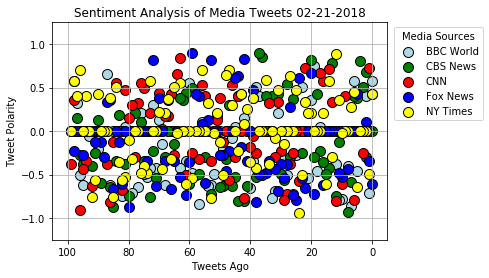
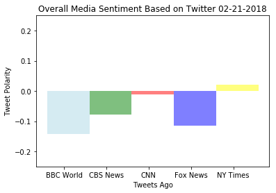

## Analysis
* Trend 1: Scatter plot:  shows a similar trend between the positive and negative tweets with very slight variations for all the news channels.
* Trend 2: Bar Graph: NY Times has the highest positive tweets than all the news channels. 
* Trend 3: Bar Graph: BBC World has the highest negative tweets than all the news channels.

## Performing a sentiment analysis for Twitter activity of various news organizations, extracting csv file and presenting findings visually.


```python
# Dependencies
   
import tweepy
import json
import numpy as np
import pandas as pd
import seaborn as sb
import time
import datetime
import matplotlib.pyplot as plt
from datetime import datetime,tzinfo,timedelta
import csv

# Import and Initialize Sentiment Analyzer
from vaderSentiment.vaderSentiment import SentimentIntensityAnalyzer
analyzer = SentimentIntensityAnalyzer()
```


```python
# Twitter API Keys (please use your keys)
consumer_key = "mymEkFlYejolPocBMz1g1CCau"
consumer_secret = "DgPAuuvCG6Ti4dDQIJSiFbZBH8xOqvYyT3VHM4GWfFCCUGwiZa"
access_token = "17875254-tVtAYqQ1hA8ctMUCgDINRGiPyqt16GffN7MKowAkS"
access_token_secret = "pZekN6xoG3A27MujjSmRishSSEJfa0EFRfDEYPfYiaX67"

# Setup Tweepy API Authentication
auth = tweepy.OAuthHandler(consumer_key, consumer_secret)
auth.set_access_token(access_token, access_token_secret)
api = tweepy.API(auth)
```


```python
# Target User Accounts
target_user = ("@BBCWorld", "@CBSNews", "@CNN", "@FoxNews", "@nytimes")

# Variables for holding sentiments
compound_list = []
positive_list = []
negative_list = []
neutral_list = []

#Other variables for dataframe
user_list = []
converted_timestamps = []
tweet_time_ago = []
tweet_text = []
```


```python
# Target User Accounts
target_user = ("@BBCWorld","@CBSNews", "@CNN", "@FoxNews", "@nytimes")

# Loop through each user
for user in target_user:
    counter = 0
       
    # Loop through 10 pages of tweets (total 100 tweets)
    for page in tweepy.Cursor(api.user_timeline, id=user).pages(100):

        # Get all tweets from home feed
        #public_tweets = api.user_timeline(user)
        page = page[0]
        tweet = json.dumps(page._json, indent=3)
        tweet = json.loads(tweet)
        text = tweet['text']
        raw_time = tweet['created_at']
        
        converted_time = datetime.strptime(raw_time, "%a %b %d %H:%M:%S %z %Y")
        date_stamp = converted_time.strftime("%m-%d-%Y")
        converted_time = converted_time.strftime("%m-%d-%Y %H:%M:%S") 
        
        # Run Vader Analysis on each tweet
        compound = analyzer.polarity_scores(text)["compound"]
        pos = analyzer.polarity_scores(text)["pos"]
        neu = analyzer.polarity_scores(text)["neu"]
        neg = analyzer.polarity_scores(text)["neg"]

        # Add each value to the appropriate array
        user_list.append(user)
        compound_list.append(compound)
        positive_list.append(pos)
        neutral_list.append(neu)
        negative_list.append(neg)
        
        converted_timestamps.append(converted_time)
        tweet_time_ago.append(counter)
        tweet_text.append(text)
              
        counter = counter + 1
        
        if counter % 59 == 0:
            time.sleep(60)
# Add sentiments for each tweet into an array
sentiments = {"User" : user_list,
                "Compound" : compound_list,
                "Positive" : positive_list,
                "Neutral" : neutral_list,
                "Negative" : negative_list,
                "Tweet" : tweet_text,
                "Time Stamp" : converted_timestamps,
                "Tweet_Ago" : tweet_time_ago,
               }

# Print sentiments dict.
print(sentiments)
print("")              
```

    {'User': ['@BBCWorld', '@BBCWorld', '@BBCWorld', '@BBCWorld', '@BBCWorld', '@BBCWorld', '@BBCWorld', '@BBCWorld', '@BBCWorld', '@BBCWorld', '@BBCWorld', '@BBCWorld', '@BBCWorld', '@BBCWorld', '@BBCWorld', '@BBCWorld', '@BBCWorld', '@BBCWorld', '@BBCWorld', '@BBCWorld', '@BBCWorld', '@BBCWorld', '@BBCWorld', '@BBCWorld', '@BBCWorld', '@BBCWorld', '@BBCWorld', '@BBCWorld', '@BBCWorld', '@BBCWorld', '@BBCWorld', '@BBCWorld', '@BBCWorld', '@BBCWorld', '@BBCWorld', '@BBCWorld', '@BBCWorld', '@BBCWorld', '@BBCWorld', '@BBCWorld', '@BBCWorld', '@BBCWorld', '@BBCWorld', '@BBCWorld', '@BBCWorld', '@BBCWorld', '@BBCWorld', '@BBCWorld', '@BBCWorld', '@BBCWorld', '@BBCWorld', '@BBCWorld', '@BBCWorld', '@BBCWorld', '@BBCWorld', '@BBCWorld', '@BBCWorld', '@BBCWorld', '@BBCWorld', '@BBCWorld', '@BBCWorld', '@BBCWorld', '@BBCWorld', '@BBCWorld', '@BBCWorld', '@BBCWorld', '@BBCWorld', '@BBCWorld', '@BBCWorld', '@BBCWorld', '@BBCWorld', '@BBCWorld', '@BBCWorld', '@BBCWorld', '@BBCWorld', '@BBCWorld', '@BBCWorld', '@BBCWorld', '@BBCWorld', '@BBCWorld', '@BBCWorld', '@BBCWorld', '@BBCWorld', '@BBCWorld', '@BBCWorld', '@BBCWorld', '@BBCWorld', '@BBCWorld', '@BBCWorld', '@BBCWorld', '@BBCWorld', '@BBCWorld', '@BBCWorld', '@BBCWorld', '@BBCWorld', '@BBCWorld', '@BBCWorld', '@BBCWorld', '@BBCWorld', '@BBCWorld', '@CBSNews', '@CBSNews', '@CBSNews', '@CBSNews', '@CBSNews', '@CBSNews', '@CBSNews', '@CBSNews', '@CBSNews', '@CBSNews', '@CBSNews', '@CBSNews', '@CBSNews', '@CBSNews', '@CBSNews', '@CBSNews', '@CBSNews', '@CBSNews', '@CBSNews', '@CBSNews', '@CBSNews', '@CBSNews', '@CBSNews', '@CBSNews', '@CBSNews', '@CBSNews', '@CBSNews', '@CBSNews', '@CBSNews', '@CBSNews', '@CBSNews', '@CBSNews', '@CBSNews', '@CBSNews', '@CBSNews', '@CBSNews', '@CBSNews', '@CBSNews', '@CBSNews', '@CBSNews', '@CBSNews', '@CBSNews', '@CBSNews', '@CBSNews', '@CBSNews', '@CBSNews', '@CBSNews', '@CBSNews', '@CBSNews', '@CBSNews', '@CBSNews', '@CBSNews', '@CBSNews', '@CBSNews', '@CBSNews', '@CBSNews', '@CBSNews', '@CBSNews', '@CBSNews', '@CBSNews', '@CBSNews', '@CBSNews', '@CBSNews', '@CBSNews', '@CBSNews', '@CBSNews', '@CBSNews', '@CBSNews', '@CBSNews', '@CBSNews', '@CBSNews', '@CBSNews', '@CBSNews', '@CBSNews', '@CBSNews', '@CBSNews', '@CBSNews', '@CBSNews', '@CBSNews', '@CBSNews', '@CBSNews', '@CBSNews', '@CBSNews', '@CBSNews', '@CBSNews', '@CBSNews', '@CBSNews', '@CBSNews', '@CBSNews', '@CBSNews', '@CBSNews', '@CBSNews', '@CBSNews', '@CBSNews', '@CBSNews', '@CBSNews', '@CBSNews', '@CBSNews', '@CBSNews', '@CBSNews', '@CNN', '@CNN', '@CNN', '@CNN', '@CNN', '@CNN', '@CNN', '@CNN', '@CNN', '@CNN', '@CNN', '@CNN', '@CNN', '@CNN', '@CNN', '@CNN', '@CNN', '@CNN', '@CNN', '@CNN', '@CNN', '@CNN', '@CNN', '@CNN', '@CNN', '@CNN', '@CNN', '@CNN', '@CNN', '@CNN', '@CNN', '@CNN', '@CNN', '@CNN', '@CNN', '@CNN', '@CNN', '@CNN', '@CNN', '@CNN', '@CNN', '@CNN', '@CNN', '@CNN', '@CNN', '@CNN', '@CNN', '@CNN', '@CNN', '@CNN', '@CNN', '@CNN', '@CNN', '@CNN', '@CNN', '@CNN', '@CNN', '@CNN', '@CNN', '@CNN', '@CNN', '@CNN', '@CNN', '@CNN', '@CNN', '@CNN', '@CNN', '@CNN', '@CNN', '@CNN', '@CNN', '@CNN', '@CNN', '@CNN', '@CNN', '@CNN', '@CNN', '@CNN', '@CNN', '@CNN', '@CNN', '@CNN', '@CNN', '@CNN', '@CNN', '@CNN', '@CNN', '@CNN', '@CNN', '@CNN', '@CNN', '@CNN', '@CNN', '@CNN', '@CNN', '@CNN', '@CNN', '@CNN', '@CNN', '@CNN', '@FoxNews', '@FoxNews', '@FoxNews', '@FoxNews', '@FoxNews', '@FoxNews', '@FoxNews', '@FoxNews', '@FoxNews', '@FoxNews', '@FoxNews', '@FoxNews', '@FoxNews', '@FoxNews', '@FoxNews', '@FoxNews', '@FoxNews', '@FoxNews', '@FoxNews', '@FoxNews', '@FoxNews', '@FoxNews', '@FoxNews', '@FoxNews', '@FoxNews', '@FoxNews', '@FoxNews', '@FoxNews', '@FoxNews', '@FoxNews', '@FoxNews', '@FoxNews', '@FoxNews', '@FoxNews', '@FoxNews', '@FoxNews', '@FoxNews', '@FoxNews', '@FoxNews', '@FoxNews', '@FoxNews', '@FoxNews', '@FoxNews', '@FoxNews', '@FoxNews', '@FoxNews', '@FoxNews', '@FoxNews', '@FoxNews', '@FoxNews', '@FoxNews', '@FoxNews', '@FoxNews', '@FoxNews', '@FoxNews', '@FoxNews', '@FoxNews', '@FoxNews', '@FoxNews', '@FoxNews', '@FoxNews', '@FoxNews', '@FoxNews', '@FoxNews', '@FoxNews', '@FoxNews', '@FoxNews', '@FoxNews', '@FoxNews', '@FoxNews', '@FoxNews', '@FoxNews', '@FoxNews', '@FoxNews', '@FoxNews', '@FoxNews', '@FoxNews', '@FoxNews', '@FoxNews', '@FoxNews', '@FoxNews', '@FoxNews', '@FoxNews', '@FoxNews', '@FoxNews', '@FoxNews', '@FoxNews', '@FoxNews', '@FoxNews', '@FoxNews', '@FoxNews', '@FoxNews', '@FoxNews', '@FoxNews', '@FoxNews', '@FoxNews', '@FoxNews', '@FoxNews', '@FoxNews', '@FoxNews', '@nytimes', '@nytimes', '@nytimes', '@nytimes', '@nytimes', '@nytimes', '@nytimes', '@nytimes', '@nytimes', '@nytimes', '@nytimes', '@nytimes', '@nytimes', '@nytimes', '@nytimes', '@nytimes', '@nytimes', '@nytimes', '@nytimes', '@nytimes', '@nytimes', '@nytimes', '@nytimes', '@nytimes', '@nytimes', '@nytimes', '@nytimes', '@nytimes', '@nytimes', '@nytimes', '@nytimes', '@nytimes', '@nytimes', '@nytimes', '@nytimes', '@nytimes', '@nytimes', '@nytimes', '@nytimes', '@nytimes', '@nytimes', '@nytimes', '@nytimes', '@nytimes', '@nytimes', '@nytimes', '@nytimes', '@nytimes', '@nytimes', '@nytimes', '@nytimes', '@nytimes', '@nytimes', '@nytimes', '@nytimes', '@nytimes', '@nytimes', '@nytimes', '@nytimes', '@nytimes', '@nytimes', '@nytimes', '@nytimes', '@nytimes', '@nytimes', '@nytimes', '@nytimes', '@nytimes', '@nytimes', '@nytimes', '@nytimes', '@nytimes', '@nytimes', '@nytimes', '@nytimes', '@nytimes', '@nytimes', '@nytimes', '@nytimes', '@nytimes', '@nytimes', '@nytimes', '@nytimes', '@nytimes', '@nytimes', '@nytimes', '@nytimes', '@nytimes', '@nytimes', '@nytimes', '@nytimes', '@nytimes', '@nytimes', '@nytimes', '@nytimes', '@nytimes', '@nytimes', '@nytimes', '@nytimes', '@nytimes'], 'Compound': [0.5719, -0.7096, 0.4019, 0.0, 0.0, -0.4588, 0.5719, -0.8591, -0.4019, 0.0, -0.7783, -0.7906, -0.3818, 0.0, 0.0, 0.0, 0.0, 0.0516, -0.4588, 0.743, 0.3612, -0.5423, 0.0, 0.5106, 0.0, -0.2732, -0.7184, 0.0, -0.5106, 0.0, -0.296, 0.2023, -0.6908, -0.7717, 0.0, 0.0, 0.0, 0.4019, 0.5106, -0.34, -0.6597, 0.0, 0.1531, 0.0, 0.4019, 0.0516, -0.0772, 0.0, 0.0, -0.2023, 0.0, 0.0, -0.4939, -0.6249, -0.6369, 0.0, 0.1027, -0.8402, -0.5106, -0.4767, 0.5574, -0.34, 0.0, -0.4215, 0.0, 0.0, 0.0, 0.0, -0.6249, -0.1537, 0.128, -0.4215, 0.296, -0.4215, -0.5267, -0.4939, 0.2023, -0.644, 0.0, -0.7088, 0.0, 0.0516, -0.743, 0.0, 0.0, 0.0, -0.6249, 0.6597, 0.0, 0.0, -0.2023, 0.0, 0.0, -0.0572, -0.3875, -0.6249, -0.5106, 0.3182, 0.0, 0.0, 0.0, 0.0, 0.6801, 0.505, 0.8074, 0.3818, 0.4019, -0.5859, -0.9349, 0.0, 0.0, -0.128, -0.743, 0.7783, -0.4215, -0.4939, -0.3612, -0.2263, 0.4215, -0.296, 0.8126, 0.0, 0.0, -0.25, 0.0, 0.0, 0.3724, -0.296, 0.5423, -0.5574, -0.4939, 0.4215, -0.0516, 0.4019, 0.0, 0.4019, 0.8519, 0.8957, -0.5267, 0.3818, 0.0, -0.6369, -0.802, 0.4215, -0.802, -0.5267, -0.6369, 0.296, -0.3182, -0.6369, -0.6486, 0.1779, 0.0, -0.7184, 0.0, -0.296, 0.0, -0.4939, 0.0, 0.4939, -0.6124, 0.4404, 0.3612, 0.3818, 0.0, -0.1531, 0.0, 0.0, -0.296, 0.0258, 0.0, -0.5423, -0.2263, -0.7579, 0.0, -0.34, 0.1027, 0.0, 0.2023, 0.0, -0.743, -0.3818, 0.0, 0.1867, -0.34, -0.8779, -0.6486, 0.0, 0.0, -0.5994, 0.128, -0.25, -0.4023, 0.0, 0.0, -0.3818, -0.2732, 0.1531, 0.5719, 0.0, 0.4215, 0.7269, -0.296, -0.25, 0.0, 0.0, -0.7964, 0.0, 0.0, 0.4019, -0.6131, 0.0, -0.8074, 0.34, 0.7096, 0.0, 0.5719, 0.6705, 0.0, 0.0, 0.0, 0.0, 0.7227, 0.0, -0.5719, 0.0, -0.25, -0.3818, -0.7184, -0.796, -0.2263, 0.34, -0.296, 0.0, 0.3182, 0.0, 0.0, 0.0, -0.25, -0.0516, -0.1779, 0.0, -0.765, 0.0, 0.4019, -0.296, 0.5346, -0.5574, 0.0, -0.128, 0.3818, 0.128, 0.0, -0.34, 0.0, 0.4019, 0.5267, -0.3182, 0.0, -0.25, 0.0, -0.5106, 0.0, 0.8402, 0.6597, -0.2732, 0.4215, 0.1779, 0.1779, 0.0, 0.4404, 0.0, 0.0, 0.2023, 0.0, 0.4939, 0.5574, 0.3252, -0.296, 0.296, 0.1531, 0.4767, -0.6808, 0.0, 0.5574, -0.128, -0.8126, -0.3818, 0.0, 0.0, 0.0, 0.0, -0.6369, 0.0, -0.34, -0.4404, -0.9081, 0.0, 0.3612, -0.3818, -0.6124, -0.34, 0.1027, 0.0, 0.0, 0.4215, 0.0, 0.0, -0.4404, 0.0, -0.5267, -0.4767, 0.0, 0.0, 0.0, 0.0, -0.6249, 0.0, 0.0, -0.7184, 0.6705, 0.0, -0.6597, -0.5423, 0.6124, -0.7964, -0.7351, 0.2732, -0.3818, -0.5423, -0.3818, -0.6908, -0.4404, 0.0, -0.34, -0.4805, -0.5106, -0.4939, -0.8176, 0.4767, 0.0, -0.34, 0.8271, -0.1779, 0.6369, 0.6131, 0.0, -0.2263, -0.4588, -0.2732, -0.2732, 0.0, 0.0, 0.8225, 0.128, -0.5994, 0.0772, 0.4019, 0.4215, 0.8979, -0.3612, -0.7351, 0.0, -0.5267, 0.0, -0.347, -0.6705, 0.3612, -0.347, 0.0, 0.3818, -0.6369, 0.8115, 0.0, -0.347, 0.0, 0.0, 0.0, 0.0, 0.0, -0.875, 0.0, -0.6124, -0.128, 0.0, -0.6705, 0.3612, 0.34, -0.296, -0.128, 0.0, -0.128, 0.0, 0.0, 0.0, -0.2732, 0.0, 0.0, -0.2263, 0.0, 0.4215, -0.4939, 0.0, 0.0, 0.0, -0.6486, 0.4528, 0.2732, 0.0, 0.0, -0.0258, 0.3612, 0.891, -0.296, 0.5719, -0.6124, 0.2023, 0.0, 0.0, 0.0, 0.2023, 0.2023, 0.3291, -0.5106, -0.946, 0.4767, 0.0, 0.6361, 0.0, -0.1531, 0.0, 0.4767, -0.0772, 0.0, -0.3802, 0.5859, 0.0, 0.0, -0.4215, 0.3818, -0.3612, 0.2567, 0.0772, 0.4215, -0.2263, 0.0, 0.296, 0.7003, 0.6486, -0.5106, -0.128, 0.2023, -0.0258, -0.7717, 0.3182, 0.0, 0.7003, 0.0, 0.0, -0.5423, 0.0, -0.6124, 0.0, 0.5574, -0.0258, 0.5106, -0.3182, 0.3716, 0.2111, -0.4404, 0.2235, 0.0, 0.0, 0.5719, -0.4767, -0.4019, -0.4767, 0.0, 0.0, -0.3182, -0.1027, -0.5267, -0.5574, -0.3612, 0.5106, -0.7579, 0.3818, 0.0, 0.0, 0.0, 0.4215, -0.5574, -0.7574, 0.0, 0.4019, 0.0, 0.7003, 0.4019, 0.5719, 0.0], 'Positive': [0.402, 0.144, 0.197, 0.0, 0.0, 0.0, 0.239, 0.0, 0.0, 0.0, 0.0, 0.0, 0.0, 0.0, 0.0, 0.0, 0.0, 0.27, 0.0, 0.378, 0.238, 0.0, 0.0, 0.462, 0.0, 0.0, 0.0, 0.0, 0.27, 0.0, 0.0, 0.184, 0.094, 0.0, 0.0, 0.0, 0.0, 0.278, 0.292, 0.0, 0.0, 0.0, 0.151, 0.0, 0.31, 0.207, 0.197, 0.0, 0.0, 0.0, 0.0, 0.0, 0.0, 0.0, 0.0, 0.0, 0.23, 0.078, 0.0, 0.0, 0.265, 0.0, 0.0, 0.0, 0.0, 0.0, 0.0, 0.0, 0.0, 0.0, 0.315, 0.0, 0.099, 0.178, 0.0, 0.227, 0.13, 0.0, 0.0, 0.0, 0.0, 0.116, 0.0, 0.157, 0.0, 0.0, 0.0, 0.375, 0.0, 0.0, 0.0, 0.0, 0.0, 0.0, 0.0, 0.0, 0.0, 0.219, 0.133, 0.0, 0.0, 0.0, 0.227, 0.211, 0.399, 0.115, 0.114, 0.0, 0.0, 0.0, 0.0, 0.194, 0.129, 0.343, 0.0, 0.0, 0.0, 0.0, 0.226, 0.0, 0.359, 0.0, 0.0, 0.0, 0.0, 0.0, 0.108, 0.0, 0.36, 0.0, 0.0, 0.138, 0.0, 0.13, 0.0, 0.252, 0.316, 0.454, 0.0, 0.205, 0.0, 0.0, 0.145, 0.141, 0.145, 0.0, 0.0, 0.115, 0.051, 0.0, 0.047, 0.133, 0.0, 0.0, 0.0, 0.0, 0.0, 0.0, 0.0, 0.242, 0.0, 0.1, 0.128, 0.12, 0.0, 0.098, 0.0, 0.0, 0.0, 0.068, 0.0, 0.0, 0.0, 0.0, 0.0, 0.0, 0.154, 0.0, 0.136, 0.0, 0.235, 0.0, 0.0, 0.093, 0.0, 0.0, 0.0, 0.0, 0.0, 0.0, 0.154, 0.067, 0.0, 0.0, 0.0, 0.0, 0.0, 0.147, 0.176, 0.0, 0.16, 0.295, 0.0, 0.0, 0.0, 0.0, 0.0, 0.0, 0.0, 0.184, 0.092, 0.0, 0.0, 0.107, 0.315, 0.0, 0.252, 0.244, 0.0, 0.0, 0.0, 0.0, 0.202, 0.0, 0.0, 0.0, 0.068, 0.0, 0.0, 0.0, 0.0, 0.124, 0.0, 0.0, 0.103, 0.0, 0.0, 0.0, 0.132, 0.0, 0.0, 0.0, 0.0, 0.0, 0.137, 0.0, 0.278, 0.0, 0.0, 0.0, 0.12, 0.123, 0.0, 0.0, 0.0, 0.144, 0.145, 0.0, 0.0, 0.216, 0.0, 0.0, 0.0, 0.286, 0.221, 0.087, 0.141, 0.091, 0.091, 0.0, 0.225, 0.0, 0.0, 0.141, 0.0, 0.259, 0.248, 0.109, 0.0, 0.147, 0.147, 0.291, 0.0, 0.0, 0.204, 0.0, 0.0, 0.12, 0.0, 0.0, 0.0, 0.0, 0.0, 0.0, 0.0, 0.0, 0.0, 0.0, 0.227, 0.0, 0.0, 0.0, 0.123, 0.0, 0.0, 0.113, 0.0, 0.0, 0.0, 0.0, 0.0, 0.0, 0.0, 0.0, 0.0, 0.0, 0.0, 0.0, 0.0, 0.0, 0.407, 0.0, 0.106, 0.0, 0.333, 0.0, 0.0, 0.189, 0.0, 0.0, 0.0, 0.0, 0.225, 0.0, 0.0, 0.0, 0.0, 0.0, 0.0, 0.147, 0.0, 0.0, 0.383, 0.158, 0.286, 0.2, 0.0, 0.0, 0.0, 0.0, 0.093, 0.0, 0.0, 0.297, 0.111, 0.0, 0.064, 0.144, 0.313, 0.421, 0.113, 0.0, 0.0, 0.0, 0.0, 0.124, 0.0, 0.116, 0.124, 0.0, 0.157, 0.0, 0.318, 0.0, 0.124, 0.0, 0.0, 0.0, 0.0, 0.0, 0.0, 0.0, 0.0, 0.0, 0.0, 0.0, 0.152, 0.118, 0.0, 0.0, 0.0, 0.0, 0.0, 0.0, 0.0, 0.0, 0.0, 0.0, 0.0, 0.0, 0.157, 0.0, 0.0, 0.0, 0.0, 0.0, 0.148, 0.1, 0.0, 0.0, 0.0, 0.116, 0.379, 0.071, 0.188, 0.0, 0.087, 0.0, 0.0, 0.0, 0.122, 0.087, 0.121, 0.151, 0.0, 0.256, 0.0, 0.259, 0.0, 0.108, 0.0, 0.237, 0.15, 0.0, 0.0, 0.153, 0.0, 0.0, 0.0, 0.178, 0.0, 0.275, 0.115, 0.149, 0.213, 0.0, 0.315, 0.244, 0.238, 0.0, 0.094, 0.152, 0.123, 0.0, 0.223, 0.0, 0.266, 0.0, 0.0, 0.0, 0.0, 0.0, 0.0, 0.261, 0.183, 0.193, 0.0, 0.173, 0.13, 0.0, 0.1, 0.0, 0.0, 0.27, 0.0, 0.0, 0.0, 0.0, 0.0, 0.0, 0.094, 0.0, 0.0, 0.116, 0.148, 0.153, 0.178, 0.0, 0.0, 0.0, 0.125, 0.0, 0.0, 0.0, 0.137, 0.127, 0.234, 0.114, 0.222, 0.0], 'Neutral': [0.598, 0.442, 0.803, 1.0, 1.0, 0.7, 0.761, 0.387, 0.748, 1.0, 0.541, 0.5, 0.776, 1.0, 1.0, 1.0, 1.0, 0.476, 0.727, 0.622, 0.762, 0.667, 1.0, 0.538, 1.0, 0.792, 0.538, 1.0, 0.252, 1.0, 0.732, 0.816, 0.552, 0.511, 1.0, 1.0, 1.0, 0.722, 0.708, 0.676, 0.526, 1.0, 0.849, 1.0, 0.69, 0.603, 0.584, 1.0, 1.0, 0.735, 1.0, 1.0, 0.61, 0.823, 0.679, 1.0, 0.574, 0.39, 0.68, 0.721, 0.735, 0.595, 1.0, 0.763, 1.0, 1.0, 1.0, 1.0, 0.594, 0.833, 0.47, 0.682, 0.901, 0.526, 0.673, 0.303, 0.87, 0.8, 1.0, 0.786, 1.0, 0.775, 0.488, 0.685, 1.0, 1.0, 0.579, 0.625, 1.0, 1.0, 0.816, 1.0, 1.0, 0.942, 0.878, 0.662, 0.708, 0.645, 0.734, 1.0, 1.0, 1.0, 0.773, 0.789, 0.601, 0.885, 0.886, 0.725, 0.515, 1.0, 1.0, 0.632, 0.523, 0.657, 0.811, 0.789, 0.884, 0.909, 0.774, 0.909, 0.641, 1.0, 1.0, 0.875, 1.0, 1.0, 0.892, 0.896, 0.64, 0.841, 0.842, 0.81, 0.909, 0.87, 1.0, 0.748, 0.684, 0.546, 0.784, 0.697, 1.0, 0.698, 0.374, 0.859, 0.374, 0.645, 0.724, 0.885, 0.837, 0.819, 0.723, 0.763, 1.0, 0.75, 1.0, 0.879, 1.0, 0.856, 1.0, 0.758, 0.773, 0.9, 0.872, 0.88, 1.0, 0.781, 1.0, 1.0, 0.885, 0.932, 1.0, 0.837, 0.853, 0.615, 1.0, 0.854, 0.714, 1.0, 0.763, 1.0, 0.282, 0.809, 1.0, 0.907, 0.789, 0.547, 0.719, 1.0, 1.0, 0.83, 0.769, 0.817, 0.891, 1.0, 1.0, 0.729, 0.84, 0.78, 0.824, 1.0, 0.84, 0.705, 0.879, 0.9, 1.0, 1.0, 0.664, 1.0, 1.0, 0.816, 0.612, 1.0, 0.711, 0.893, 0.594, 1.0, 0.748, 0.756, 1.0, 1.0, 1.0, 1.0, 0.798, 1.0, 0.68, 1.0, 0.818, 0.806, 0.667, 0.738, 0.909, 0.876, 0.891, 1.0, 0.897, 1.0, 1.0, 1.0, 0.686, 0.938, 0.918, 1.0, 0.777, 1.0, 0.863, 0.896, 0.576, 0.833, 1.0, 0.919, 0.88, 0.776, 1.0, 0.893, 1.0, 0.856, 0.855, 0.867, 1.0, 0.568, 1.0, 0.837, 1.0, 0.714, 0.779, 0.773, 0.859, 0.909, 0.909, 1.0, 0.775, 1.0, 1.0, 0.859, 1.0, 0.741, 0.68, 0.891, 0.872, 0.756, 0.737, 0.709, 0.588, 1.0, 0.796, 0.909, 0.684, 0.659, 1.0, 1.0, 1.0, 1.0, 0.802, 1.0, 0.789, 0.888, 0.547, 1.0, 0.664, 0.867, 0.571, 0.888, 0.877, 1.0, 1.0, 0.887, 1.0, 1.0, 0.633, 1.0, 0.815, 0.807, 1.0, 1.0, 1.0, 1.0, 0.806, 1.0, 1.0, 0.6, 0.593, 1.0, 0.65, 0.788, 0.667, 0.664, 0.64, 0.811, 0.852, 0.741, 0.776, 0.63, 0.48, 1.0, 0.806, 0.727, 0.784, 0.868, 0.585, 0.853, 1.0, 0.833, 0.617, 0.643, 0.714, 0.8, 1.0, 0.872, 0.778, 0.87, 0.745, 1.0, 1.0, 0.703, 0.889, 0.83, 0.936, 0.856, 0.542, 0.579, 0.711, 0.744, 1.0, 0.761, 1.0, 0.687, 0.757, 0.884, 0.687, 1.0, 0.843, 0.776, 0.682, 1.0, 0.687, 1.0, 1.0, 1.0, 1.0, 1.0, 0.438, 1.0, 0.667, 0.842, 1.0, 0.667, 0.848, 0.882, 0.872, 0.842, 1.0, 0.897, 1.0, 1.0, 1.0, 0.769, 1.0, 1.0, 0.899, 1.0, 0.843, 0.873, 1.0, 1.0, 1.0, 0.739, 0.78, 0.9, 1.0, 1.0, 0.939, 0.884, 0.621, 0.802, 0.812, 0.762, 0.913, 1.0, 1.0, 1.0, 0.878, 0.913, 0.879, 0.504, 0.511, 0.744, 1.0, 0.639, 1.0, 0.753, 1.0, 0.763, 0.648, 1.0, 0.885, 0.847, 1.0, 1.0, 0.823, 0.822, 0.783, 0.541, 0.885, 0.851, 0.542, 1.0, 0.489, 0.756, 0.762, 0.815, 0.785, 0.735, 0.749, 0.729, 0.777, 1.0, 0.734, 1.0, 1.0, 0.759, 1.0, 0.643, 1.0, 0.739, 0.629, 0.807, 0.887, 0.827, 0.87, 0.791, 0.9, 1.0, 1.0, 0.73, 0.846, 0.876, 0.853, 1.0, 1.0, 0.796, 0.792, 0.841, 0.833, 0.664, 0.852, 0.508, 0.822, 1.0, 1.0, 1.0, 0.811, 0.825, 0.724, 1.0, 0.863, 0.746, 0.766, 0.886, 0.778, 1.0], 'Negative': [0.0, 0.414, 0.0, 0.0, 0.0, 0.3, 0.0, 0.613, 0.252, 0.0, 0.459, 0.5, 0.224, 0.0, 0.0, 0.0, 0.0, 0.254, 0.273, 0.0, 0.0, 0.333, 0.0, 0.0, 0.0, 0.208, 0.462, 0.0, 0.478, 0.0, 0.268, 0.0, 0.354, 0.489, 0.0, 0.0, 0.0, 0.0, 0.0, 0.324, 0.474, 0.0, 0.0, 0.0, 0.0, 0.19, 0.219, 0.0, 0.0, 0.265, 0.0, 0.0, 0.39, 0.177, 0.321, 0.0, 0.197, 0.532, 0.32, 0.279, 0.0, 0.405, 0.0, 0.237, 0.0, 0.0, 0.0, 0.0, 0.406, 0.167, 0.215, 0.318, 0.0, 0.296, 0.327, 0.47, 0.0, 0.2, 0.0, 0.214, 0.0, 0.109, 0.512, 0.157, 0.0, 0.0, 0.421, 0.0, 0.0, 0.0, 0.184, 0.0, 0.0, 0.058, 0.122, 0.338, 0.292, 0.135, 0.133, 0.0, 0.0, 0.0, 0.0, 0.0, 0.0, 0.0, 0.0, 0.275, 0.485, 0.0, 0.0, 0.174, 0.348, 0.0, 0.189, 0.211, 0.116, 0.091, 0.0, 0.091, 0.0, 0.0, 0.0, 0.125, 0.0, 0.0, 0.0, 0.104, 0.0, 0.159, 0.158, 0.052, 0.091, 0.0, 0.0, 0.0, 0.0, 0.0, 0.216, 0.098, 0.0, 0.302, 0.481, 0.0, 0.481, 0.355, 0.276, 0.0, 0.112, 0.181, 0.23, 0.104, 0.0, 0.25, 0.0, 0.121, 0.0, 0.144, 0.0, 0.0, 0.227, 0.0, 0.0, 0.0, 0.0, 0.121, 0.0, 0.0, 0.115, 0.0, 0.0, 0.163, 0.147, 0.385, 0.0, 0.146, 0.132, 0.0, 0.102, 0.0, 0.484, 0.191, 0.0, 0.0, 0.211, 0.453, 0.281, 0.0, 0.0, 0.17, 0.077, 0.115, 0.109, 0.0, 0.0, 0.271, 0.16, 0.073, 0.0, 0.0, 0.0, 0.0, 0.121, 0.1, 0.0, 0.0, 0.336, 0.0, 0.0, 0.0, 0.296, 0.0, 0.289, 0.0, 0.091, 0.0, 0.0, 0.0, 0.0, 0.0, 0.0, 0.0, 0.0, 0.0, 0.32, 0.0, 0.114, 0.194, 0.333, 0.262, 0.091, 0.0, 0.109, 0.0, 0.0, 0.0, 0.0, 0.0, 0.181, 0.062, 0.082, 0.0, 0.223, 0.0, 0.0, 0.104, 0.146, 0.167, 0.0, 0.081, 0.0, 0.1, 0.0, 0.107, 0.0, 0.0, 0.0, 0.133, 0.0, 0.216, 0.0, 0.163, 0.0, 0.0, 0.0, 0.14, 0.0, 0.0, 0.0, 0.0, 0.0, 0.0, 0.0, 0.0, 0.0, 0.0, 0.073, 0.0, 0.128, 0.097, 0.116, 0.0, 0.412, 0.0, 0.0, 0.091, 0.316, 0.221, 0.0, 0.0, 0.0, 0.0, 0.198, 0.0, 0.211, 0.112, 0.453, 0.0, 0.109, 0.133, 0.429, 0.112, 0.0, 0.0, 0.0, 0.0, 0.0, 0.0, 0.367, 0.0, 0.185, 0.193, 0.0, 0.0, 0.0, 0.0, 0.194, 0.0, 0.0, 0.4, 0.0, 0.0, 0.244, 0.212, 0.0, 0.336, 0.36, 0.0, 0.148, 0.259, 0.224, 0.37, 0.295, 0.0, 0.194, 0.273, 0.216, 0.132, 0.415, 0.0, 0.0, 0.167, 0.0, 0.199, 0.0, 0.0, 0.0, 0.128, 0.222, 0.13, 0.161, 0.0, 0.0, 0.0, 0.0, 0.17, 0.0, 0.0, 0.145, 0.0, 0.176, 0.256, 0.0, 0.239, 0.0, 0.189, 0.243, 0.0, 0.189, 0.0, 0.0, 0.224, 0.0, 0.0, 0.189, 0.0, 0.0, 0.0, 0.0, 0.0, 0.562, 0.0, 0.333, 0.158, 0.0, 0.333, 0.0, 0.0, 0.128, 0.158, 0.0, 0.103, 0.0, 0.0, 0.0, 0.231, 0.0, 0.0, 0.101, 0.0, 0.0, 0.127, 0.0, 0.0, 0.0, 0.261, 0.072, 0.0, 0.0, 0.0, 0.061, 0.0, 0.0, 0.127, 0.0, 0.238, 0.0, 0.0, 0.0, 0.0, 0.0, 0.0, 0.0, 0.345, 0.489, 0.0, 0.0, 0.102, 0.0, 0.14, 0.0, 0.0, 0.202, 0.0, 0.115, 0.0, 0.0, 0.0, 0.177, 0.0, 0.217, 0.184, 0.0, 0.0, 0.245, 0.0, 0.196, 0.0, 0.0, 0.185, 0.12, 0.113, 0.128, 0.271, 0.0, 0.0, 0.0, 0.0, 0.0, 0.241, 0.0, 0.357, 0.0, 0.0, 0.189, 0.0, 0.113, 0.0, 0.0, 0.209, 0.0, 0.0, 0.0, 0.0, 0.154, 0.124, 0.147, 0.0, 0.0, 0.204, 0.114, 0.159, 0.167, 0.22, 0.0, 0.339, 0.0, 0.0, 0.0, 0.0, 0.064, 0.175, 0.276, 0.0, 0.0, 0.127, 0.0, 0.0, 0.0, 0.0], 'Tweet': ['Chile creates law to protect its ocean habitat https://t.co/3ZV7g76L31', 'Report finds US hospital failed to protect infants from abuse https://t.co/LIp3OEVs07', 'Russian spy: Foreign minister says Russia willing to help in inquiry https://t.co/DGsNyBTzo6', "RT @BBCKarishma: As @POTUS announces he's going to meet NK's Kim Jong Un by May, here's a piece I wrote earlier in the year about why NK ap…", 'RT @bbc5live: “He was a gem"\n\nOscar-winning actress @SusanSarandon tells @AnnaeFoster the late Paul Newman once gave her part of his salary…', 'Saudi lion tamer held after girl attacked https://t.co/DBAnkcdVUT', 'RT @SallyBundockBBC: Morning - getting ready for #BBCTheBriefing. @hare_brain will join me to discuss key issues on #InternationalWomensDay…', 'German far-right terror group members jailed for attacks https://t.co/3ITFKDhYWA', "Terminal illness led to Australia's first same-sex marriage https://t.co/WrPYmBLXE8", 'The girl who sabotaged her own wedding https://t.co/MmfykZHUPl', 'USS Lexington: World War Two aircraft carrier wreck found https://t.co/m8oUxkAjTc', "Syria war: 'Chlorine attack' on besieged Eastern Ghouta https://t.co/51skSNZBah", "Afrin: What is going on in Syria's other battle? https://t.co/WfZ9BlFlGb", "Germany's gender-neutral anthem alternative met with resistance https://t.co/BhdKDBZk0Y", 'Oscars 2018: who or what is an inclusion rider? https://t.co/X6yeKs9cBs', 'China NPC: Government sets trillion yuan military budget https://t.co/ZSNSJr3hdc', 'US aircraft carrier Carl Vinson in historic Vietnam visit https://t.co/jbXTXKiWVu', 'Jailed school shooter praises Florida student activists https://t.co/P1QSGZ5XPQ', 'President Trump mocks Jared Kushner at annual dinner https://t.co/tSgKviwO3G', "Ice skaters enjoy frozen canals in the Netherlands thanks to Europe's big freeze ⛸️ https://t.co/uk6dVR6Vby", 'The news that made us smile this week https://t.co/GGxUYrfQW1', 'Deadly avalanche in French Alps kills four https://t.co/wZA9b9IgAP', "Swimmer, 99, 'breaks world record' in Australia https://t.co/1SFOYTlvZo", "Russia describes reach of 'invincible missile' https://t.co/498tanvs0H", 'Bill Gates says crypto-currencies cause deaths https://t.co/hCUlA2vJWh', 'Pesticides put bees at risk, European watchdog confirms https://t.co/cobUEo4arS', 'Iran wrestling officials resign over Israel competition ban https://t.co/oxL8QRgHBU', 'Taliban offer: Afghan President Ashraf Ghani seeks talks https://t.co/ms1ubllKbE', "'Euphoria killing' women jailed in Australia https://t.co/G6GXm4eUgS", 'Antony Wong: Hong Kong actor on looking for his father https://t.co/D8E0DAlEWe', 'US cuts Cambodia aid over crackdown https://t.co/V3F87DEohz', "Top Australian police officer quits over 'racist' comments https://t.co/JpCrpQ8mM2", 'How do you escape an abusive relationship when no one will listen? https://t.co/VCjGKxVkUk', 'Slovakia shocked by killing of journalist and partner https://t.co/c6nn7sDJ6i', "Turkey's Erdogan in row over 'girl martyr' comment on TV https://t.co/i6VBQcKAA6", 'Rare photographs that changed lives https://t.co/2RKLbWNU5A', "N Korea 'willing to hold US talks' https://t.co/MDdTSX8PRM", 'Trump tax reform gives Buffett $29bn boost https://t.co/OS1U3wO4Gp', 'Africans at the Winter Olympics: Inspirational - or glory-hunters? https://t.co/XvJOxK20wI', 'Doping whistleblower in Olympics warning https://t.co/oQ71feb6zr', "Armed teacher's fear? 'Missing and hitting a student' https://t.co/7WUEA5uESi", "Florida armed school guard 'never went in' https://t.co/ZflbbA87pm", 'Justin Trudeau rescinds India dinner invite to Sikh separatist https://t.co/NrPcP0M41O', "Don't look down! 😣\n\nWorld's longest glass bridge visited by thousands in China every day https://t.co/AJvHVZga2h", "Justin Trudeau's 'Bollywood' wardrobe amuses Indians https://t.co/gAc8JxXSRl", 'Trump endorses guns for teachers to stop shootings https://t.co/iyweXTRjyk', 'Pakistani ex-PM Nawaz Sharif banned from leading his party https://t.co/DFYafdRA3V', "FaceTime chat 'saves woman's life' https://t.co/9gnHAYsLJY", 'Face to face with a crocodile while collecting its eggs https://t.co/6ImZUCozBu', 'Lawyer charged in Trump-Russia inquiry https://t.co/zl4YqL8u2V', 'The Russian guns for hire dying in Syria https://t.co/UXXWonhlVb', 'Mexico investigates disappearance of three Italians https://t.co/tPU6TO1NqQ', 'Deadly rubbish collapse in Mozambique https://t.co/ut8Tp68bqV', "RT @BBCSport: It was skater Gabriella Papadakis 'worst nightmare at the Olympics' when her dress came undone mid-performance. \n\n⛸👉 https://…", 'Winter Olympics: Alexander Krushelnitsky named as Russian suspected of failed doping test https://t.co/tWCSJdut5X', 'Giant pandas perform roly-polys in the snow as they go on show for the first time at a Finland zoo. 🐼🐼❄️ https://t.co/D9t0aTCxWe', 'Grace Mugabe PhD: Arrest made over corruption allegations https://t.co/f6d8GvGOHj', "Pakistan: Zainab Ansari's killer gets four death sentences https://t.co/11NIeG9BRU", 'FBI failed to act on gunman concerns https://t.co/Zu6uQsTtMt', 'New York ex-teacher and twin arrested for bomb-making https://t.co/oo2n3TcO7c', 'Chinese New Year food: How to get rich tossing fish https://t.co/IfD86WOudo', 'Florida shooting: Trump warns against inaction https://t.co/s7C503TyWn', 'Chinese woman joins handbag in X-ray machine https://t.co/KfzGsgZqBl', "'Guns and survivalists, but no school until I was 17' https://t.co/nYGLPJuywa", 'Maldives opposition MPs forcibly moved from parliament https://t.co/k2wPGY8vwk', "Maid left to 'sleep outside with dog' dies https://t.co/RH2owukj29", 'European Union grows at fastest pace for 10 years https://t.co/c0NWvVodc9', "World chess body accounts closed over president's Syria sanctions https://t.co/QkqnXiTXNV", "Cape Town drought declared a 'national disaster' https://t.co/MnTXt0cPM1", "Being a surrogate in Ukraine is 'not without risk' https://t.co/rE2rKbv9Y6", "Australia's apology to Stolen Generations: 'It gave me peace' https://t.co/RbqtrCpxmS", 'Baltimore police guilty of robbing citizens https://t.co/tAiWA0bo79', '"This is the week for decision time" - Mary Lou McDonald, Leader of Sinn Féin on talks to restore Northern Ireland\'… https://t.co/SRH2sw2pO3', "Indian woman killed by 'celebratory gunshots' at wedding party https://t.co/7iRakUbls6", "Inside the world of extreme 'terror pranking' https://t.co/CCq7PXnHjU", 'Grand Canyon helicopter crash kills three https://t.co/B4TJFhJuHu', 'Saudi women should not have to wear long robes, top cleric says https://t.co/NCjqURfanM', 'RT @BBCNorthAmerica: President Trump is constantly talking about the US trade deficit. \nBut what is it? And should we be worried about it?…', 'RT @BBCSport: The moment the Olympic rings came together... incredible!\n#bbcolympics #openingceremony #WinterOlympics2018 https://t.co/KnRs…', 'RT @BBCSport: From Rio to Pyeongchang... \n\nThe climate may change, but Pita Taufatofua remains the same! \n\n#bbcolympics #openingceremony #w…', 'Jarrod Bannister: Commonwealth Games javelin gold medallist dies https://t.co/BEwS4kcHkK', 'RT @BBCBreaking: US Dow Jones index slumps 1,000 points for second time in a week, amid worries over inflation and interest rates https://t…', 'French minister Nicolas Hulot denies harassment allegations https://t.co/YvYstxt7S3', 'Made-up to look beautiful, sent out to die.\n\nThe young women sent into crowds to blow themselves up… https://t.co/3X8IhCakLr', "North Korea's athletes at the Winter Olympics https://t.co/0E52AoPHv8", 'EU migration chief hits out at ‘sick minds’ over Greece bribery probe https://t.co/oIEnUGTzEy', "Poland Holocaust law: France criticises 'ill advised' text https://t.co/CyR8VnFUsm", 'The plastic bottle scheme that could help clean the oceans https://t.co/Y1thK516q8', '100 Women: Does being called Emmeline change your life? https://t.co/mG56QSuPjh', 'Taiwan eyewitness caught in aftershock live on TV https://t.co/JzYfus2oj0', "Poland President Duda 'will sign' controversial Holocaust bill https://t.co/tDQLz5vSCV", 'The extraordinary healing powers of music 🎶 https://t.co/t3lJYsHPOr', 'John Mahoney: British-born Frasier actor dies aged 77 https://t.co/qbbOuDNyv9', "RT @BBC_HaveYourSay: Doritos to launch 'lady-friendly' crisps because women don't want to crunch loudly in public or lick their fingers, ap…", '"The reason I\'ve gone through this ordeal is not just to save myself....but it\'s to set a precedent."  Alleged comp… https://t.co/NwpTFvmKXx', 'Salah Abdeslam: Paris attacks suspect to go on trial in Belgium https://t.co/ny0QZPuaxD', 'US police officer run over by car thieves https://t.co/wPQUrI1Ziv', 'US House Speaker Paul Ryan deletes $1.50 tax cut gain tweet https://t.co/RgxHuHhTHU', 'Thousands of hidden Mayan ruins have been uncovered, thanks to technology that some archaeologists describe as "mag… https://t.co/93B6SlSHOo', 'Temptations singer Dennis Edwards dies aged 74 https://t.co/KDb7akGkqW', 'Senator Marco Rubio says there are preconditions for Trump summit with Kim Jong Un https://t.co/FEzAzKlJfo https://t.co/cU7AdJHajk', '"Monster" 197-pound cougar captured by Washington state biologists https://t.co/2sx6UyVqAr https://t.co/S8ADTFPTAT', '"The fundamentals are very strong right now in our economy." The economy created 313,000 jobs last month, and the u… https://t.co/jKdxgxwpfH', 'Q: Why did the president accept this invitation without any preconditions? For example, without demanding the North… https://t.co/WRdRsKowre', 'These emperor penguins found a camera in Antarctica and snapped a pretty great "selfie."🐧 📷 https://t.co/NbbULUIIJY', 'RT @CBSThisMorning: Florida Senator @MarcoRubio says the "fundamental question is whether or not Kim Jong-un will ever accept not having nu…', "House Intel Committee's plan to build a physical wall to separate the staffs of the two parties has been put on hol… https://t.co/wVkPQCWOdO", 'Mark Cuban sexual assault allegations being reviewed by NBA https://t.co/nE7OwSAw8i https://t.co/z6JQNOzazb', 'Therapist testifies New York City nanny wasn’t suicidal or murderous days before killings of two children.… https://t.co/Z7yRsz3Lke', '@CBSNews\xa0.@jillonmoney on new steel &amp; aluminum tariffs: "If you work for a steel or an aluminum producer, it\'s prob… https://t.co/DpijwsH8Kr', 'President Trump will sign proclamations that will institute a 25 percent tariff on steel and a 10 percent tariff on… https://t.co/1x53iEhFv1', '"There\'s a good chance I get murdered tonight," one Twitter user wrote after his Alexa let out an unprovoked, eerie… https://t.co/64rbNb301O', '“Tariffs always hurt us. Ultimately nobody ever wins a trade war. Both sides lose a trade war...We need more trade,… https://t.co/m2XsX5zM2V', 'Powerball winning numbers announced for $348 million jackpot. And the winning numbers are... https://t.co/mkkhnhcVY6 https://t.co/nHzxWZJAat', 'Oprah Winfrey explores revolutionary approach to childhood trauma for "60 Minutes" https://t.co/wgyDlQJQoE https://t.co/CPN5nZAkJm', 'Unattended bag prompts bomb squad response at Houston airport, police say https://t.co/MnwmXIh15y https://t.co/2yzoC7P5gN', "As nor'easter strikes -- potentially dropping more than a foot of snow in some places -- whiteout conditions make d… https://t.co/dX0mUDvtO8", 'California Gov. Jerry Brown responds to federal immigration lawsuit against the state: "I do think this is pure red… https://t.co/h89fmElU6i', '“Let’s be clear, I think to say ‘arming teachers’ — is an oversimplification and a mischaracterization,” Education… https://t.co/tRm6UOCvWC', 'Tens of millions of people in the east are dealing with the second big storm in a week. Winter storm warnings are a… https://t.co/kvc0UxgGfZ', 'A new GOP effort to dismantle Obama-era financial regulations is gaining traction --\nthanks to support from Democra… https://t.co/8D8nbdMAuB', 'Prosecutor: Mom returned to work after 8-year-old son shot sister, 4 https://t.co/QHqxZP3eMD https://t.co/QGdJQ5Aodv', "RT @CBSEveningNews: NOW: @CBSEveningNews with @JeffGlor airs in its entirety on CBSN, @CBSNews' 24/7 streaming news service https://t.co/Me…", "The president's chief economic adviser, Gary Cohn, resigned. @nancycordes has more on the @CBSEveningNews.… https://t.co/CtnznV4iy0", 'MOMENTS AGO: President Trump speaks on possible talks with North Korea https://t.co/71XSXGktQj https://t.co/f4weComftB', '"We think the proper approach is a more surgical approach, so we do not have unintended consequences," House Speake… https://t.co/hYue9ryP4T', "“The question that we should be asking is not 'What’s wrong with that child,' it’s 'What happened to that child?' A… https://t.co/OYHEN5rEHY", 'West Virginia teachers will surround the state capitol again this morning to put pressure on lawmakers to raise the… https://t.co/qcsbJqwwFa', 'Special counsel subpoenas documents regarding Trump, top advisers https://t.co/YzlsOvHNEy https://t.co/VcL7y9S32O', 'Authorities in northern Illinois say a college professor and his two sons are those who died in an apparent murder-… https://t.co/80z7YrS7My', 'A passenger tried to open the door of a plane in flight today. @krisvancleave reports on the mid-air scare. https://t.co/Oxwhx2PuIw', '"We believe Gov. Scott\'s proposals demonstrate good movement toward the goal of preventing future acts of school vi… https://t.co/R5BA0IYb2N', 'Harvard professor placed on leave following series of sexual misconduct allegations https://t.co/qYkKP9ajkL https://t.co/ElMl33uftS', 'Special Counsel Robert Mueller reported has what @axios calls a “hit list” of people who communicated with one witn… https://t.co/9kBN5zMMLj', "Ahead on @cbsthismorning, @etnow's @KevinFrazier discusses last night's 90th Academy Awards--winners, highlights, a… https://t.co/EpfmIKZcrs", 'Oscars 2018: Stars voice support for immigrants https://t.co/YYOHfPWPDH https://t.co/muIygygiJE', 'RT @CBSThisMorning: With this win, James Ivory (#CallMeByYourName) just became the oldest Oscar winner ever at 89.\n#Oscars-- @ErikDavis htt…', 'Sam Rockwell wins best actor in a supporting role for "Three Billboards outside Ebbing, Missouri. #Oscars… https://t.co/g5kxxhWKke', "North Korea says President Trump's demand that it abandon its nuclear program as a precondition to diplomatic negot… https://t.co/iXsvrUoT5k", '"Nobody does self-deprecating humor better than I do. It\'s not even close," Pres. Trump puts aside feud with the me… https://t.co/RlQidLI95L', 'Carl Icahn unloaded millions in steel-related stock days before Trump tariff https://t.co/sqVKXhzyBp https://t.co/y9Za2EAbCW', 'Kansas man wrongfully imprisoned for 23 years receives no compensation from state https://t.co/EMImOMwjLw https://t.co/MlRtyWUnUx', 'Friends defend Joshua Tree couple accused of child cruelty, abuse https://t.co/ZiOBcfgCkF https://t.co/6GtIgdRlmJ', "Northeast coast braced for more flooding during high tides Saturday, as powerful nor'easter that inundated roads, s… https://t.co/HZL0cy7wt1", 'Friends defend Joshua Tree couple accused of child cruelty, abuse https://t.co/ggSgbhZQ0o https://t.co/R8QaSnXaYi', 'Disneyland workers struggle with low wages and homelessness https://t.co/IekdzAi5Q2 https://t.co/eYMwH6k8cV', 'First male athlete sues Larry Nassar over alleged sexual abuse https://t.co/PIOfLR22YO https://t.co/cZCpMA6fWG', "Media-savvy Stoneman Douglas students in broadcast journalism class share what they've sworn off in wake of shootin… https://t.co/uWWkprtUYi", 'Outspoken Florida sheriff on defensive as he takes heat from Republicans, gun rights activists who believe he is fo… https://t.co/YLM8RUzdy0', 'JUST IN: Two people have been fatally shot at Central Michigan University, campus police say; deceased are not stud… https://t.co/eQYAHchzcQ', 'As the assault on Eastern Ghouta continues, the Syrian army, backed by Russian airstrikes aimed at rebel forces, sa… https://t.co/gkyOvwPql0', "A major Nor'easter is starting to slam the East Coast with heavy rain, some heavy snow, strong winds and the prospe… https://t.co/TsgJJbgK90", 'Did Melania Trump really qualify for her "Einstein visa"? https://t.co/SwVJpgR8Jn https://t.co/Tqr3MTekeA', "@CBSNews\xa0In follow up question, if gun ban should be looked as case-by-case basis depending on state, O'Malley said… https://t.co/8VII1bXMHO", "Your Facebook news feed won't be splitting up after all. The social network ended a test in six countries that show… https://t.co/TSF5JuLZFY", 'NEW: President Trump announces that his administration will impose aluminum and steel tariffs beginning next week… https://t.co/9lTG3DwyDn', 'New information emerges on teen who attempted to assassinate Queen Elizabeth II during her 1981 visit to New Zealan… https://t.co/HWc1Kb0ZF7', 'A woman jailed in Thailand for offering sex lessons without a work permit says she has a story to tell involving th… https://t.co/Tm5r6CdkqA', 'Guns and Congress: The proposals lawmakers are talking about\nhttps://t.co/PwW4CzfLjc https://t.co/eCGiBNYz5I', 'Hundreds gather at church for blessing ceremony featuring AR-15s https://t.co/91mW8gFRnk https://t.co/6F7zGHsCZ1', 'The political battle over sanctuary cities has exploded into a public feud between the head of Immigration and Cust… https://t.co/IH00hYonIP', 'RT @markknoller: Hope Hicks now joins a long list of senior WH officials in the Trump WH to call it quits or be shown the door. Includes Fl…', 'Denver mayor publicly apologizes for "unprofessional" text messages he sent to a woman who once served as a member… https://t.co/mvbOJpCnxA', 'U.S. economic growth was revised down slightly to a still-solid 2.5% rate in the final three months of last year.… https://t.co/BKNyXLJxQp', 'Students &amp; teachers from Stoneman Douglas High School are returning to class today for the first time since 17 peop… https://t.co/JgQLRMrhtd', 'ICE announces more than 150 people arrested since the weekend in the greater San Francisco Bay Area, who they say w… https://t.co/QdnZKrBmJT', 'Virginia couple finds WWII-era explosive device inside wall https://t.co/z2b8YqjMHh https://t.co/9iT8Udkspy', 'Students will return to class at Marjory Stoneman Douglas High School Wednesday for the first time since the deadly… https://t.co/g0RtWRbxMq', 'NEW: Swastikas were found on ammunition magazines used by Florida school shooting suspect Nikolas Cruz, sources con… https://t.co/9PUZ23fFRF', 'Boeing and President Trump reach $3.9 billion deal on new Air Force One planes https://t.co/wpNFn2NSrL https://t.co/jHv3YpDv8S', 'Judge Roy Moore endorsing Courtland Sykes, Missouri candidate who slammed feminists https://t.co/vW6x9Occon https://t.co/ZS54NhcHQt', 'A former stylist for Ryan Seacrest is detailing sexual harassment allegations against him for the first time. In an… https://t.co/2UXV9HfCi9', 'Pennsylvania school cancels classes over nearby church ceremony featuring AR-15s https://t.co/0w4jY02rAu https://t.co/eg2oNvBvh9', 'No bond for suspect in "vicious, unprovoked" attack on aspiring doctor in library https://t.co/LA4qwHRwus https://t.co/RDAmXDUf1s', 'David Martin reports on a video captured by National Geographic cameraman that shows Sgt. La David Johnson, one of… https://t.co/Ec3JdFXGTA', 'WATCH LIVE: @PressSec Sarah Huckabee Sanders holds White House briefing amid gun control debate… https://t.co/Jz6GWZvdHZ', 'WATCH: President Trump meets with U.S. governors; addresses school safety and gun control measures… https://t.co/tXfmxDIgxD', 'RT @CBSSports: Introducing CBS Sports HQ, a New 24/7 Direct-to-Consumer Streaming Network for Sports News, Highlights, &amp; Analysis.\n\nStream…', 'Here are three things you should know this morning:\n1⃣WH visit with Mexican president derailed\n2⃣Public to honor Re… https://t.co/k07CJ4lJV7', "Rev. Billy Graham's body makes journey from mountains to Charlotte https://t.co/KhvROLOfIm https://t.co/Fos4rAH8DO", 'GOP congressman optimistic Trump could support assault weapons ban https://t.co/T7TgxNfanQ https://t.co/mR49J3mrXW', "One man's fight to raise awareness about HPV in men https://t.co/hRYUf0BLK2 https://t.co/6YEDJcSJZb", 'Michelle Obama\'s memoir "Becoming," one of the most highly anticipated books in recent years, is coming out Nov. 13… https://t.co/rJjh2NGYCJ', "RT @FaceTheNation: Today on @FaceTheNation with @margbrennan we talk to @RepTedDeutch, @RepBrianMast, and @AsaHutchinson. Don't miss it! ht…", 'Massachusetts transportation bosses under fire for $100K bathroom https://t.co/PBoc18Nvaq https://t.co/ltrFHRSABF', 'Police charge landscaper with 6th murder in Toronto serial killing case https://t.co/6nlcN5UMl2 https://t.co/hINkoU6fhM', 'Nanette Fabray, Tony and Emmy Award-winning actress, dead at 97 https://t.co/Flv2W407Dp https://t.co/f8OiubczAy', 'Rep. Adam Schiff’s statement on releasing Democratic memo: “The Democratic response memo released today should put… https://t.co/0Z7j3AzrWq', 'Teachers and faculty returned to Marjory Stoneman Douglas High School on Friday, the first time they were back at t… https://t.co/9pm9mHe8UC', 'To address the rising epidemic of opioid overdose deaths, advocates are taking a page from the war on "Big Tobacco"… https://t.co/KrrDtwnefO', 'A growing number of businesses are cutting ties with the NRA:\n-MetLife\n-Symantec\n-car rental companies National, En… https://t.co/yNuKAoG059', 'Turnbull on Australia gun laws: "It is a completely different context historically, legally, and so forth. We are v… https://t.co/MA2IzCETSd', '"We can\'t trust the federal process, which is why we have to make these changes here in Florida," FL Gov. Rick Scot… https://t.co/pdxKacOswk', "Florida school sheriff's deputy was allegedly aware of shooting suspect's behavior:\nhttps://t.co/t9FAx7sopR https://t.co/bv76fRMxco", 'Teachers returned to Marjory Stoneman Douglas High School on Friday morning, more than a week after the deadliest s… https://t.co/utH2GC0Omm', "Facebook's younger users are abandoning ship https://t.co/nH7rAycyk2 https://t.co/pIV6vHNWHC", 'Could California drought restrictions slash water rights? Some think so https://t.co/kcOZPa66pE https://t.co/6LCkWVHCZF', "Broward County sheriff said an armed security officer in Parkland had a chance to stop last week's shooting but did… https://t.co/YHyfk5WY57", '"Our view is that most of our policies will create growth on the supply side in the economy. When the supply side g… https://t.co/aaNe6wKeBl', 'Vice President Mike Pence on White House meeting with mass shooting survivors: "As the president said, we will neve… https://t.co/tGHrbbQpzL', 'RT @CNNTonight: Former Republican congressman David Jolly: "It is an optimistic moment to see a governor take on the NRA, ... but realistic…', 'Concerns in Washington are growing amid reports that China is poised to gain control of a major commercial port on… https://t.co/QikJejHO3n', 'Volkswagen says it will stop using coal to power its main factory in Wolfsburg, Germany https://t.co/l6CeSbpDhr https://t.co/ltRCY3UoSb', 'A North Carolina police officer who resigned after a body camera video showed him hitting and using a Taser on a ma… https://t.co/bWATDIktOR', 'US President Trump will travel to Peru next month where he will attend the Summit of the Americas, according to a W… https://t.co/FHfnzjY1Uc', 'Of the 313,000 jobs that were added last month, 92,000 were in the construction and manufacturing sectors. Another… https://t.co/I9JcaysfdY', 'A North Carolina police officer is facing charges after body camera footage shows him beating, choking and tasing a… https://t.co/s2dA3HoNU6', 'When a shooting erupted at Marjory Stoneman Douglas High School in Parkland, Florida, the first thing some students… https://t.co/ItrLEm75xn', 'Barack Obama might appear on-camera as the moderator of a new series on Netflix. Or he might stay off-camera as a p… https://t.co/AEPZ8tTdH8', "Yes, Stormy Daniels is a real issue | Analysis by CNN's Gregory Krieg https://t.co/JNeSUMMazM https://t.co/QgAxQAGmgT", 'The US is not effectively countering the Russia cyber threat, a top general says https://t.co/chJ4SMLuIA https://t.co/TmIWVg1HIt', 'Discovery just bought Scripps Networks. Now what? Global expansion, a possible new streaming service, and an eye on… https://t.co/4r3R8KnGxN', 'Anthony C. Acevedo, an Army medic who documented the horrors inside a Nazi slave camp, has died at age 93… https://t.co/EOy6EmoBju', 'President Trump will meet with North Korean leader Kim Jong Un by May, the South Korean national security adviser a… https://t.co/BOB4kIaOiW', 'With America facing a massive nursing shortage, some hospitals are offering five-figure signing bonuses, free housi… https://t.co/tyTDsUsOOk', 'President Trump on NAFTA: “We either make a deal or we terminate. And if we do, there won’t be any tariffs on Canad… https://t.co/uzvHjesQ6E', "McDonald's is celebrating #InternationalWomensDay by flipping its famous golden arches https://t.co/biYp1ZduyT https://t.co/H8MMkU7HOL", '@theashleygraham @Caitlyn_Jenner "The one thing I would do to improve gender equality is to ensure that all of our… https://t.co/H3dJOKwSNc', 'A White House taken by storm(y) | Analysis by @StCollinson https://t.co/LwbPnJtJuX https://t.co/JmvyB9DlGq', 'On #InternationalWomensDay, CNN wants to know what living #AsEquals means to you. Tell us by filling out this form:… https://t.co/EbGAjhIJUB', 'The creator of Pepe the Frog, the once-innocent cartoon that was appropriated as a mascot of the alt-right, is suin… https://t.co/lE9S9Fhuce', "Broadcom has a message for US regulators: We'll make 5G technology a priority and invest in America if you let our… https://t.co/IOdiWZ5Ysy", 'Texas could make history by sending not just one\xa0— but two — Hispanic women to Congress. These candidates won in sa… https://t.co/GURwBN72SK', 'Gary Cohn is the latest Goldman Sachs alum to ill-serve America | By Jeffrey Sachs via @CNNOpinion… https://t.co/sCOG7DS0vu', 'London risks losing its role as banker to the world https://t.co/r9NyVAliop https://t.co/IwyLoegB4G', '"We expect that the President will sign something by the end of the week," says White House press secretary Sarah S… https://t.co/5v0uLbEil5', 'Chris Cuomo asks Sen. Ted Cruz why he’s criticizing his Democratic challenger Beto O’Rourke for going by the childh… https://t.co/SY0Wjd9AlG', "A 20-year-old man has filed a lawsuit against Dick's Sporting Goods, accusing the retailer of age discrimination fo… https://t.co/3G5sWzM1iT", "In Trump's White House, the conflict is the chaos | Analysis by @zbyronwolf\xa0https://t.co/nIOVMxFu6W https://t.co/UhglhCrQSx", 'At least 78 people have died in Nigeria with hundreds more infected in an outbreak of Lassa fever, the Nigeria Cent… https://t.co/itaVcs8lvo', 'Britain\'s Boris Johnson says the UK would respond "robustly" if Russia is found to be behind the suspected poisonin… https://t.co/AMIiaud1IO', "Senate Democrats ask EPA Administrator Scott Pruitt for answers over a member of his security detail's business tie… https://t.co/6ps6xYHdXX", 'Rep. Charlie Dent on Gary Cohn\'s resignation: "There\'s been unusually high turnover (in the White House). ... I thi… https://t.co/9HuQ65bsbU', 'The Trump administration has quietly said it will consider big game trophy imports on a "case-by-case" basis… https://t.co/hjvWoPTtSI', "McDonald's announces that Quarter Pounders in every US store except for ones in Hawaii and Alaska will have fresh b… https://t.co/5rfcYlY9ZK", 'Facebook robots may one day follow you around at home https://t.co/uWWZFu26gw https://t.co/5K5Assr8py', 'Barbie unveils dolls based on real-life figures including Amelia Earhart, Frida Kahlo, Katherine Johnson and Chloe… https://t.co/gMBXbVY75Z', 'Meet the CryptoKitties, a species of blockchain-based digital cat that you can now buy and trade with cryptocurrenc… https://t.co/yXRwVH3N3H', 'Yes, Mr. President, there is total chaos in your White House | Analysis by @CillizzaCNN https://t.co/OgZSfbwg6m https://t.co/XyeoSMEHH8', 'Now that President Trump is officially running for re-election, federal workers will need to leave their Make Ameri… https://t.co/xhyGgyZkop', '"Italy\'s elections may have ended in a political deadlock ... but the projected results of the vote signal that swe… https://t.co/zCyp5txaPb', '"I can\'t reconcile anything he said. What he did here today was impugn his own credibility." Former Trump White Hou… https://t.co/uSHDBnMJ52', '"I\'m not going to be sent to prison. ... Do you think Robert Mueller is going to send me to prison, Erin, for this?… https://t.co/HmS7C5PhX1', 'The Trump administration continues to review a report from the Department of Veterans Affairs inspector general tha… https://t.co/T6BTfUfVAd', 'Former Trump aide Sam Nunberg on the special counsel’s investigation: “They know something on [Donald Trump] … I do… https://t.co/POqOwdrauM', "President Trump wants to impose a 25% tariff on steel imports and a 10% tariff on aluminum imports. Here's what tha… https://t.co/jrX4ZshL9z", "As the dust settles on Italy's election, there are clear winners and losers, but no clear outcome after a campaign… https://t.co/Nl5LQbvxhQ", 'Senators are considering a bill that would, among other things, ban bump stocks, raise the minimum age to purchase… https://t.co/JjnQxt5Cuo', 'A high-ranking South Korean delegation headed to North Korea on Monday, where they will raise the possibility of ta… https://t.co/O5ttCjMsXl', "China's parliament session: Xi Jinping to dominate this year's proceedings as delegates are expected to rubber stam… https://t.co/fWhZ7hqN6c", 'The Chinese government announces economic growth target of 6.5% -- several notches below the 6.9% rate at which the… https://t.co/FvZDmwC10t', 'Polls have closed in Italian parliamentary elections, with the first exit polls showing no party has received more… https://t.co/LKs9k5C6aZ', '"We have some record nominations this year for the black community, but the fact that we are still talking about fi… https://t.co/d7lO09zxWM', 'Looking for a new podcast? All six episodes of CNN\'s "Patty Has a Gun: The Life and Crimes of Patricia Hearst" are… https://t.co/v7q85TVeXA', 'A day after the President called Alec Baldwin\'s impersonation of him "terrible," Baldwin\'s Trump returned to Saturd… https://t.co/drwcoDM7iE', "Members of Germany's Social Democratic Party have voted to renew a coalition with Chancellor Angela Merkel's Christ… https://t.co/WQVCWXttFJ", "President Trump praises Chinese leader Xi Jinping's power grab. “He’s now president for life. He was able to do tha… https://t.co/WxuKxpre9x", 'Senate Minority Leader Chuck Schumer defends voting against white judicial nominee, citing "lack of diversity"… https://t.co/PKQ1Et7Y2f', 'President Trump has spent 100 days in office at one of his golf clubs https://t.co/OzeOSZk0tp https://t.co/JYbgygjCNE', '"Westworld" star shares her story of sexual assault in emotional testimony https://t.co/OVIefToatn https://t.co/ydBdikZZP4', 'Chief of staff John Kelly says the White House\'s handling of classified material "wasn\'t up to the standards" he wa… https://t.co/20EULjKms3', 'Wilbur Ross thinks the outcry about steel and aluminum tariffs are "a lot to do about nothing." https://t.co/Rc8wSfMkGW', "■ More than 2,000 flights are canceled\n■ 80 million people\xa0are in the storm's path\n■ The cold front stretches 2,500… https://t.co/NWyAsOGXQ2", 'Today’s a day to celebrate\n\nThe work of someone gone but great.\n\nCome on now, don’t be obtuse,\n\nLet’s all give than… https://t.co/tewvW0ePBP', "Actress Jennifer Lawrence says she's going to spend a year away from movie sets to help get young people engaged wi… https://t.co/vzLTMF03J3", 'The Treasury Department moved to block a university from releasing footage of hecklers during an interview with Sec… https://t.co/JQ5G7hyJt2', "In 2013, Antoinette Tuff saved an elementary school from a gunman. Here's what she thinks about arming teachers.… https://t.co/CMhFIpmGnf", "Planned Parenthood is spending $20M, targeting eight states with competitive Senate and governor's races in its lar… https://t.co/m5ayvSxgPx", 'Russia is developing new missiles with almost unlimited range that can pierce US defenses, Russian President Vladim… https://t.co/P23fjgJp6X', "The 43 most eye-popping lines from President Trump's 'surreal' gathering on guns | Analysis by @CillizzaCNN… https://t.co/E9eg2dd1FY", "Questions remain over Trump Organization's donation of foreign profits https://t.co/QwOlk9y3dW https://t.co/gOF8AQba2q", '"Take the guns first. Go through due process second," President Trump says at a meeting with bipartisan lawmakers.… https://t.co/zpYLcZ0rmO', 'RT @CNNTonight: Democrat Rep. Elizabeth Esty: "People elected (Trump) to be a disruptor and if he will actually stand up to the NRA and get…', 'How a top actor went from action movies to baking cookies https://t.co/Oh9mQAMqXg https://t.co/z6ObkW0f6o', 'The White House chief calligrapher has a higher clearance than Jared Kushner https://t.co/q6nx6riV4R https://t.co/583M2Bg68Q', "What Jared Kushner's security clearance downgrade — from top secret to secret — actually means… https://t.co/dLdTjGzbDe", "Faculty members at Lehigh University have voted overwhelmingly in favor of rescinding President Trump's honorary de… https://t.co/51dGWL08qx", 'JUST IN: Former Trump campaign chairman Paul Manafort pleaded not guilty at an arraignment in federal court to new… https://t.co/prQdCAKVQG', "BREAKING: Dick's Sporting Goods, the nation's largest sporting goods retailer, will stop selling assault-style weap… https://t.co/LyP6wV1Bkg", "The US' efforts to broker an elusive peace to end the decades-old Israeli-Palestinian conflict are now being led by… https://t.co/T6lPjell0v", 'North Korea has been sending chemical weapon supplies to Syria, United Nations report says https://t.co/2Sbo4HMko9 https://t.co/agW1sEG8Np', 'Amazon buys Ring to get into the home security business https://t.co/jYXycxBzDe https://t.co/8TNk1FureM', "Los Angeles' notorious traffic problem explained in graphics https://t.co/XlT0jdBISm https://t.co/EWJ5vLCFuu", 'SeaWorld CEO steps down as attendance slides https://t.co/Z84Qx0FhL1 https://t.co/aNV4duneJa', 'Sanders says President Trump "still supports raising the age limit to 21 for the purchase of certain firearms" and… https://t.co/42xwKNrTtE', 'Teachers in West Virginia are still feeding their students during an expected two-day strike https://t.co/fUBnt8KTuw https://t.co/SOKoXetu7E', 'A Florida GOP congressman who recently called for a ban on future purchases of "assault and tactical firearms" says… https://t.co/heqR6381GU', 'US military and intelligence officials believe that the ISIS fighters that ambushed and killed four US troops in Ni… https://t.co/Jpkxoigg9w', 'Russia vetoed a UN draft resolution on Monday that would have linked Iran with the transfer of Iranian-made arms to… https://t.co/qRDc7S5W5K', 'The banana phone is back! Take a look at the new Nokia 8110 https://t.co/gslyr9monp https://t.co/mgUeMKQLUU', 'Sources say Ivanka Trump’s balance between presidential daughter and staffer irks White House chief of staff John K… https://t.co/gJ2Pzz9rJk', 'Pennsylvania Democrat running in tight House race distances himself from Nancy Pelosi in new ad… https://t.co/fZggV5xmJC', 'The Trump administration is investigating how Michigan State University handled the sexual abuse cases of sports do… https://t.co/5kqrCtr7Ps', 'Washington Gov. Jay Inslee tells President Trump that "we need a little less tweeting here and a little more listen… https://t.co/D8cdV6shxI', "Why gun background checks don't work | via @CNNopinion https://t.co/6wE5RckEEm https://t.co/JoywAhwzyq", 'Monica Lewinsky on Clinton affair: "I now see how problematic it was that the two of us even got to a place where t… https://t.co/SW9f0SoEiF', '16 Turkish women were found guilty of terrorism and sentenced to death by an Iraqi court on Sunday https://t.co/0tYWK7cdZm', 'Glenn Beck says America needs a "reconciliation" https://t.co/mtHqybdGON https://t.co/2qqE6JgUBz', "Despite the city state's reputation for technocratic efficiency, for some it's a huge struggle to get paid.… https://t.co/EqmyUS8K23", 'Mexican President Enrique Peña Nieto calls off visit to White House after confrontational call with President Trump… https://t.co/Cf9vMV3Eya', "Cutting @NASA science missions 'Can set a dangerous precedent,' Congressman warns https://t.co/ZQTogPkcLZ", 'AG Jeff Sessions on Oakland mayor warning of ICE raids: "This is a radical ideology. It\'s contrary to the American… https://t.co/YON0ktYsWh', '.@realDonaldTrump says Australia could be exempt from steel, aluminum tariffs https://t.co/U7FquCmhqv', '.@CallyGingrich: Ending human trafficking must be a global priority for us all https://t.co/dZ564HQOuD', "White House says meeting with Kim Jong Un will not happen without 'concrete' actions by North Korea - via… https://t.co/Pz0cu7bdLW", '.@PressSec on @POTUS plans to meet with Kim Jong Un: "For the first time in a long time, the United States is actua… https://t.co/ekVf4J3GkU', 'ESPN’s Michael Smith joins anti-Trump former co-host Jemele Hill on ‘SportsCenter’ sideline https://t.co/nqRnGriQW7', '.@Nigel_Farage: "Anybody that is seen as Russia as a traitor, anybody that has crossed Vladimir Putin, comes to a v… https://t.co/dDEAcKMaVB', 'BREAKING NEWS: 4.1% unemployment - February. https://t.co/qoB34O3TUU', '.@HomeDepot pledges $50 million to train 20,000 skilled laborers, military veterans wanted https://t.co/c5isn2Gone https://t.co/sx0Jgw6F1O', "Stormy weather: Can lawyer's attempt to silence porn star hurt the president? https://t.co/xsJ8n0YkIt via @HowardKurtz @MediaBuzzFNC", "Two SWAT members suspended after responding to Florida shooting 'without notification', officials say https://t.co/Jj3hdyqGaO", "Nikolas Cruz's mom, tormented by his behavior, weighed signing over parental rights: family source https://t.co/NvBuhWrPzO", 'RT @FoxNewsResearch: Since taking power in 2011, Kim Jong Un has never traveled abroad, and has never met with a foreign head of state. htt…', "Former Obama aide Kal Penn wants Schumer 'out of office' after pro-Israel speech https://t.co/nkoYgI4gAo", 'The @Volkswagen Beetle will soon be squashed https://t.co/FSh8BCb7XN', '.@DLoesch on @GovMalloyOffice likening @NRA to terrorists: "Maybe making my kids get all their homework done makes… https://t.co/K1DC5eMqBt', 'Moments ago, California Sen. @KamalaHarris slammed President @realDonaldTrump and AG Jeff Sessions over immigration… https://t.co/hw6OSsqfg5', 'MOMENTS AGO: Former @POTUS campaign chair @PaulManafort appears at U.S. district court for an arraignment hearing. https://t.co/j9y9vUBIr4', '53-year-old man allegedly stabs deputy, hurts another in California https://t.co/YJlcB4Z4w3 #FoxNewsUS', "Trump hints at steel tariff flexibility for 'real friends' https://t.co/HzI8AVDanQ", 'RT @FoxBusiness: U.S. futures: https://t.co/lJ7xdjhO0U', 'Sgt. Sean Larkin: “This is an alarming number for number of officers killed by gunfire so far this year.”… https://t.co/SKNvtXYgAc', 'US drone kills 21 militants, including son of Pakistani Taliban leader, report says https://t.co/XWYc5JtLXB', 'NFL prospect says team official asked him if he likes men https://t.co/Y8uCEQX0ev', "Cecil the lion 'suffered incredible cruelty' for up to 12 hours before dying, researcher claims https://t.co/8zXywAg2eH", 'Alabama man charged after killing 1, wounding 3 in restaurant shooting, authorities say https://t.co/sOPURrxWWr', "Nor'easter brings heavy snow, creates travel headaches across Northeast https://t.co/evMWxuKWHn", 'Bill to arm some Florida teachers, restrict rifle sales passes state house, goes to governor https://t.co/HYTBBKx6oe', 'Astronaut @StationCDRKelly: How I went from bad student to space star https://t.co/an4h4oguWq', "Pennsylvania, New Jersey battle second nor'easter in one week https://t.co/GB7Wx1NBNx", "Connecticut Governor: The NRA Has Become 'Terrorist Organization' https://t.co/YKeBWSBmdr", "Ingraham Hits Back at Bush Over Trump Jab: Endless War, Financial Crisis Was Not 'Pretty Good' https://t.co/sseZLyAxxb", '.@RepMattGaetz: "In 2015, there was a federal court filing where Russian officials were calling Carter Page an idio… https://t.co/vCLWurwE9C', "20-year-old sues Dick's, Walmart over new gun policies (via @FoxBusiness) https://t.co/7yrhzGXh6U", "Wild otter attacks 77-year-old Florida kayaker: 'It didn't want to come off' https://t.co/gHGFSq80gA", 'NBA owner Mark Cuban was investigated for sexually assaulting woman in 2011 https://t.co/u8lsjeKhO4', 'A scary sight in North Dakota as a garbage truck can be seen sliding out of control at Bismarck State College on Mo… https://t.co/rsboya3Tui', 'Nashville mayor who had affair with bodyguard resigns after pleading guilty to criminal theft https://t.co/bmaHQflDqC', "TRY TO 'SHEEP' UP: A paramedic responding to a house call in England made some fluffy friends while trekking throug… https://t.co/Q3HwBc2fbe", "What to know about the incoming nor'easter https://t.co/GM7OTy4JCd", 'Gary Cohn, White House chief economic adviser, to resign - via @brookefoxnews  @johnrobertsFox \nhttps://t.co/oI0r9YL1xC', '.@POTUS: "A strong and balanced economic relationship strengthens security and prosperity in both of our countries… https://t.co/1w1mi9LwEy', 'U.S. Office of Special Counsel says Kellyanne Conway violated Hatch Act https://t.co/pX3hnSO2KB https://t.co/8xKQcIDrV4', '.@SpeakerRyan: “What we’re trying to do is make sure we have good economic policy.” https://t.co/22tRtTelv6', 'JUST IN: North Korea promises to not use nuclear weapons against South Korea, willing to hold talks with US on denu… https://t.co/nEGt804lPO', '.@davidburstein: "Tariff\'s are not the way to do it... this will only incentivize, as everybody\'s pointing out, qui… https://t.co/B5oJZ3rZbl', "Tennessee woman's lawsuit claims trooper groped her, pulled her over twice in hours https://t.co/Thz90ouR4L", 'Union coffee boys pulled in over $42 an hour working Hudson Yards project, lawsuit charges https://t.co/C2L3C52Ff4', "NJ Transit suspends conductor who allegedly warned passengers ICE agents were 'looking for illegals' https://t.co/pYpYnw4ymx", ".@MarkSteynOnline Battles Immigration Advocate on 'Sanctuary' Policies: 'As a Legal Immigrant I'm a Bit Concerned' https://t.co/CpJwy3qaZE", ".@FBI agent Peter Strzok was told of possible breach into @HillaryClinton's server but didn't follow up, sources say https://t.co/UwCZJD7hkE", 'Stephen Hawking says he knows what happened before the dawn of time https://t.co/EEq2LdcCYD', '.@POTUS: “If we could do peace between Israel and the Palestinians that would be a great thing for the world.” https://t.co/gQOOsqzH6p', "Trump's DACA deadline passes under legal cloud, with urgency dwindling in Congress https://t.co/lptA1Jyseo", 'For the first time since the Vietnam War, a U.S. Navy aircraft carrier is paying a visit to a Vietnamese port. The… https://t.co/myZxahCq0l', '.@TGowdySC: "I want to know everything that happened in 2016, and whether Andy McCabe was leaking for or against… https://t.co/qXuaQ6wEt9', '.@RepMattGaetz: "It’s absolutely time for Jeff Sessions to either appoint a second special counsel… or have someone… https://t.co/p0boaM2w4d', '#Trump, Netanyahu to meet amid growing uncertainty on Mideast peace deal https://t.co/XnRBzY8fao', 'JUST IN: "The Shape of Water" won Best Picture at the 90th Academy Awards Sunday night. #Oscars… https://t.co/AUAB2EPvj1', '.@DevinNunes on FISA abuse: "The [FISA] court was never told that the Democratic Party and the @HillaryClinton camp… https://t.co/nvPRGMcKWH', '.@SteveHiltonx: "The American people got sick and tired of all that corruption. It is a big part of the reason… https://t.co/zjCVygo7BR', 'Everything to know about the #Oscars https://t.co/URO1hTlsso', '.@TomFitton: "The dossier is the reason for the Mueller investigation. No dossier, no Mueller investigation." https://t.co/Tib2O9hrhv', '.@SecretaryRoss: "We\'re talking about a total of $9 billion of tariffs. That\'s about one half of one percent of the… https://t.co/TTWNutTxYI', "TONIGHT: A special 2-hour SCANDALOUS - First, Episode 6: 'Impeachment,' then the all-new finale: 'The Show That Nev… https://t.co/9uwUvzBp7M", "Texas man killed after 'device' explodes on front porch of Austin home (via @travfed)  https://t.co/FeQBUfu4Pw", '.@TGowdySC: "This Democrat memo makes me smile. If it were up to @AdamSchiffCA... it would\'ve been a haiku and not… https://t.co/AhM2u47KAr', "TONIGHT: A special 2-hour SCANDALOUS - First, Episode 6: 'Impeachment,' then the all-new finale: 'The Show That Nev… https://t.co/JtfQrz6lUc", "A large wave crashed into a seawall in Winthrop, Massachusetts, a day after a fierce nor'easter pounded the Atlanti… https://t.co/u7dgWbiXe6", '"All the promises that [@realDonaldTrump has] made, he kept."\n\nOn #StreetJustice, @JudgeJeanine visits #CPAC2018. https://t.co/hGAa0V6IWI', 'Alex Little on Oakland Mayor warning of ICE raids: "The question of whether she broke a specific law [is] probably… https://t.co/ReGEjxXRxi', 'Mark Glyptis: “The president, on his campaign, promised to have fair trade and so he’s honoring one of his commitme… https://t.co/YhzJWkrk3o', 'MH370 disappearance 4 years on, Malaysia to end search in June https://t.co/A7UhN86I7y', "TOMORROW: A special 2-hour SCANDALOUS - First, Episode 6: 'Impeachment,' then the all-new finale: 'The Show That Ne… https://t.co/i74CFNAiwD", 'Italian election could see right-wing, populists rise to power https://t.co/uwwGINF3hs', 'Jose Aristimuno on John Kelly: "There\'s a trend at the White House right now that is happening that people are resi… https://t.co/O104ZnhFZV', 'RT @FoxBusiness: On \'@LouDobbs Tonight\': @Jim_Jordan "We had Congressman Schiff\'s memo come out and I think all it did was reinforce and bu…', 'TONIGHT on "Justice," @JudgeJeanine talks to @RepLeeZeldin - Tune in at 9p ET on Fox News Channel! https://t.co/TBlffiNDu7', '.@dagenmcdowell: "@Walmart and @DICKS did this, made this announcement, for PR purposes, for public relations purpo… https://t.co/DlgDY2GjFR', 'Snowboarder killed in California; skiers killed in France https://t.co/oeBZoRQuRQ', 'PBS to launch conservative talk show April 13 https://t.co/ixEdiOfX0s', 'Michigan student suspected of slaying parents has been arrested, authorities say https://t.co/Ggd37Dd1zL', 'Companies cutting ties with the NRA. @IngrahamAngle https://t.co/rotJnKFMFk https://t.co/sT2pZdidO5', 'Elton John storms off stage, sounds off on fans https://t.co/tWm34gpap8', 'Officers killed in the line of duty in 2018 https://t.co/RvlddGFDZ1', "'Markets Do Not Like This': Sandra Smith Grills WH Trade Official on Steel Tariffs https://t.co/C9U9hFdMrb", 'Bagpipes are played at #BillyGrahamFuneral as the casket carrying the body of the late Rev. #BillyGraham is carried… https://t.co/3mfDSiZH26', 'Chris Wallace: "There\'s no question he\'s one of the giants of the 20th century." #BillyGraham https://t.co/K3NdZZK0m3', 'RT @FoxBusiness: Companies cutting ties with the NRA https://t.co/8bqvABF6X6', 'Moments ago, President @realDonaldTrump tweeted that: "IF YOU DON\'T HAVE STEEL, YOU DON\'T HAVE A COUNTRY!" https://t.co/HYvCehyyMA', '.@Surgeon_General on @foxandfriends: “We know our president has always been tough on drugs.” https://t.co/qWlEG4w6fm', '.@SenSchumer on Wednesday voted against a nomination by the #Trump administration to fill a federal judgeship — and… https://t.co/t319sBbBq9', "Jesse Jackson Jr. seeks to unload $2M house amid unemployed wife's lavish lifestyle: report https://t.co/rd65TxiokT (via @LukasMikelionis)", '.@SenSchumer on Wednesday voted against a nomination by the #Trump administration to fill a federal judgeship — and… https://t.co/gvnOmZapXZ', 'Low @BlueAngels takeoff covers onlookers in dust. https://t.co/iPEUarWFBM', "Stock market plunges following President @realDonaldTrump's announcement on steel, aluminum tariffs. #SpecialReport… https://t.co/7pBSuzhzH0", "RT @FoxBusiness: #BreakingNews: Major averages end down more than 1% after @POTUS' tariff comments. https://t.co/vPDBzccuU4", '.@PressSec: "@POTUS is concerned about the men and women of this country who have been forgotten about." https://t.co/XSmWZn6E1L', 'Caged gorilla statue called ‘racially insensitive’ will return to Texas park https://t.co/v9hSv9jd19', "RT @AKannapell: What We’re Reading: @SamSifton likes @aswordmaven’s report from a hot N.Y. restaurant's backstage (@bonappetit); @marclacey…", 'RT @nytpolitics: Satellite imagery shows that North Korea appears to be making new nuclear bomb fuel, even  as Kim Jong-un has expressed wi…', '36 Hours in Auckland: The New Zealand city is laid-back and outdoorsy, but its sophistication shines https://t.co/BiyT97CC6D', '"Literature cannot be the business of a woman’s life," young Charlotte Brontë was mansplained — advice she fortunat… https://t.co/4036wuCKiU', "Breaking News: The U.S. economy added 313,000 jobs in February, far exceeding analysts' expectations. The jobless r… https://t.co/cXWKKfmH61", 'President Trump has accused China of unfair tactics in the steel trade, including transshipping.  A fact check: https://t.co/irX50EWVLY', 'RT @sewellchan: Honored to contribute this essay on trans pioneer Marsha P. Johnson to our new series OVERLOOKED. Her contributions to the…', 'The South Korean official who conveyed the invitation told reporters that Trump had accepted it and would meet with… https://t.co/zZrCd94Alx', 'Deceptively simple to make and the payoff is just sublime https://t.co/q3LkEi3CGq', 'RT @nytopinion: The next Standing Rock may be in Oregon, where the Klamath Tribes have joined with other Native American tribes to oppose a…', '@NatalieOrnell This is just a start. We’ll be adding to this collection each week, as Overlooked becomes a regular… https://t.co/wIgq14YgOD', 'A group of 11 nations — including major U.S. allies like Japan, Canada and Australia — is set to sign a broad trade… https://t.co/kbxPa3e9X6', 'RT @nytimesworld: “We had hoped that you — as someone we and many others have celebrated for your commitment to human dignity and universal…', 'Ted Cruz launched his general re-election campaign by mocking his Democratic opponent for going by his childhood ni… https://t.co/oLtr84qwea', 'Congressional Republicans and industry leaders, who only recently were celebrating the passage of a sweeping tax cu… https://t.co/igFDiscCTo', '“This is basically going to war.” California’s governor struck back after Attorney General Jeff Sessions attacked t… https://t.co/CwetPpkj9a', 'Stocks fell in early trading on Wall Street, a day after President Trump’s top economic adviser, Gary Cohn, said he… https://t.co/u6bhiuVrqN', 'Full results and maps from the Texas primaries https://t.co/WhLZDBW58T', 'The actress Cynthia Nixon is talking with 2 veteran Democratic political operatives, a sign that she may be moving… https://t.co/DUSvcFYKbv', '“Who made history?” chanted the throng of red-clad West Virginia teachers, who had defied state officials by stagin… https://t.co/QSW38TPcPi', 'Here are the top officials in the Trump White House who have left https://t.co/CBoskDdasx', 'The corruption trial of a former top aide to Governor Andrew Cuomo could be headed to a mistrial after jurors said… https://t.co/PNcdu5Uzse', "Happy Birthday, Gabriel García Márquez.\n\nFrom December: Márquez's literary remains may be in Texas, but a new digit… https://t.co/Py3fIZ0p2J", 'Can This Judge Solve the Opioid Crisis? https://t.co/UTEHToSNzV', 'RT @NYTScience: Trauma surgeons recount the horror of assault weapons: "You will see multiple organs shattered. The exit wounds can be a fo…', 'The complete list of winners at the 2018 Oscars https://t.co/tNKGLu5PVC', 'In one of China’s biggest cities, the women-only subway cars are full of men https://t.co/WgkWPzg7jb', '“Immigrants are the perfect scapegoat for all manner of angst, both economic and cultural, and very easy fertile gr… https://t.co/PVv4TUnk2R', 'Jimmy Kimmel threw barbs at Harvey Weinstein, President Trump and Mike Pence https://t.co/WuTFHnqCkh', 'The State Department was granted $120 million to fight Russian meddling. It has spent $0.\nhttps://t.co/omgJPpXNzq', 'South Korean Envoys Fly to North Korea to Meet Kim Jong-un https://t.co/DA6h9wOuNa', 'A running list of Oscar winners so far, including Jordan Peele https://t.co/Pqxci8UTEe', 'Allison Janney just won an Oscar for "I, Tonya." She channeled her harsh inner critic to get it. https://t.co/9sSfGvd3c9', "What @Wesley_Morris is watching for at this year's Oscars ceremony  https://t.co/NFvp3uJc22 https://t.co/kW0QJ2xul7", 'RT @poniewozik: Background on Seacrest, for whom E! was reportedly also considering a 30-second delay in case someone brought up the issue…', 'Helen Mirren on the power of #MeToo: "It’s an amazing moment, isn’t it? I’ve never wanted to be younger than I am,… https://t.co/XJOVBDwND6', 'RT @nytimesmusic: The David Bowie you’ve never seen https://t.co/U5gvL55VPN https://t.co/KgAdLNw6iv', "What can we expect at this year's Oscars? https://t.co/p0Ui2wVn8Y", 'Researchers are struggling to understand what causes “self-neglect” — and how to fix it https://t.co/IuDsqURMXK', 'In a remote Colombian jungle, citizens move to protect "the river of 5 colors" https://t.co/mL5Ig1uvEF', 'If a channel receives 3 strikes within 3 months, YouTube\u200b terminates it https://t.co/yhHWPHEVzN', 'Modern Love: "I had assumed I was straight; I was just really, really bad at it." https://t.co/4srlibGvV6', 'Doctors: The Challenge of Doctor-Patient Relations in the Internet Age https://t.co/9rYMzzCgO1', 'RT @nytopinion: The teachers in West Virginia can provide workers throughout the country with a powerful lesson. https://t.co/8yb0GMi44h', 'RT @nytopinion: It’s been inspiring and thrilling to watch furious, cleareyed teenagers shame and vilify gutless politicians and soul-dead…', 'The airstrikes have been unrelenting in a Damascus suburb and families have headed into basements and dank tunnels,… https://t.co/vhCoRdsVsa', '"Trade wars are good, and easy to win," President Trump tweeted https://t.co/6YPTxRI6xw', 'RT @nytopinion: White House nepotism is only one element of Trump’s determination to install unqualified friends and political lackeys acro…', "The net worth of the richest members of China's legislature now totals $650 billion, a touch below Switzerland’s an… https://t.co/B7StZVeeJ6", 'RT @nytpolitics: The ex-F.B.I. deputy director, long derided by President Trump, will be criticized in an internal inquiry over leaks about…', 'Arizona men’s basketball coach vehemently pushed back against accusations that he discussed paying a top recruit $1… https://t.co/9fxdJemVNN', 'Bipartisan members of the Senate Intelligence Committee have concluded that House Republicans leaked private text m… https://t.co/3ZNftxge2e', 'Vladimir Putin introduced new weapons developed by Russia, telling Europe and the United States that he was prepare… https://t.co/kJV8IugkeF', 'A teacher at a high school in Georgia was arrested after he barricaded himself in his classroom and fired at least… https://t.co/4FzTQKMvJl', 'The truth about national identity? It’s made up. https://t.co/iv1yXVaZIk', 'Inside the mysterious art — and big business — of color forecasting https://t.co/8GPk5C7Om5', 'It offers hairstylists, makeup artists and models a space to create and showcase styles that celebrate the versatil… https://t.co/YLusmZtJgI', '28. “The Watermelon Woman” (1996): The moral of this movie is that “sometimes you have to invent your own history.”… https://t.co/BB9bOhIOwF', '"If Xi stays in office for life, as many now expect, that will only formalize a process he has undertaken for years… https://t.co/JAl5AqTeN1', 'NBC Universal defended Ryan Seacrest against sexual harassment allegations on Tuesday https://t.co/Ltz4FgGpL7', 'RT @nytimesworld: “Before I just stayed in the house and I couldn’t even wake up in the morning,” says an Arab woman in northern Syria. “No…', 'How low must unemployment go for workers to get a raise? https://t.co/Y4AuiNGoK2', 'Opinion: "How much longer must transgender people continue to participate in public conversations about whether or… https://t.co/asRMvsOR4t', 'Craft breweries are helping revive sleepy commercial districts and bringing tourist dollars to downtowns https://t.co/45EW3qU9kU', 'Italy is having an election. Most Italians are too depressed to care. https://t.co/Tuvzhb7Y22', 'To revive a disused railway as a leisure trail, an Irish council had to persuade 161 landowners to allow hordes of… https://t.co/xH0zgPq3B6', 'Nearly 1,000 power workers have left Puerto Rico in the past 2 weeks even though many still lack power https://t.co/6QPdFTPn2a', "Companies are using President Trump's tax-cut savings to buy their own shares. That's good for investors, but doesn… https://t.co/TyoGE4LNhr", 'Roger Goodell plans to fine the Cowboys owner Jerry Jones millions of dollars, partly for his challenge to the NFL… https://t.co/XvWJKxzyJZ', '“Maroon berets don’t cry,” President Erdogan told the weeping 6-year-old girl https://t.co/drxqLI4nAh', 'Samara, 15, cannot stop thinking about that afternoon when she fled through a blood-covered hallway. "I keep having… https://t.co/vlA9WOCe02', 'Technology borrowed from medicine might finally answer some lingering questions about Vermeer\'s "Girl With a Pearl… https://t.co/EBhM2DpcZw', 'Sridevi Kapoor, Bollywood’s First Female Superstar, Dies at 54 https://t.co/dzTaL4IuCX', 'Book Entry: Review: How Corporate America Won Its Civil Rights https://t.co/OmRvVCbIdl', 'President Trump said the redistricting of the Pennsylvania congressional map was “very unfair to Republicans and to… https://t.co/7hVVRrK7AO', 'In addition to the effects of climate change, human engineering has contributed broadly to the losses of wetlands i… https://t.co/S12q49ab9a', "Trump mixed facts and falsehoods in a speech at CPAC. Here's a look at what he got right and wrong: https://t.co/hmky2xJzjK", 'Breaking News: China has proposed abolishing a two-term limit on the presidency, clearing the way for Xi Jinping to… https://t.co/O3hdxICfu3', 'Have you been saying “I could do that!” while watching the Winter Olympics? Prove it. https://t.co/l6QGtm6Ryo', 'Loose Ends: Wanted: A Personal Assistant for Some Unconventional Tasks https://t.co/jpcD2HxNKI', 'When Antioch College first introduced its affirmative sexual consent policy it was roundly mocked. Since then, camp… https://t.co/0pwhMI8GfR', 'The conspiracy theories about the school shooting survivors in Parkland, Florida have roots dating to the civil rig… https://t.co/H8KhfmQ4it', 'RT @nytopinion: A conservative prime minister in Australia was able to confiscate some 650,000 privately owned firearms and ban semiautomat…', 'Citing safety concerns and frustrations with antidoping efforts, the U.S. biathlon team says it will boycott an eve… https://t.co/MmgTG7HdL4', "In their hometown, curling fans cheer themselves hoarse for Korea's Garlic Girls who have emerged as the most unexp… https://t.co/ZeWjz5QHg0", 'Rick Gates, a top Trump campaign aide, pleaded guilty to fraud and lying to investigators in the special counsel in… https://t.co/IOX1GR697l', "Citigroup overcharged nearly 2 million credit card customers. It's preparing to issue refunds. https://t.co/TfVLVa7hGL", "What does this note say about Trump's empathy? https://t.co/hPH81FQmo0", 'Guards replaced the cocaine with flour and returned the bags to the embassy, fitted with tracking devices. "The dru… https://t.co/UohjIra5SZ', '“I’ve acknowledged that in many areas, I’m rough around the edges,” Barnaby Joyce, Australia’s deputy prime ministe… https://t.co/RFEGxowAtK', 'RT @NYTSports: Genie Bouchard won her lawsuit, as the jury found that the USTA was liable for her fall at the US Open in 2015. https://t.co…', 'One of the country’s biggest charter school chains fired a co-founder, Michael Feinberg, over claims that he’d sexu… https://t.co/H1Vm39yx18', 'RT @UpshotNYT: If the blue wave hits this November, Republican governors could suffer the most losses, via @FiveThirtyEight https://t.co/GD…', "“Let It Go” was a showstopper. Now Elsa's got a new song to sing. https://t.co/kQJKGgjAp8", 'President Trump said he wanted to give "concealed guns" to teachers with "military or special training experience" https://t.co/vdBEiv5E1d', 'RT @nytimesworld: Hard-line Brexit supporters are dismayed as a report suggests that a post-EU transition could stretch beyond two years ht…', 'Minnie Driver said that Matt Damon "represented every intelligent, nice white male who feels it is their job to com… https://t.co/Ko97mDr1OZ', "RT @nytopinion: What do the school shootings have in common? Guns, yes. But also, boys. It's always boys pulling the triggers. https://t.co…", "Mikaela Shiffrin has won a lot of slalom races. She's hungry for more. https://t.co/JSKrRJcgU0 https://t.co/bEOkusEK2S", '@nytopinion @carvellwallace @ManohlaDargis From @Refinery29: The costume designer for "Black Panther" wanted to mak… https://t.co/8rt0pcYFsi'], 'Time Stamp': ['03-10-2018 06:38:00', '03-09-2018 18:39:02', '03-09-2018 09:18:55', '03-09-2018 01:37:24', '03-08-2018 16:44:53', '03-08-2018 10:29:45', '03-08-2018 04:49:21', '03-07-2018 16:48:16', '03-07-2018 08:17:45', '03-07-2018 00:36:45', '03-06-2018 16:17:44', '03-06-2018 11:21:00', '03-06-2018 04:54:34', '03-05-2018 19:21:04', '03-05-2018 12:07:21', '03-05-2018 04:37:55', '03-05-2018 02:18:17', '03-04-2018 21:04:09', '03-04-2018 08:46:03', '03-03-2018 15:05:14', '03-03-2018 02:09:10', '03-02-2018 15:09:40', '03-02-2018 03:29:03', '03-01-2018 19:16:49', '03-01-2018 12:59:23', '03-01-2018 02:22:00', '02-28-2018 18:37:56', '02-28-2018 13:22:17', '02-28-2018 06:25:27', '02-28-2018 00:48:23', '02-27-2018 17:33:09', '02-27-2018 11:04:58', '02-27-2018 00:33:46', '02-26-2018 16:23:18', '02-26-2018 11:08:57', '02-26-2018 00:58:48', '02-25-2018 11:41:39', '02-24-2018 18:17:08', '02-24-2018 02:56:13', '02-23-2018 17:36:29', '02-23-2018 14:29:07', '02-23-2018 07:22:56', '02-22-2018 18:21:16', '02-22-2018 13:56:51', '02-22-2018 08:42:35', '02-21-2018 23:13:42', '02-21-2018 16:13:22', '02-21-2018 10:13:01', '02-21-2018 00:34:23', '02-20-2018 16:16:46', '02-20-2018 12:00:56', '02-20-2018 04:42:48', '02-19-2018 15:25:12', '02-19-2018 12:38:47', '02-19-2018 05:36:59', '02-18-2018 12:40:49', '02-17-2018 16:35:01', '02-17-2018 08:40:55', '02-16-2018 17:54:48', '02-16-2018 12:56:59', '02-16-2018 05:32:38', '02-15-2018 17:07:10', '02-15-2018 12:27:39', '02-15-2018 05:13:42', '02-14-2018 23:10:38', '02-14-2018 17:53:57', '02-14-2018 13:27:07', '02-14-2018 04:48:06', '02-13-2018 17:01:16', '02-13-2018 12:18:22', '02-13-2018 04:58:57', '02-12-2018 23:32:05', '02-12-2018 17:22:00', '02-12-2018 10:15:23', '02-12-2018 00:42:42', '02-11-2018 07:27:12', '02-10-2018 14:15:57', '02-09-2018 23:22:20', '02-09-2018 15:22:58', '02-09-2018 12:14:07', '02-09-2018 04:51:00', '02-08-2018 21:19:57', '02-08-2018 17:11:58', '02-08-2018 10:07:03', '02-08-2018 01:00:53', '02-07-2018 18:23:17', '02-07-2018 11:08:44', '02-07-2018 06:12:13', '02-07-2018 01:00:55', '02-06-2018 19:41:22', '02-06-2018 12:03:05', '02-06-2018 08:46:30', '02-06-2018 00:03:59', '02-05-2018 16:17:43', '02-05-2018 12:00:25', '02-05-2018 01:49:14', '02-04-2018 13:53:28', '02-03-2018 22:54:52', '02-03-2018 10:36:59', '02-02-2018 23:03:08', '03-10-2018 08:33:03', '03-10-2018 04:03:03', '03-09-2018 23:36:56', '03-09-2018 19:27:09', '03-09-2018 15:20:35', '03-09-2018 13:12:44', '03-09-2018 12:00:01', '03-09-2018 07:48:04', '03-09-2018 03:05:01', '03-08-2018 23:48:44', '03-08-2018 20:11:01', '03-08-2018 15:45:31', '03-08-2018 13:06:53', '03-08-2018 12:01:01', '03-08-2018 07:18:04', '03-08-2018 03:00:09', '03-07-2018 23:10:03', '03-07-2018 18:01:16', '03-07-2018 15:34:52', '03-07-2018 13:04:58', '03-07-2018 12:00:02', '03-07-2018 07:18:10', '03-07-2018 03:03:30', '03-06-2018 23:37:40', '03-06-2018 19:26:35', '03-06-2018 15:22:57', '03-06-2018 13:26:06', '03-06-2018 12:15:19', '03-06-2018 09:33:05', '03-06-2018 04:55:01', '03-05-2018 23:41:14', '03-05-2018 19:37:43', '03-05-2018 16:01:01', '03-05-2018 13:10:52', '03-05-2018 11:35:01', '03-05-2018 07:10:04', '03-05-2018 03:42:31', '03-05-2018 01:25:52', '03-04-2018 20:42:31', '03-04-2018 14:21:01', '03-04-2018 09:18:07', '03-04-2018 05:18:08', '03-04-2018 01:33:05', '03-03-2018 20:42:01', '03-03-2018 16:00:03', '03-03-2018 11:18:08', '03-03-2018 06:33:05', '03-03-2018 02:10:01', '03-02-2018 22:41:32', '03-02-2018 15:56:42', '03-02-2018 13:17:03', '03-02-2018 12:00:02', '03-02-2018 07:48:05', '03-02-2018 03:05:49', '03-01-2018 22:15:01', '03-01-2018 17:52:14', '03-01-2018 14:30:01', '03-01-2018 13:00:02', '03-01-2018 11:40:01', '03-01-2018 07:18:09', '03-01-2018 01:50:01', '02-28-2018 21:58:54', '02-28-2018 18:48:02', '02-28-2018 16:00:02', '02-28-2018 13:04:53', '02-28-2018 12:01:01', '02-28-2018 07:18:10', '02-28-2018 02:00:01', '02-27-2018 22:50:34', '02-27-2018 18:00:02', '02-27-2018 15:00:02', '02-27-2018 12:33:30', '02-27-2018 10:18:10', '02-27-2018 05:33:08', '02-26-2018 23:56:26', '02-26-2018 20:12:20', '02-26-2018 17:09:42', '02-26-2018 15:04:15', '02-26-2018 12:33:11', '02-26-2018 09:33:05', '02-26-2018 05:18:13', '02-26-2018 01:33:06', '02-25-2018 20:30:01', '02-25-2018 15:28:00', '02-25-2018 10:33:05', '02-25-2018 06:03:05', '02-25-2018 02:03:05', '02-24-2018 21:31:21', '02-24-2018 17:20:01', '02-24-2018 05:30:01', '02-23-2018 23:42:05', '02-23-2018 19:47:48', '02-23-2018 16:47:40', '02-23-2018 15:00:03', '02-23-2018 13:05:55', '02-23-2018 10:03:06', '02-23-2018 05:03:05', '02-22-2018 23:36:27', '02-22-2018 19:20:28', '02-22-2018 16:01:19', '03-10-2018 08:35:53', '03-10-2018 04:50:00', '03-10-2018 03:10:32', '03-10-2018 00:49:48', '03-09-2018 22:41:04', '03-09-2018 20:44:31', '03-09-2018 19:20:07', '03-09-2018 16:13:21', '03-09-2018 13:39:07', '03-09-2018 11:11:38', '03-09-2018 07:01:08', '03-09-2018 04:31:05', '03-09-2018 02:28:04', '03-09-2018 00:34:15', '03-08-2018 22:33:03', '03-08-2018 21:09:04', '03-08-2018 18:32:00', '03-08-2018 17:24:39', '03-08-2018 13:15:09', '03-08-2018 10:01:35', '03-08-2018 06:31:05', '03-08-2018 03:46:07', '03-08-2018 02:22:26', '03-08-2018 00:03:04', '03-07-2018 22:34:06', '03-07-2018 20:41:20', '03-07-2018 18:20:41', '03-07-2018 15:41:14', '03-07-2018 13:04:04', '03-07-2018 09:22:57', '03-07-2018 05:57:08', '03-07-2018 03:51:06', '03-07-2018 02:51:45', '03-07-2018 01:31:05', '03-07-2018 00:08:04', '03-06-2018 22:41:05', '03-06-2018 20:37:41', '03-06-2018 17:51:46', '03-06-2018 14:50:06', '03-06-2018 11:52:56', '03-06-2018 06:01:04', '03-06-2018 02:44:31', '03-06-2018 00:54:54', '03-05-2018 22:54:12', '03-05-2018 21:24:07', '03-05-2018 18:05:04', '03-05-2018 14:14:12', '03-05-2018 11:04:07', '03-05-2018 07:34:29', '03-05-2018 04:48:38', '03-05-2018 02:59:34', '03-05-2018 01:36:20', '03-04-2018 22:49:30', '03-04-2018 19:07:35', '03-04-2018 15:49:42', '03-04-2018 09:50:44', '03-04-2018 01:22:38', '03-03-2018 20:00:19', '03-03-2018 15:32:13', '03-03-2018 05:30:05', '03-02-2018 23:31:17', '03-02-2018 19:34:25', '03-02-2018 15:47:01', '03-02-2018 12:21:04', '03-02-2018 09:00:50', '03-02-2018 04:53:38', '03-02-2018 00:32:48', '03-01-2018 20:25:03', '03-01-2018 17:18:03', '03-01-2018 13:55:59', '03-01-2018 11:05:06', '03-01-2018 07:45:57', '03-01-2018 05:02:16', '03-01-2018 01:15:09', '02-28-2018 22:38:03', '02-28-2018 20:25:17', '02-28-2018 17:50:05', '02-28-2018 15:11:56', '02-28-2018 12:33:08', '02-28-2018 09:27:29', '02-28-2018 06:15:13', '02-28-2018 03:00:05', '02-28-2018 00:07:08', '02-27-2018 21:51:07', '02-27-2018 19:27:16', '02-27-2018 16:31:23', '02-27-2018 13:43:38', '02-27-2018 10:59:06', '02-27-2018 07:20:57', '02-27-2018 05:29:04', '02-27-2018 02:58:51', '02-27-2018 01:10:05', '02-26-2018 22:21:06', '02-26-2018 19:12:05', '02-26-2018 15:50:09', '02-26-2018 13:20:12', '02-26-2018 11:18:06', '02-26-2018 08:00:24', '02-26-2018 05:09:39', '02-25-2018 23:15:07', '03-10-2018 08:45:00', '03-10-2018 03:59:23', '03-10-2018 01:51:04', '03-09-2018 23:31:47', '03-09-2018 21:23:19', '03-09-2018 19:32:15', '03-09-2018 17:42:13', '03-09-2018 15:27:27', '03-09-2018 13:34:06', '03-09-2018 11:40:00', '03-09-2018 09:04:23', '03-09-2018 05:45:00', '03-09-2018 02:40:00', '03-09-2018 00:46:13', '03-08-2018 23:02:44', '03-08-2018 21:17:00', '03-08-2018 20:33:33', '03-08-2018 19:19:58', '03-08-2018 17:45:00', '03-08-2018 16:33:33', '03-08-2018 14:39:45', '03-08-2018 13:04:51', '03-08-2018 11:32:00', '03-08-2018 09:41:58', '03-08-2018 08:15:00', '03-08-2018 06:55:00', '03-08-2018 05:15:00', '03-08-2018 03:23:11', '03-08-2018 01:02:50', '03-07-2018 22:57:23', '03-07-2018 21:25:14', '03-07-2018 19:27:52', '03-07-2018 17:50:43', '03-07-2018 16:25:29', '03-07-2018 14:22:32', '03-07-2018 12:17:21', '03-07-2018 10:16:51', '03-07-2018 08:45:00', '03-07-2018 07:10:00', '03-07-2018 05:35:00', '03-07-2018 02:51:33', '03-06-2018 23:07:48', '03-06-2018 20:46:18', '03-06-2018 17:30:33', '03-06-2018 15:22:41', '03-06-2018 11:55:57', '03-06-2018 10:25:45', '03-06-2018 08:55:00', '03-06-2018 07:25:00', '03-06-2018 05:45:00', '03-06-2018 03:03:02', '03-06-2018 00:13:32', '03-05-2018 21:04:19', '03-05-2018 17:49:31', '03-05-2018 15:39:22', '03-05-2018 12:13:18', '03-05-2018 09:42:00', '03-05-2018 08:05:00', '03-05-2018 06:30:00', '03-05-2018 04:53:51', '03-05-2018 03:37:39', '03-05-2018 02:11:23', '03-05-2018 00:30:01', '03-04-2018 22:40:34', '03-04-2018 21:05:00', '03-04-2018 19:25:00', '03-04-2018 16:55:00', '03-04-2018 15:26:08', '03-04-2018 13:23:00', '03-04-2018 09:46:00', '03-04-2018 08:10:00', '03-04-2018 06:35:00', '03-04-2018 05:01:00', '03-04-2018 03:11:15', '03-04-2018 01:22:00', '03-03-2018 23:09:16', '03-03-2018 21:39:00', '03-03-2018 20:18:41', '03-03-2018 18:51:05', '03-03-2018 16:51:32', '03-03-2018 14:50:39', '03-03-2018 11:16:56', '03-03-2018 06:27:02', '03-03-2018 03:09:37', '03-03-2018 00:17:01', '03-02-2018 22:13:14', '03-02-2018 19:43:20', '03-02-2018 18:24:39', '03-02-2018 17:11:03', '03-02-2018 16:34:39', '03-02-2018 14:06:45', '03-02-2018 12:04:57', '03-02-2018 10:30:01', '03-02-2018 07:00:24', '03-02-2018 03:32:06', '03-02-2018 01:02:46', '03-01-2018 23:10:32', '03-01-2018 21:22:55', '03-01-2018 19:51:12', '03-01-2018 17:57:25', '03-10-2018 08:31:06', '03-10-2018 03:17:02', '03-09-2018 22:28:04', '03-09-2018 18:30:45', '03-09-2018 13:37:14', '03-09-2018 09:16:01', '03-09-2018 04:35:04', '03-09-2018 00:33:00', '03-08-2018 21:05:03', '03-08-2018 18:15:07', '03-08-2018 15:04:52', '03-08-2018 11:45:04', '03-08-2018 06:43:05', '03-08-2018 01:32:03', '03-07-2018 21:30:04', '03-07-2018 18:40:42', '03-07-2018 16:06:02', '03-07-2018 12:30:08', '03-07-2018 07:38:54', '03-07-2018 03:02:06', '03-06-2018 23:03:04', '03-06-2018 18:48:32', '03-06-2018 15:55:03', '03-06-2018 11:24:22', '03-06-2018 06:02:02', '03-06-2018 01:37:06', '03-05-2018 21:15:03', '03-05-2018 18:45:12', '03-05-2018 15:45:11', '03-05-2018 11:10:08', '03-05-2018 05:37:24', '03-05-2018 03:56:46', '03-05-2018 02:29:35', '03-05-2018 01:09:06', '03-04-2018 23:20:47', '03-04-2018 19:53:03', '03-04-2018 15:07:50', '03-04-2018 09:19:23', '03-04-2018 04:24:23', '03-03-2018 23:36:42', '03-03-2018 18:47:01', '03-03-2018 14:02:04', '03-03-2018 09:46:29', '03-03-2018 04:26:03', '03-02-2018 23:32:03', '03-02-2018 19:20:11', '03-02-2018 14:45:09', '03-02-2018 10:00:26', '03-02-2018 05:02:03', '03-02-2018 00:30:08', '03-01-2018 20:45:10', '03-01-2018 17:45:13', '03-01-2018 14:44:03', '03-01-2018 09:45:07', '03-01-2018 05:05:06', '03-01-2018 00:51:04', '02-28-2018 21:13:59', '02-28-2018 19:10:00', '02-28-2018 15:30:19', '02-28-2018 11:15:11', '02-28-2018 06:17:04', '02-28-2018 01:32:09', '02-27-2018 21:25:09', '02-27-2018 18:23:03', '02-27-2018 15:25:15', '02-27-2018 10:31:04', '02-27-2018 05:32:04', '02-27-2018 00:33:04', '02-26-2018 20:08:20', '02-26-2018 16:50:09', '02-26-2018 14:00:12', '02-26-2018 08:55:04', '02-26-2018 04:03:22', '02-26-2018 00:16:07', '02-25-2018 20:30:07', '02-25-2018 16:26:37', '02-25-2018 13:30:12', '02-25-2018 09:51:31', '02-25-2018 04:46:02', '02-25-2018 00:27:08', '02-24-2018 19:52:03', '02-24-2018 15:42:06', '02-24-2018 11:02:06', '02-24-2018 06:47:01', '02-24-2018 02:31:10', '02-23-2018 22:20:47', '02-23-2018 19:10:51', '02-23-2018 16:43:04', '02-23-2018 13:30:08', '02-23-2018 08:36:04', '02-23-2018 04:22:03', '02-23-2018 01:02:06', '02-22-2018 21:10:09', '02-22-2018 17:55:16', '02-22-2018 14:30:26', '02-22-2018 09:44:01', '02-22-2018 05:47:06', '02-22-2018 02:56:03', '02-21-2018 23:31:48', '02-21-2018 20:28:00'], 'Tweet_Ago': [0, 1, 2, 3, 4, 5, 6, 7, 8, 9, 10, 11, 12, 13, 14, 15, 16, 17, 18, 19, 20, 21, 22, 23, 24, 25, 26, 27, 28, 29, 30, 31, 32, 33, 34, 35, 36, 37, 38, 39, 40, 41, 42, 43, 44, 45, 46, 47, 48, 49, 50, 51, 52, 53, 54, 55, 56, 57, 58, 59, 60, 61, 62, 63, 64, 65, 66, 67, 68, 69, 70, 71, 72, 73, 74, 75, 76, 77, 78, 79, 80, 81, 82, 83, 84, 85, 86, 87, 88, 89, 90, 91, 92, 93, 94, 95, 96, 97, 98, 99, 0, 1, 2, 3, 4, 5, 6, 7, 8, 9, 10, 11, 12, 13, 14, 15, 16, 17, 18, 19, 20, 21, 22, 23, 24, 25, 26, 27, 28, 29, 30, 31, 32, 33, 34, 35, 36, 37, 38, 39, 40, 41, 42, 43, 44, 45, 46, 47, 48, 49, 50, 51, 52, 53, 54, 55, 56, 57, 58, 59, 60, 61, 62, 63, 64, 65, 66, 67, 68, 69, 70, 71, 72, 73, 74, 75, 76, 77, 78, 79, 80, 81, 82, 83, 84, 85, 86, 87, 88, 89, 90, 91, 92, 93, 94, 95, 96, 97, 98, 99, 0, 1, 2, 3, 4, 5, 6, 7, 8, 9, 10, 11, 12, 13, 14, 15, 16, 17, 18, 19, 20, 21, 22, 23, 24, 25, 26, 27, 28, 29, 30, 31, 32, 33, 34, 35, 36, 37, 38, 39, 40, 41, 42, 43, 44, 45, 46, 47, 48, 49, 50, 51, 52, 53, 54, 55, 56, 57, 58, 59, 60, 61, 62, 63, 64, 65, 66, 67, 68, 69, 70, 71, 72, 73, 74, 75, 76, 77, 78, 79, 80, 81, 82, 83, 84, 85, 86, 87, 88, 89, 90, 91, 92, 93, 94, 95, 96, 97, 98, 99, 0, 1, 2, 3, 4, 5, 6, 7, 8, 9, 10, 11, 12, 13, 14, 15, 16, 17, 18, 19, 20, 21, 22, 23, 24, 25, 26, 27, 28, 29, 30, 31, 32, 33, 34, 35, 36, 37, 38, 39, 40, 41, 42, 43, 44, 45, 46, 47, 48, 49, 50, 51, 52, 53, 54, 55, 56, 57, 58, 59, 60, 61, 62, 63, 64, 65, 66, 67, 68, 69, 70, 71, 72, 73, 74, 75, 76, 77, 78, 79, 80, 81, 82, 83, 84, 85, 86, 87, 88, 89, 90, 91, 92, 93, 94, 95, 96, 97, 98, 99, 0, 1, 2, 3, 4, 5, 6, 7, 8, 9, 10, 11, 12, 13, 14, 15, 16, 17, 18, 19, 20, 21, 22, 23, 24, 25, 26, 27, 28, 29, 30, 31, 32, 33, 34, 35, 36, 37, 38, 39, 40, 41, 42, 43, 44, 45, 46, 47, 48, 49, 50, 51, 52, 53, 54, 55, 56, 57, 58, 59, 60, 61, 62, 63, 64, 65, 66, 67, 68, 69, 70, 71, 72, 73, 74, 75, 76, 77, 78, 79, 80, 81, 82, 83, 84, 85, 86, 87, 88, 89, 90, 91, 92, 93, 94, 95, 96, 97, 98, 99]}
    


```python
# Convert sentiments to DataFrame
sentiments_df = pd.DataFrame.from_dict(sentiments)
sentiments_df.head()
```


<div>
<style>
    .dataframe thead tr:only-child th {
        text-align: right;
    }

    .dataframe thead th {
        text-align: left;
    }

    .dataframe tbody tr th {
        vertical-align: top;
    }
</style>
<table border="1" class="dataframe">
  <thead>
    <tr style="text-align: right;">
      <th></th>
      <th>Compound</th>
      <th>Negative</th>
      <th>Neutral</th>
      <th>Positive</th>
      <th>Time Stamp</th>
      <th>Tweet</th>
      <th>Tweet_Ago</th>
      <th>User</th>
    </tr>
  </thead>
  <tbody>
    <tr>
      <th>0</th>
      <td>0.5719</td>
      <td>0.000</td>
      <td>0.598</td>
      <td>0.402</td>
      <td>03-10-2018 06:38:00</td>
      <td>Chile creates law to protect its ocean habitat...</td>
      <td>0</td>
      <td>@BBCWorld</td>
    </tr>
    <tr>
      <th>1</th>
      <td>-0.7096</td>
      <td>0.414</td>
      <td>0.442</td>
      <td>0.144</td>
      <td>03-09-2018 18:39:02</td>
      <td>Report finds US hospital failed to protect inf...</td>
      <td>1</td>
      <td>@BBCWorld</td>
    </tr>
    <tr>
      <th>2</th>
      <td>0.4019</td>
      <td>0.000</td>
      <td>0.803</td>
      <td>0.197</td>
      <td>03-09-2018 09:18:55</td>
      <td>Russian spy: Foreign minister says Russia will...</td>
      <td>2</td>
      <td>@BBCWorld</td>
    </tr>
    <tr>
      <th>3</th>
      <td>0.0000</td>
      <td>0.000</td>
      <td>1.000</td>
      <td>0.000</td>
      <td>03-09-2018 01:37:24</td>
      <td>RT @BBCKarishma: As @POTUS announces he's goin...</td>
      <td>3</td>
      <td>@BBCWorld</td>
    </tr>
    <tr>
      <th>4</th>
      <td>0.0000</td>
      <td>0.000</td>
      <td>1.000</td>
      <td>0.000</td>
      <td>03-08-2018 16:44:53</td>
      <td>RT @bbc5live: “He was a gem"\n\nOscar-winning ...</td>
      <td>4</td>
      <td>@BBCWorld</td>
    </tr>
  </tbody>
</table>
</div>


```python
#Export dataframe in csv file
Sentiment_Analysis_of_News_Organizations = sentiments_df.to_csv('Sentiment Analysis of News Organizations.csv')
```

## Sentiment Analysis of Media Tweets


```python
BBCWorld = sentiments_df[(sentiments_df.User == "@BBCWorld")]
CBSNews = sentiments_df[(sentiments_df.User == "@CBSNews")]
CNN = sentiments_df[(sentiments_df.User == "@CNN")]
FoxNews = sentiments_df[(sentiments_df.User == "@FoxNews")]
NYTimes = sentiments_df[(sentiments_df.User == "@nytimes")]


plt.scatter(BBCWorld["Tweet_Ago"], BBCWorld["Compound"], label = "BBC World", marker="o", s=100, c=["lightblue"], edgecolors="black")
plt.scatter(CBSNews["Tweet_Ago"], CBSNews["Compound"], label = "CBS News", marker="o",s=100, c=["green"], edgecolors="black")
plt.scatter(CNN["Tweet_Ago"], CNN["Compound"], label = "CNN", marker="o", c=["red"],s=100, edgecolors="black")
plt.scatter(FoxNews["Tweet_Ago"], FoxNews["Compound"], label = "Fox News", marker="o",s=100, c=["blue"], edgecolors="black")
plt.scatter(NYTimes["Tweet_Ago"], NYTimes["Compound"], label = "NY Times", marker="o",s=100, c=["yellow"], edgecolors="black")

# Plot field size
plt.xlim(-5, counter + 5)
plt.ylim(-1.25, 1.25)

# Incorporate the other graph properties
plt.title('Sentiment Analysis of Media Tweets' + ' ' + str(date_stamp))
plt.ylabel("Tweet Polarity")
plt.xlabel("Tweets Ago")
plt.grid(True)

plt.legend(title='Media Sources', bbox_to_anchor=(1.3, 1))

# Save the figure
plt.savefig('Sentiment Analysis of Media Tweets.png')

# invert x axis
ax = plt.gca()
ax.invert_xaxis()

# Show plot
plt.show()
```





## Overall Media Sentiment based on Twitter


```python
BBCWorld = sentiments_df[(sentiments_df.User == "@BBCWorld")]
CBSNews = sentiments_df[(sentiments_df.User == "@CBSNews")]
CNN = sentiments_df[(sentiments_df.User == "@CNN")]
FoxNews = sentiments_df[(sentiments_df.User == "@FoxNews")]
NYTimes = sentiments_df[(sentiments_df.User == "@nytimes")]

BBCWorld_avg_compound = BBCWorld.mean()["Compound"]
CBSNews_avg_compound = CBSNews.mean()["Compound"]
CNN_avg_compound = CNN.mean()["Compound"]
FoxNews_avg_compound = FoxNews.mean()["Compound"]
NYTimes_avg_compound = NYTimes.mean()["Compound"]

# Creating a list for each new channe's average compound values
news_avg_list = [BBCWorld_avg_compound, CBSNews_avg_compound, CNN_avg_compound, FoxNews_avg_compound, NYTimes_avg_compound]
x_axis = np.arange(len(news_avg_list))

# Tell matplotlib that we will be making a bar chart
plt.bar(x_axis, news_avg_list, width=1, color=["lightblue", "green", "red", "blue", "yellow"], alpha=0.5, align="edge")

# Tell matplotlib where we would like to place each of our x axis headers
tick_locations = [value+0.4 for value in x_axis]
plt.xticks(tick_locations, ["BBC World", "CBS News", "CNN", "Fox News", "NY Times"])

# Plot field size
plt.ylim(-.25, .25)

# Incorporate the other graph properties
plt.title('Overall Media Sentiment Based on Twitter'+ ' '  + str(date_stamp))
plt.ylabel('Tweet Polarity')
plt.xlabel('Tweets Ago')
plt.grid(False)

# # Save the figure
plt.savefig('Overall Media Sentiment Based on Twitter, Compound Sentiment.png')

# Show plot
plt.show()
```




