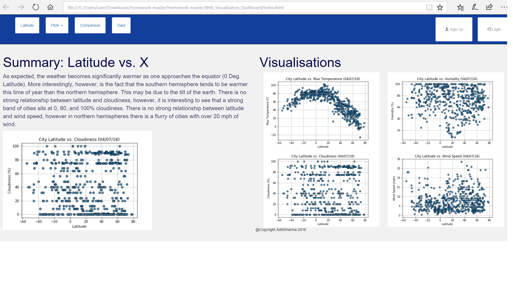

Web Visualization Dashboard (Latitude)

The Latitude dashboard focuses on showing relationshiops between latitude and different parameters like max temperature, humidity, cloudiness and wind speed.

The website consists of information on various plots, main data and comparisons on various plots.

