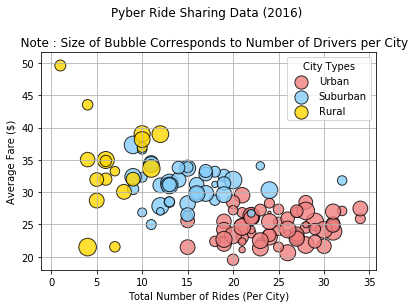
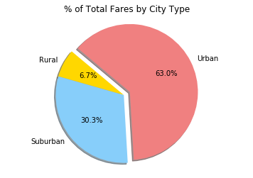
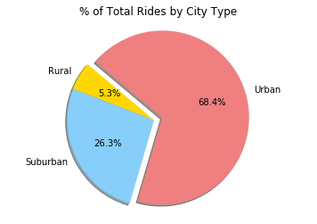
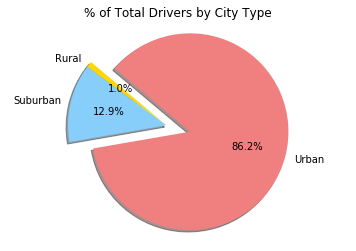

#Pyber Ride Sharing 

##Analysis

###Trend 1: Urban cities had highest number of rides and rural cities had the lowest.
###Trend 2: 63% of the total fare is generated by the urban sector, whereas rural and suburban combined generate 37% of the total fare.
###Trend 3: Urban cities have the highest percentage of total fare, total rides and total drivers' count per city as compared to rural and suburban cities. Hence, showing highest use of Pyber service in urban cities.


```python
# Dependencies
import pandas as pd
import numpy as np
import matplotlib.pyplot as plt
import seaborn as sns
import os
```


```python
# import file using pandas

city_file = os.path.join('raw_data', 'city_data.csv')
ride_file = os.path.join('raw_data', 'ride_data.csv')

city_df = pd.read_csv(city_file)
ride_df = pd.read_csv(ride_file)
city_df.head()
ride_df.head()
```


<div>
<style>
    .dataframe thead tr:only-child th {
        text-align: right;
    }

    .dataframe thead th {
        text-align: left;
    }

    .dataframe tbody tr th {
        vertical-align: top;
    }
</style>
<table border="1" class="dataframe">
  <thead>
    <tr style="text-align: right;">
      <th></th>
      <th>city</th>
      <th>date</th>
      <th>fare</th>
      <th>ride_id</th>
    </tr>
  </thead>
  <tbody>
    <tr>
      <th>0</th>
      <td>Sarabury</td>
      <td>2016-01-16 13:49:27</td>
      <td>38.35</td>
      <td>5403689035038</td>
    </tr>
    <tr>
      <th>1</th>
      <td>South Roy</td>
      <td>2016-01-02 18:42:34</td>
      <td>17.49</td>
      <td>4036272335942</td>
    </tr>
    <tr>
      <th>2</th>
      <td>Wiseborough</td>
      <td>2016-01-21 17:35:29</td>
      <td>44.18</td>
      <td>3645042422587</td>
    </tr>
    <tr>
      <th>3</th>
      <td>Spencertown</td>
      <td>2016-07-31 14:53:22</td>
      <td>6.87</td>
      <td>2242596575892</td>
    </tr>
    <tr>
      <th>4</th>
      <td>Nguyenbury</td>
      <td>2016-07-09 04:42:44</td>
      <td>6.28</td>
      <td>1543057793673</td>
    </tr>
  </tbody>
</table>
</div>


```python
#drop one duplicate record with same city name, same ride_ids but different # of drivers
city_df = city_df.drop_duplicates('city', keep = 'first')

#merging both the sheets
merged_df = city_df.merge(ride_df, on = 'city')
merged_df.head()

#grouping by city
#group_city = merged_df.groupby('city')
```


<div>
<style>
    .dataframe thead tr:only-child th {
        text-align: right;
    }

    .dataframe thead th {
        text-align: left;
    }

    .dataframe tbody tr th {
        vertical-align: top;
    }
</style>
<table border="1" class="dataframe">
  <thead>
    <tr style="text-align: right;">
      <th></th>
      <th>city</th>
      <th>driver_count</th>
      <th>type</th>
      <th>date</th>
      <th>fare</th>
      <th>ride_id</th>
    </tr>
  </thead>
  <tbody>
    <tr>
      <th>0</th>
      <td>Kelseyland</td>
      <td>63</td>
      <td>Urban</td>
      <td>2016-08-19 04:27:52</td>
      <td>5.51</td>
      <td>6246006544795</td>
    </tr>
    <tr>
      <th>1</th>
      <td>Kelseyland</td>
      <td>63</td>
      <td>Urban</td>
      <td>2016-04-17 06:59:50</td>
      <td>5.54</td>
      <td>7466473222333</td>
    </tr>
    <tr>
      <th>2</th>
      <td>Kelseyland</td>
      <td>63</td>
      <td>Urban</td>
      <td>2016-05-04 15:06:07</td>
      <td>30.54</td>
      <td>2140501382736</td>
    </tr>
    <tr>
      <th>3</th>
      <td>Kelseyland</td>
      <td>63</td>
      <td>Urban</td>
      <td>2016-01-25 20:44:56</td>
      <td>12.08</td>
      <td>1896987891309</td>
    </tr>
    <tr>
      <th>4</th>
      <td>Kelseyland</td>
      <td>63</td>
      <td>Urban</td>
      <td>2016-08-09 18:19:47</td>
      <td>17.91</td>
      <td>8784212854829</td>
    </tr>
  </tbody>
</table>
</div>


```python
#calculate average fare ($) per city
avg_fare = group_city.mean()['fare']

#Total Number of Rides Per City
total_rides = group_city['ride_id'].count()
                         
#Total Number of Drivers Per City
total_drivers = group_city['driver_count'].count()

#City Type (Urban, Suburban, Rural)

city_type = city_df.set_index('city')['type']

# dataframe from above series
rides_data = pd.DataFrame({
    "Total Number of Rides (Per City)": total_rides,
    "Average Fare ($)": avg_fare,
    "Number of Drivers": total_drivers,
    "Type of City": city_type
})
rides_data.head()
```


<div>
<style>
    .dataframe thead tr:only-child th {
        text-align: right;
    }

    .dataframe thead th {
        text-align: left;
    }

    .dataframe tbody tr th {
        vertical-align: top;
    }
</style>
<table border="1" class="dataframe">
  <thead>
    <tr style="text-align: right;">
      <th></th>
      <th>Average Fare ($)</th>
      <th>Number of Drivers</th>
      <th>Total Number of Rides (Per City)</th>
      <th>Type of City</th>
    </tr>
  </thead>
  <tbody>
    <tr>
      <th>Alvarezhaven</th>
      <td>23.928710</td>
      <td>31</td>
      <td>31</td>
      <td>Urban</td>
    </tr>
    <tr>
      <th>Alyssaberg</th>
      <td>20.609615</td>
      <td>26</td>
      <td>26</td>
      <td>Urban</td>
    </tr>
    <tr>
      <th>Anitamouth</th>
      <td>37.315556</td>
      <td>9</td>
      <td>9</td>
      <td>Suburban</td>
    </tr>
    <tr>
      <th>Antoniomouth</th>
      <td>23.625000</td>
      <td>22</td>
      <td>22</td>
      <td>Urban</td>
    </tr>
    <tr>
      <th>Aprilchester</th>
      <td>21.981579</td>
      <td>19</td>
      <td>19</td>
      <td>Urban</td>
    </tr>
  </tbody>
</table>
</div>


# Bubble plot - Ride Sharing Data


```python
#Bubble Plot Data
urban_df = rides_data.loc[rides_data['Type of City'] == 'Urban']
suburban_df = rides_data.loc[city_info['Type of City'] == 'Suburban']
rural_df = rides_data.loc[city_info['Type of City'] == 'Rural']

ax = urban_df.plot(kind='scatter',x='Total Number of Rides (Per City)', y='Average Fare ($)', grid ='true', alpha = 0.8,
                      color ='lightcoral', s=rides_data['Number of Drivers']*10, edgecolor = 'black', label = 'Urban', title = 'Pyber Ride Sharing Data (2016)', )

suburban = suburban_df.plot(kind='scatter',x='Total Number of Rides (Per City)', y='Average Fare ($)',grid ='true',alpha = 0.8, ax=ax,
                      color ='lightskyblue', s=rides_data['Number of Drivers']*10, edgecolor = 'black', label = 'Suburban', title = 'Pyber Ride Sharing Data (2016)')

rural = rural_df.plot(kind='scatter',x='Total Number of Rides (Per City)', y='Average Fare ($)',grid ='true',alpha = 0.8, ax=ax,
                       color ='gold', s=rides_data['Number of Drivers']*10, edgecolor = 'black',label = 'Rural',title = 'Pyber Ride Sharing Data (2016)')
plt.title('Pyber Ride Sharing Data (2016) \n\n   Note : Size of Bubble Corresponds to Number of Drivers per City')
plt.legend(title = 'City Types')
plt.show()
```





```python
#Calculating % of Total Fares by City Type

citytype_df = merged_df.groupby('type')
total_fare = citytype_df.sum()['fare']

# Labels for the sections of our pie chart
labels = ["Rural", "Suburban", "Urban"]

# The colors of each section of the pie chart
colors = ["gold","lightskyblue","lightcoral"]

# Tells matplotlib to seperate the "urban" section from the others
explode = (0.0, 0, 0.1)

plt.pie(total_fare, explode=explode, labels=labels, colors=colors,
        autopct="%1.1f%%", shadow=True, startangle=140)

plt.title('% of Total Fares by City Type')
plt.axis("equal")

# Prints our pie chart to the screen
plt.show()
```





```python
#Calculating % of Total Rides by City Type

rides_count = citytype_df.count()['ride_id']

labels = ["Rural", "Suburban", "Urban"]
colors = ["gold","lightskyblue","lightcoral"]
explode = (0.0, 0, 0.1)

plt.pie(rides_count, explode=explode, labels=labels, colors=colors,
        autopct="%1.1f%%", shadow=True, startangle=140)

plt.title('% of Total Rides by City Type')
plt.axis("equal")
plt.show()
```





```python
#Calculating % of Total Drivers by City Type
drivers_sum = citytype_df.sum()['driver_count']

labels = ["Rural", "Suburban", "Urban"]
colors = ["gold","lightskyblue","lightcoral"]
explode = (0, 0, 0.25)

plt.pie(drivers_sum, explode=explode, labels=labels, colors=colors,
        autopct="%1.1f%%", shadow=True, startangle= 140)

plt.title('% of Total Drivers by City Type')
plt.axis("equal")
plt.show()
```




